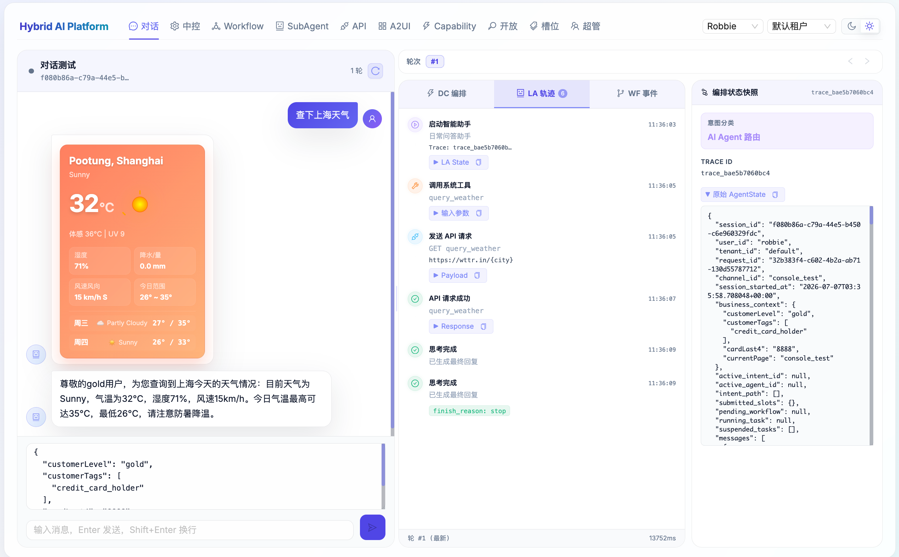
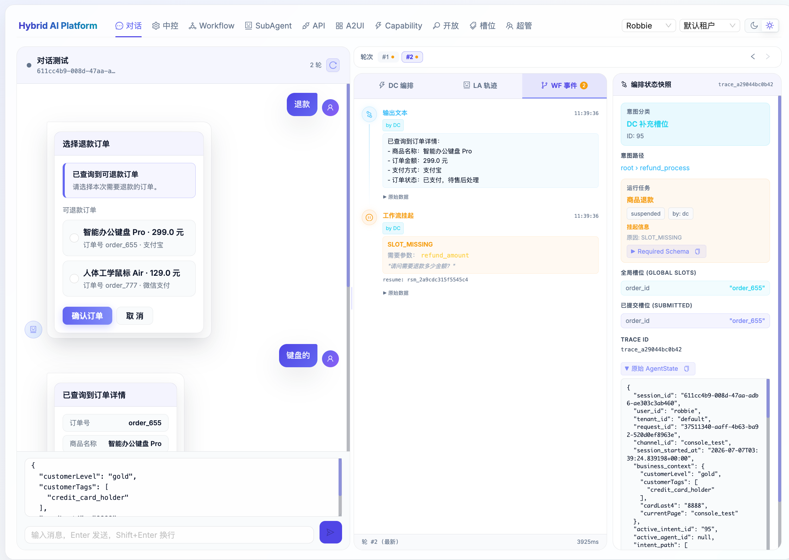
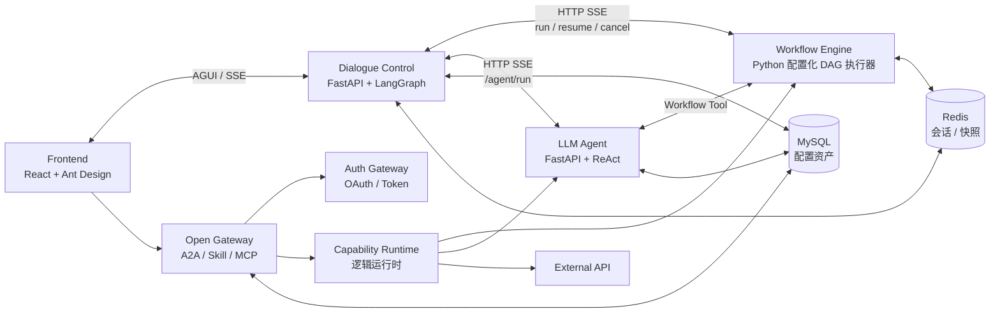
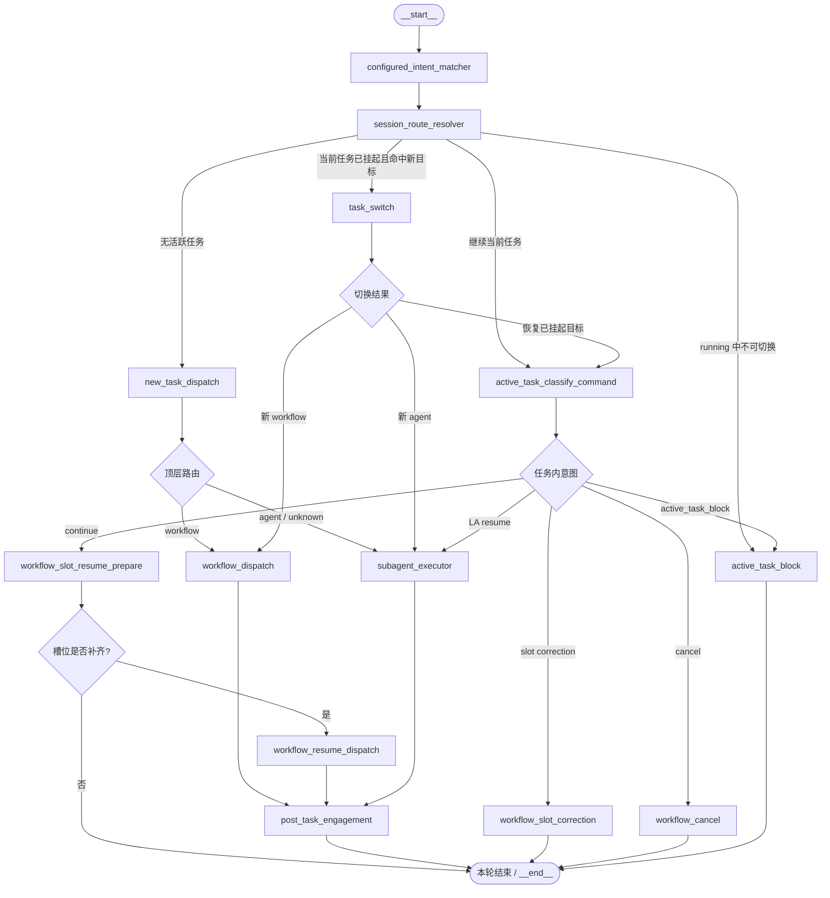
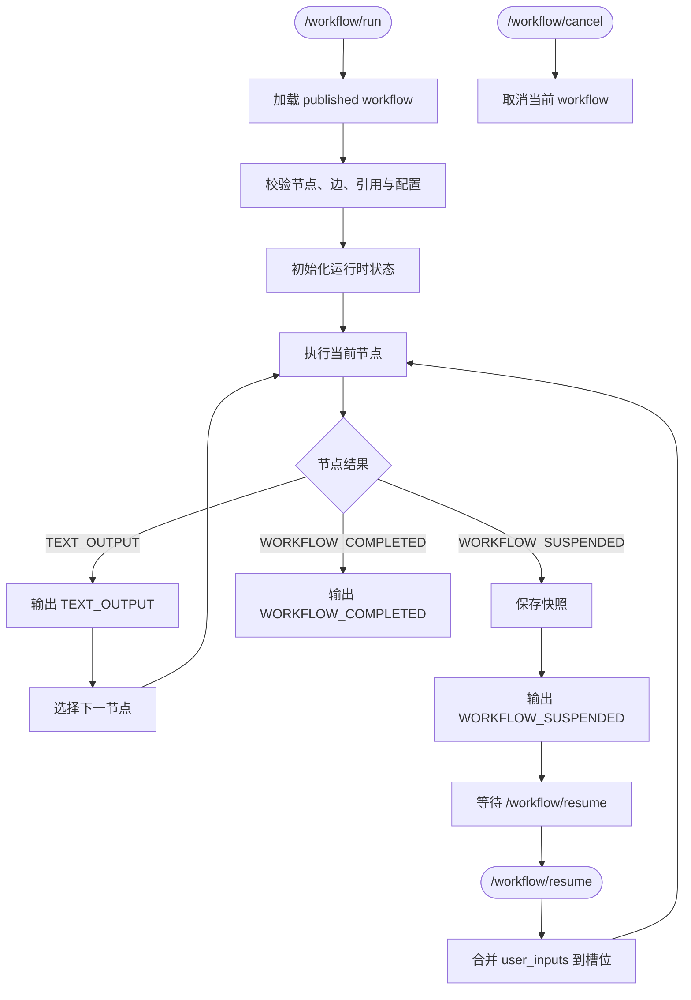
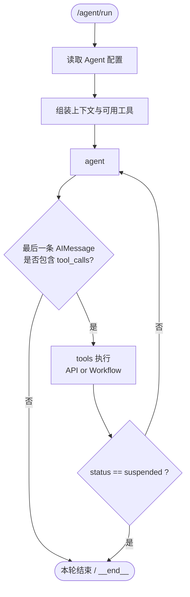

<div align="center">

# Hybrid AI Assistant Platform

### 一套面向业务运营配置的混合 Agent 平台

用统一对话入口同时承载 **Dialogue Control 中控编排**、**Workflow 确定性流程**、**LLM Agent ReAct 推理** 与 **Open Agent 能力开放**。

<p>
  
  
  
  
</p>

<p>
  <b>多租户配置</b> · <b>意图树路由</b> · <b>Workflow 画布</b> · <b>SubAgent 管理</b> · <b>A2UI 富交互</b> · <b>Skill / MCP / A2A 开放</b>
</p>

</div>

项目当前处于 MVP 阶段，重点验证模块边界、会话状态、挂起恢复、任务切换、流式协议和配置化能力。

## 效果截图

| 天气查询 Agent | 商品退款 Workflow |
|---|---|
|  |  |

## 项目亮点

- **控制面与执行面分离**：Dialogue Control 只负责会话状态和任务路由，Workflow Engine 执行业务流程，LLM Agent 负责开放式推理和工具选择。
- **LangGraph 中控编排**：DC 使用清晰的 graph nodes 拆分配置意图匹配、会话路由、任务内分类、slot resume、workflow cancel/correct、Agent 委派等职责。
- **多轮上下文意图识别**：意图匹配和任务内分类使用最近 `DC_CONTEXT_TURNS` 轮 User/Assistant 上下文，避免只看当前一句导致误判；ToolMessage 默认不进入分类上下文。
- **任务挂起与恢复**：Workflow 缺槽挂起后，DC 保存 `running_task.suspension_info.resume_token`，用户补槽时通过 `/workflow/resume` 继续，WE 内部快照实现不暴露给上游。
- **跨任务切换不丢状态**：用户在挂起 workflow 与 agent/其他 workflow 间切换时，DC 保存完整 `suspended_tasks` 快照；再次命中原任务会恢复并 resume，而不是重新 start。
- **Workflow 缺槽归 WE 管理**：DC 匹配到 workflow 后直接调用 WE；流程内部参数缺失由 WE `slot` 节点挂起并返回 `resume_token`。
- **槽位纠正有工程兜底**：LLM 识别为 `SLOT_CORRECT` 后，DC 会校验该槽位是否已有旧值；没有旧值时按补槽继续处理，避免首次赋值被误判为纠正。
- **HTTP/SSE 协议优先**：DC、WE、LA 之间通过 HTTP + Server-Sent Events 做同步流式交互，便于 MVP 验证和后续替换正式工作流引擎。
- **开放能力层**：Auth Gateway 负责外部 Agent 授权，Open Gateway 暴露 Capability / Skill / A2A 入口，并通过逻辑 Capability Runtime 直接调度 Workflow、SubAgent 或 API 能力。
- **配置与调试一体化前端**：前端支持聊天测试、模块链路日志、AgentState 快照、Intent/Agent/API/Workflow 配置、亮暗主题切换，以及基于 React Flow 的 Workflow 画布配置。

## 模块一览



| 模块 | 目录 | 主要职责 |
|---|---|---|
| Frontend | `frontend/` | 聊天测试、链路观察、配置管理 |
| Dialogue Control | `dialogue-control/` | 会话状态、意图路由、任务生命周期、下游协议适配 |
| Workflow Engine | `workflow-engine/` | 配置化 Workflow DAG 执行、节点输出、挂起、恢复、完成事件 |
| LLM Agent | `llm-agent/` | ReAct 推理、API 工具、Workflow 工具 |
| Open Agent Layer | `open-agent-layer/` | 对外 Agent 能力开放层，内部包含 Auth Gateway、A2A / Skill Gateway 和逻辑 Capability Runtime |
| Docs | `docs/` | PRD、模块架构、上下文与协议设计 |


## DC LangGraph 主干



说明：这张图里所有不再继续走下游节点的分支，都统一汇入 `本轮结束 / __end__`，包括前置缺槽、恢复缺槽、槽位纠正、取消和阻断。

## WE 配置化执行主干



## LA ReAct 推理主干



说明：这张图对应 `llm-agent/main.py` 里的实际状态图。`agent` 节点负责模型推理；当最后一条 `AIMessage` 带 `tool_calls` 时进入 `tools` 节点；`tools` 执行完后如果工作流被挂起则直接结束本轮，否则回到 `agent` 继续下一轮推理。


## 当前 MVP 能力

- DC graph 主链路见上方 `DC LangGraph 主干`，以 `configured_intent_matcher -> session_route_resolver -> new_task_dispatch / task_switch / active_task_classify_command` 为入口。
- Workflow run/resume/cancel：`/workflow/run`、`/workflow/resume`、`/workflow/cancel`。
- WE 三类业务事件：`TEXT_OUTPUT`、`WORKFLOW_SUSPENDED`、`WORKFLOW_COMPLETED`。
- LA 流式事件：`start`、`token`、`tool_call`、`api_call`、`api_response`、`end`。
- 配置资产：Intent、SubAgent、Workflow、Workflow Node/Edge、Slot、API 的基础管理能力。
- Workflow 可视化：React Flow 画布、节点编辑抽屉、节点输出引用、启动必填输入与 slot 节点配置展示。
- Capability Registry：支持把 Workflow / SubAgent / API 发布为对外能力资产，并配置 schema、scope、版本和运行策略。
- 开放接入控制台：展示 Agent Card、MCP Tools、外部 Client 和 Skill 调用测试入口。
- Auth Gateway / Open Gateway：提供 OAuth token/introspection、Capability run/resume/cancel、A2A 简化入口和 MCP 风格工具入口。
- 模型配置：DC 和 LA 支持根目录 `.env` 中的公共模型参数与模块级覆盖。

## 版本与依赖

- Python `>=3.12`
- Python 包管理：`uv`
- Frontend 包管理：`pnpm`
- 前端：React 19、Vite、Ant Design
- 后端：FastAPI、LangGraph、LangChain、SQLAlchemy
- 基础设施：Redis、MySQL

当前 `docker-compose.yml` 只保留 Redis 与 MySQL；MVP 主链路已从消息队列方案收敛为 HTTP/SSE，本地联调不依赖 Kafka。

## 快速启动

### 1. 准备配置

```bash
cp .env.example .env
```

常用配置：

- `OPENAI_API_KEY`、`OPENAI_API_BASE`：DC 和 LA 共用模型服务连接。
- `MODEL_*`：默认模型参数。
- `DC_MODEL_*`、`LA_MODEL_*`：分别覆盖 DC 或 LA。
- `DC_CONTEXT_TURNS`：DC 分类使用最近用户回合数，默认 4。
- `LA_USE_DB_MODEL_CONFIG=false`：测试时忽略 DB 中 Agent 模型配置，方便频繁切模型。
- `AUTH_GATEWAY_URL`：开放能力层调用 Auth Gateway 的地址。
- `DIALOGUE_CONTROL_URL`：A2A 对话委托进入 DC 时使用的地址。
- `AGENT_SERVICE_URL`、`WORKFLOW_ENGINE_URL`：Open Gateway 内置 Capability Runtime 调用 LA / WE 的地址。
- `OPEN_GATEWAY_AUTH_REQUIRED=false`：本地开发可关闭；生产或外部联调应开启。

### 2. 启动基础设施

```bash
docker-compose up -d
```

### 3. 初始化配置库

```bash
cd dialogue-control
uv run python seed_db.py
```

### 4. 启动后端服务

```bash
cd workflow-engine
uv run python main.py
```

```bash
cd llm-agent
uv run uvicorn main:app --host 0.0.0.0 --port 8001 --reload
```

```bash
cd dialogue-control
uv run uvicorn main:app --host 0.0.0.0 --port 8000 --reload
```

```bash
cd open-agent-layer/auth-gateway
uv run uvicorn main:app --host 0.0.0.0 --port 8010 --reload
```

```bash
cd open-agent-layer/open-gateway
uv run uvicorn main:app --host 0.0.0.0 --port 8011 --reload
```

本地初始化后会写入默认外部 Client：

```text
client_id: dev_agent_host
client_secret: dev_agent_secret
```

`OPEN_GATEWAY_AUTH_REQUIRED=false` 时可直接在“开放接入”页调用 Skill；开启后需要先通过 Auth Gateway 获取 Bearer Token。

### 5. 启动前端

```bash
cd frontend
pnpm install
pnpm dev
```

访问 Vite 输出的本地地址，通常是 `http://localhost:5173`。

## 文档入口

- [PRD：混合 AI 助手平台 MVP](docs/PRD-01-cn.md)
- [模块架构与职责说明](docs/ARCH-01-模块架构与职责说明.md)
- [内部标准事件协议](docs/ARCH-06-内部标准事件协议.md)
- [上下文模型与交互协议设计](docs/ARCH-02-上下文模型与交互协议.md)
- [A2UI 富交互输出协议设计](docs/ARCH-04-A2UI富交互输出协议设计.md)
- [Agent 能力开放与 Skill 接入架构设计](docs/ARCH-05-Agent能力开放与Skill接入架构设计.md)
- [Dialogue Control README](dialogue-control/README.md)
- [Workflow Engine README](workflow-engine/README.md)
- [LLM Agent README](llm-agent/README.md)
- [Frontend README](frontend/README.md)
- [ARCH-03 Workflow 配置化执行与可视化 MVP 设计](docs/ARCH-03-Workflow配置化执行与可视化MVP设计.md)

## 当前边界

- Workflow Engine 当前是 Python/FastAPI 配置化 DAG 执行器，正式生产形态可以继续演进或替换，但应兼容当前 HTTP/SSE 协议。
- Slot Extraction 已接入 LLM 初版，并可读取 workflow slot 节点和全局 Slot Registry；后续需要补齐版本治理和更严格校验。
- Workflow 缺槽由 WE slot 节点挂起并通过 `/workflow/resume` 恢复；DC 不再读取 start 节点输入配置做启动前提槽。
- 调试事件当前在前端测试页可见，生产环境需要按用户、管理员、开发环境分层。
- 鉴权、租户隔离、密钥治理、审计、幂等和工作流版本发布仍属于后续建设重点。
