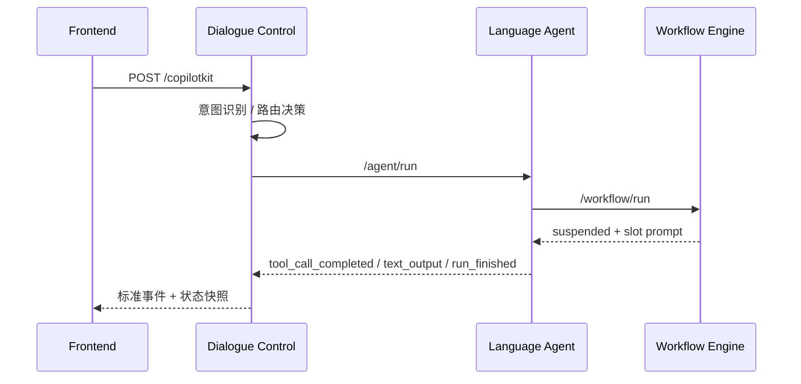

# AGUI 入口与 DC 标准请求响应对照分析

本文基于这笔实际请求做一次对照分析：

- AGUI 入口：`POST /copilotkit`
- DC 标准入口：`POST /agent/run`

目标不是解释“理论上应该怎样”，而是基于这次真实报文，梳理清楚：

1. AGUI 入参如何映射成 DC 标准入参。
2. AGUI 流里出现了哪些层级的事件。
3. DC 标准 `/agent/run` 实际返回了什么。
4. 哪些重复、冗余、或容易误读的地方，后续 review 时应重点关注。

---

## 1. 本次请求的业务语义

这笔请求的用户输入是：

```text
账单分期
```

业务上它命中了：

- 意图：`bill_query`
- 绑定目标：`bill_agent`
- 最终进入的能力：`bill_installment`

WE 在执行中发现缺少槽位 `installment_count`，因此返回挂起，提示用户选择分期期数。

---

## 2. AGUI 入口原始请求

本次 AGUI 请求大致如下：

```json
{
  "threadId": "9c73aade-f95f-449b-a9d4-c92c0e193729",
  "runId": "1bf9c717-7556-437f-bb45-a6d15d15fe10",
  "agentName": "default",
  "messages": [
    {
      "id": "205907ad-a66c-470a-9213-898e4fdde636",
      "role": "user",
      "content": "账单分期",
      "createdAt": 1783905422212
    }
  ],
  "state": {
    "tenantId": "default",
    "userId": "robbie",
    "channelId": "console_test",
    "businessContext": {
      "customerLevel": "gold",
      "customerLastName": "谢",
      "customerGender": "male",
      "customerTags": ["credit_card_holder"],
      "cardLast4": "8888",
      "currentPage": "console_test"
    }
  },
  "tools": [],
  "context": [],
  "forwardedProps": {}
}
```

### 2.1 这类 AGUI 入参的特点

从协议层看，它是“前端可见会话输入”的形态，包含：

- `threadId`：会话线程标识
- `runId`：本轮调用标识
- `messages`：本轮消息
- `state`：会话状态与业务上下文
- `tools/context/forwardedProps`：本次都很轻

这类报文更偏“平台入口协议”，不是 DC 内部最小执行协议。

---

## 3. AGUI -> DC 标准请求映射

这次我手动转成 DC `/agent/run` 时，使用的是更精简的标准报文：

```json
{
  "execution_context": {
    "tenant_id": "default",
    "user_id": "robbie",
    "session_id": "5081b386-371d-44b5-8d6b-7669ea4ab9c4",
    "request_id": "14deaf01-15e5-4977-b032-1a7c4953854a",
    "trace_id": "trace_52c7cd8354d9",
    "channel_id": "console_test",
    "mode": "direct_agent"
  },
  "conversation_context": {
    "current_message": {
      "role": "user",
      "content": "账单分期",
      "message_id": "msg_xxx",
      "created_at": "2026-07-13 09:17:02.221",
      "source": "customer"
    }
  },
  "business_context": {
    "customerLevel": "gold",
    "customerLastName": "谢",
    "customerGender": "male",
    "customerTags": ["credit_card_holder"],
    "cardLast4": "8888",
    "currentPage": "console_test"
  }
}
```

### 3.1 字段映射

| AGUI 字段 | DC 标准字段 | 说明 |
|---|---|---|
| `threadId` | `execution_context.session_id` | 会话线程标识，进入 DC 后作为会话主键使用 |
| `runId` | `execution_context.request_id` | 本轮请求标识 |
| `state.tenantId` | `execution_context.tenant_id` | 租户 |
| `state.userId` | `execution_context.user_id` | 用户 |
| `state.channelId` | `execution_context.channel_id` | 渠道 |
| `state.businessContext` | `business_context` | 业务上下文透传 |
| `messages[0]` | `conversation_context.current_message` | 当前轮用户输入 |
| `forwardedProps.traceId` | `execution_context.trace_id` | 外部透传 trace；没有时可由平台生成 |

### 3.2 这次转换的关键观察

1. DC 标准入口比 AGUI 入口更“薄”，只保留执行所需字段。
2. DC 内部不需要再看到 `tools`、`context` 这类 AGUI 适配字段。
3. 当前轮用户输入在 DC 里应该只保留一次，不要在历史和 current message 里重复。

---

## 4. AGUI 流事件顺序分析

这次 AGUI 响应的事件链路，按业务语义可以拆成下面几层：



### 4.1 事件分层

#### A. 传输/框架层

这类事件只是表示流式框架状态，不是业务语义本身：

- `RUN_STARTED`
- `RUN_FINISHED`
- `RAW`
- `CUSTOM`
- `STATE_SNAPSHOT`
- `MESSAGES_SNAPSHOT`

#### B. DC / LA / WE 的标准业务事件

这类事件才是我们真正要 review 的：

- `run_started`
- `log`
- `text_output`
- `tool_call_completed`
- `a2ui_output`
- `run_finished`

---

## 5. 本次 AGUI 响应的详细业务链路

### 5.1 DC 入口开始

第一段是 AGUI 运行包装层加的：

- `RUN_STARTED`
- `LangGraph on_chain_start`

这只代表“开始了一次运行”，不代表业务已经开始处理完。

### 5.2 DC 意图识别

随后进入 `configured_intent_matcher`：

- 命中配置意图：`账单类问题`
- 意图绑定：`bill_agent`
- 这一步对应 DC 标准事件 `run_started` 和 `log`

这里有一个很重要的点：

- 同一个 `trace_event` 会同时以 `RAW` 和 `CUSTOM` 两种形式出现
- 同一个 `log` 也一样

这说明**同一条业务事件在流里被包了两层**，不是执行了两次。

### 5.3 DC 路由决策

`session_route_resolver` 输出：

- `当前无活跃任务，进入新任务分发`
- `session_route = new_task_dispatch`

这说明本轮不是 resume，而是新任务分发。

### 5.4 LA 调用 WE

进入 `subagent_executor` 之后：

1. LA 调用 `WE:bill_installment`
2. WE 返回 `suspended`
3. WE 提示用户选择分期期数
4. LA 收到工具结果后，输出：
   - `tool_call_completed`
   - `text_output`
   - `run_finished`

### 5.5 WE 的实际挂起内容

WE 返回的核心内容是：

- `status: suspended`
- `missing_slot: installment_count`
- `required_input.prompt: 请问您想将账单分 12 期还是 24 期？`

这代表：

- 工作流没有执行完成
- 它停在槽位收集阶段
- 最终要让用户继续补一个值

### 5.6 最终对用户可见的文本

这次真正该展示给用户的是：

```text
请问您想将账单分 12 期还是 24 期？
```

也就是说，虽然中间有很多工具和日志事件，但最终 UI 只需要呈现这一句业务提示。

---

## 6. 这次 AGUI 流里明显的重复点

### 6.1 同一业务事件重复包装

同一个 `event_id` 在流里经常出现三种视角：

- `RAW.event`
- `CUSTOM.rawEvent`
- `CUSTOM.name/value`

这属于**传输层重复**，不是业务重复。

### 6.2 WE 的 `a2ui_output` 出现了三次

本次最值得注意的重复是：

- 同一个 `surface_id`
- 同一个 `producer`
- 连续出现了 3 条完全相同的 `a2ui_output`

这不是前端渲染重复，而是**上游真的发了三遍**。  
后面 review 代码时，这里值得重点查：

1. 是节点执行重复 emit
2. 还是事件桥接重复转发
3. 还是 A2UI 合并逻辑没有去重

### 6.3 `tool` 消息和 `assistant` 消息同时保留

`MESSAGES_SNAPSHOT` 里同时保留了：

- `tool`：完整的 WE 返回 JSON
- `assistant`：可展示的文本

这对状态恢复有价值，但如果前端直接渲染消息列表，就会显得很吵。

---

## 7. DC `/agent/run` 的实际返回

我按新的 `session_id` 和 `request_id` 重新跑了一次 DC 标准入口，得到的结果非常短：

```text
run_started
run_finished
```

### 7.1 实际返回

```json
data: {
  "event_id": "evt_a02c3ea8e17c",
  "event_type": "run_started",
  "source": {"module": "DC", "component": "dialogue_graph", "id": "main"},
  "execution_context": {
    "tenant_id": "default",
    "session_id": "5081b386-371d-44b5-8d6b-7669ea4ab9c4",
    "request_id": "14deaf01-15e5-4977-b032-1a7c4953854a",
    "trace_id": "trace_52c7cd8354d9"
  },
  "created_at": "2026-07-13 09:24:16.956",
  "payload": {
    "run_id": "14deaf01-15e5-4977-b032-1a7c4953854a",
    "action": "start",
    "target": {"type": "dc", "id": "main"}
  }
}

data: {
  "event_id": "evt_b5e75539861d",
  "event_type": "run_finished",
  "source": {"module": "DC", "component": "dialogue_graph", "id": "main"},
  "execution_context": {
    "tenant_id": "default",
    "session_id": "5081b386-371d-44b5-8d6b-7669ea4ab9c4",
    "request_id": "14deaf01-15e5-4977-b032-1a7c4953854a",
    "trace_id": "trace_52c7cd8354d9"
  },
  "created_at": "2026-07-13 09:24:20.980",
  "payload": {
    "run_id": "14deaf01-15e5-4977-b032-1a7c4953854a",
    "status": "suspended",
    "target": {"type": "dc", "id": "main"},
    "suspension": {
      "resume_token": null,
      "reason": "slot_missing",
      "suspended_node": null,
      "required_slots": []
    }
  }
}
```

### 7.2 这个结果和 AGUI 流的差异

和 AGUI 入口相比，这次 `/agent/run` 的公开 SSE 非常短，说明：

- 它更像 DC 的标准业务入口
- 不是完整的 AGUI 调试流
- 也没有把内部链路的细节全部透出来

如果你的预期是“直连 `/agent/run` 也要看到和 `/copilotkit` 一样丰富的链路细节”，那这次结果说明当前实现还没有做到这一点。

这不是坏事，但它意味着：

- `AGUI` 和 `DC 标准协议` 目前仍是两层不同的东西
- 一个偏入口适配，一个偏标准业务协议

---

## 8. 两个报文的核心对照结论

### 8.1 AGUI 入口更适合前端接入

它承载的是：

- `threadId`
- `runId`
- `messages`
- `state`
- `forwardedProps`

适合前端或 CopilotKit 使用。

### 8.2 DC `/agent/run` 更适合内部标准执行

它承载的是：

- `execution_context`
- `conversation_context`
- `business_context`
- `slot_context`

适合内部模块间调用、调试和协议收敛。

### 8.3 当前最需要盯住的不是“能不能跑”

而是这几个问题：

1. **事件是否重复发出**
2. **前端是否把工具消息误渲染成普通对话**
3. **A2UI 是否需要统一去重**
4. **AGUI 适配层和 DC 标准层是否足够解耦**
5. **直连 `/agent/run` 的公开事件是否符合预期**

---

## 9. 建议你 review 代码时重点看什么

1. `copilotkit` 适配层是否只是做字段归一化，不要混入业务执行逻辑。
2. `run_started / run_finished` 是否区分了“AGUI 运行包装”和“DC 业务标准事件”。
3. `a2ui_output` 重复三次的问题是在哪一层被放大的。
4. `tool` 消息是否应该继续保留在状态里，但不直接喂给前端渲染。
5. `/agent/run` 的公开返回是否需要和 `/copilotkit` 保持相同粒度，还是继续保持“标准、收敛、薄接口”。

---

## 10. 一句话总结

这笔请求本质上是：

> AGUI 入口负责把前端会话请求转成 DC 标准执行请求；DC 再把它路由给 LA，LA 调 WE，WE 挂起后由 LA/DC 把最终提示返回给前端。  
> 这条链路能跑通，但当前报文里重复包装、A2UI 重复 emit、以及 tool/assistant 混放的问题，已经足够值得进一步收敛。

---

## 11. 重新验证：AGUI 与 DC `/agent/run` 新会话对照

根据 review 反馈，DC 标准入口也应该流式输出执行细节。原实现中 `/agent/run` 使用 `compiled_graph.ainvoke()` 等待 graph 完成后再输出，因此只能看到很薄的：

```text
run_started
run_finished
```

这不符合“标准入口也可观察完整链路”的预期。已调整为基于 `compiled_graph.astream_events()` 消费 LangGraph 事件流，并将内部 custom event 转换为 DC 标准 SSE 输出。随后 `/copilotkit` 也改成显式 AGUI adapter endpoint：它先把 AGUI 请求转换为 DC 标准 Run Request，再复用同一套标准事件流，只在响应上包一层 AGUI 外壳。

### 11.1 新造 AGUI 请求

本次新造 AGUI 请求：

| 字段 | 值 |
| --- | --- |
| `threadId` | `28cd8d3d-6d6c-4992-9ef9-ef686bf8641e` |
| `runId` | `cf0c22ca-f477-40f1-af87-9527c4948476` |
| `messageId` | `60cd8098-4809-4608-9847-3d55fd94f3a1` |
| `content` | `账单分期` |

响应摘要：

| 指标 | 结果 |
| --- | --- |
| 总事件数 | 24 |
| AGUI 顶层事件 | `RUN_STARTED` 1、`RAW` 22、`RUN_FINISHED` 1 |
| 标准事件语义 | `run_started` 3、`log` 13、`tool_call_started` 1、`a2ui_output` 1、`run_finished` 3、`tool_call_completed` 1 |
| 日志分类 | `dc.intent.match`、`dc.route.decision`、`dc.task.dispatch`、`dc.downstream.request`、`la.model.request`、`la.model.response`、`la.downstream.request`、`we.node.started`、`we.node.completed`、`we.slot.missing`、`la.downstream.response`、`dc.downstream.response` |
| A2UI surface | `chat_wf_bill_installment_installment_count_e321f3`，只输出 1 次 |
| 文本输出 | 无独立 `text_output` |

AGUI 入口现在不再输出 LangGraph 的 `STEP_STARTED`、`STEP_FINISHED`、`STATE_SNAPSHOT`、`MESSAGES_SNAPSHOT` 和双层 `CUSTOM` 包装。它只输出 AGUI 运行外壳，以及承载标准事件的 `RAW on_custom_event`。

### 11.2 新造 DC `/agent/run` 请求

本次新造 DC 标准请求：

| 字段 | 值 |
| --- | --- |
| `session_id` | `0903076f-2957-41b2-8cf4-821c88925d5e` |
| `request_id` | `44679e46-0a1f-4138-b288-e47c9313e65b` |
| `trace_id` | `trace_2bac152a64b2` |
| `message_id` | `msg_75859cbaff6a` |
| `content` | `账单分期` |

响应摘要：

| 指标 | 结果 |
| --- | --- |
| 总事件数 | 22 |
| 顶层事件 | 全部是标准事件，无 AGUI `RAW/CUSTOM/STEP` 外壳 |
| 标准事件语义 | `run_started` 3、`log` 13、`tool_call_started` 1、`a2ui_output` 1、`run_finished` 3、`tool_call_completed` 1 |
| 日志分类 | `dc.intent.match`、`dc.route.decision`、`dc.task.dispatch`、`dc.downstream.request`、`la.model.request`、`la.model.response`、`la.downstream.request`、`we.node.started`、`we.node.completed`、`we.slot.missing`、`la.downstream.response`、`dc.downstream.response` |
| A2UI surface | `chat_wf_bill_installment_installment_count_d96454`，只输出 1 次 |
| 文本输出 | 无独立 `text_output`，本轮主要输出为 A2UI 卡片 |

### 11.3 DC `/agent/run` 的关键事件顺序

修复后，DC 标准入口能看到完整链路：

```text
DC run_started
DC log: dc.intent.match
DC log: dc.route.decision
DC log: dc.task.dispatch
DC log: dc.downstream.request
LA run_started
LA log: la.model.request
LA log: la.model.response
LA tool_call_started
LA log: la.downstream.request
WE run_started
WE log: we.node.started
WE log: we.node.completed
WE log: we.node.started
WE log: we.slot.missing
WE a2ui_output
WE run_finished(status=suspended)
LA log: la.downstream.response
LA tool_call_completed
LA run_finished(status=suspended)
DC log: dc.downstream.response
DC run_finished(status=suspended)
```

### 11.4 重新对比结论

| 对比项 | AGUI `/copilotkit` | DC `/agent/run` |
| --- | --- | --- |
| 入口定位 | 前端 / CopilotKit 适配 | DC 标准执行入口 |
| 事件外壳 | `RUN_STARTED` / `RAW` / `RUN_FINISHED` | 只输出标准业务事件 |
| 执行细节 | 有，`RAW.data` 中是标准事件 | 有，直接以标准事件输出 |
| A2UI 输出 | 已按 `surface_id` 去重，只输出一次 | 已按 `surface_id` 去重，只输出一次 |
| 状态快照 | 当前不输出状态快照 | 当前不输出状态快照 |
| 阅读体验 | 适合 AGUI/CopilotKit 客户端 | 更适合标准协议 review |

### 11.5 当前仍值得继续 review 的点

1. DC `/agent/run` 和 AGUI `/copilotkit` 当前都不输出 `STATE_SNAPSHOT`。如果标准调试接口需要状态快照，可以后续增加可选 debug 开关。
2. 本轮 `a2ui_output` 是主要用户可见输出，因此没有独立 `text_output` 是合理的；如果端侧需要无障碍文本，可使用 A2UI 的 `display_text`。
3. DC 最终 `run_finished` 中 `suspension.required_slots` 仍为空，因为挂起发生在 LA 调用的 workflow tool 内，DC 当前只知道 agent 挂起，不直接解析 WE 的槽位详情。这个点是否要透出，需要单独决策。
4. 前端现在兼容 AGUI 外壳和标准事件直接输入；如果后续测试页切换到 `/agent/run`，无需再重写事件解析主干。
