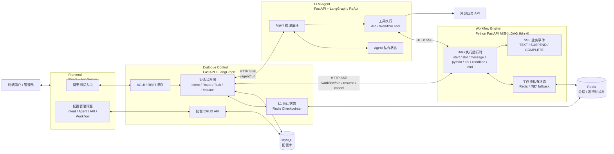
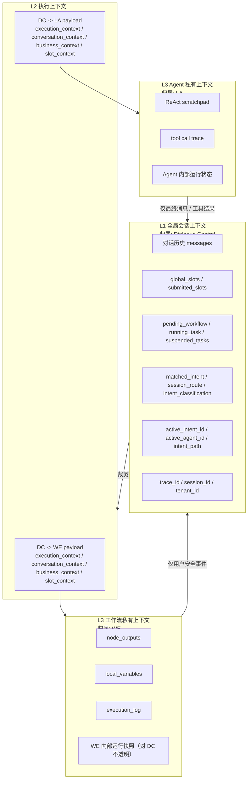
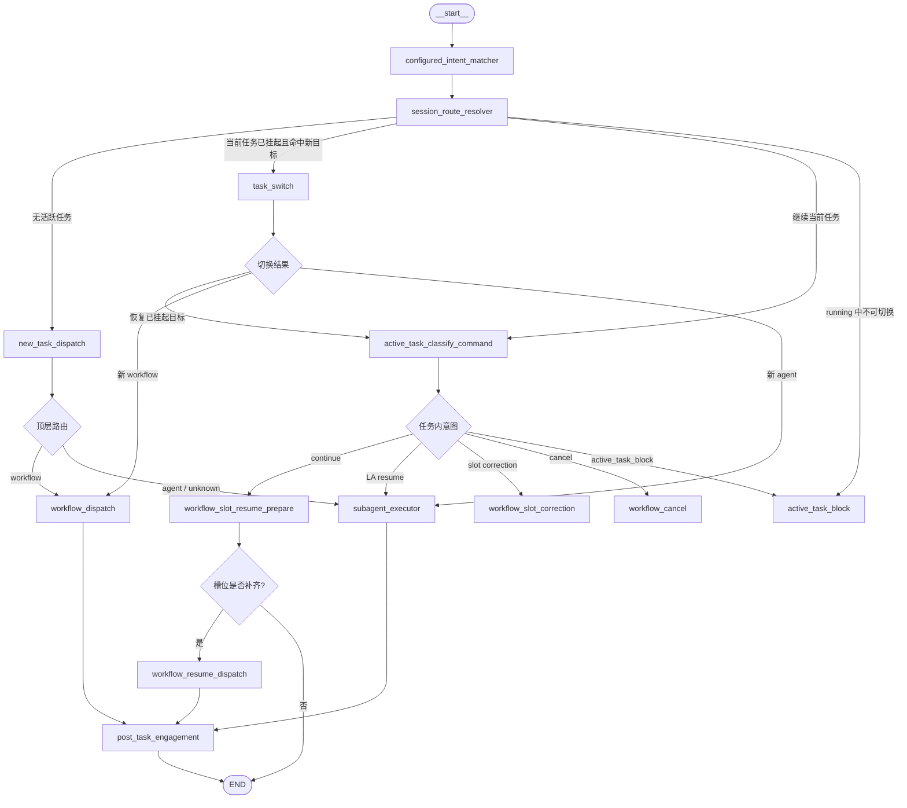
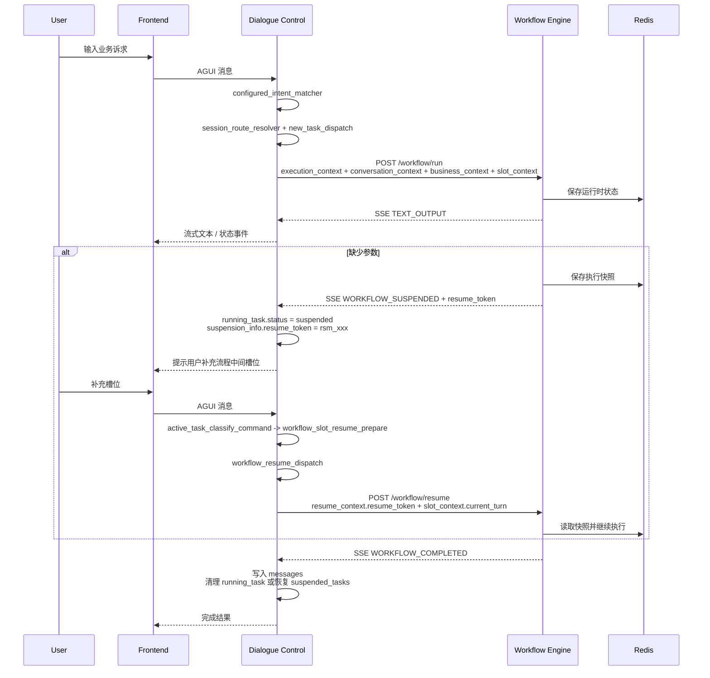
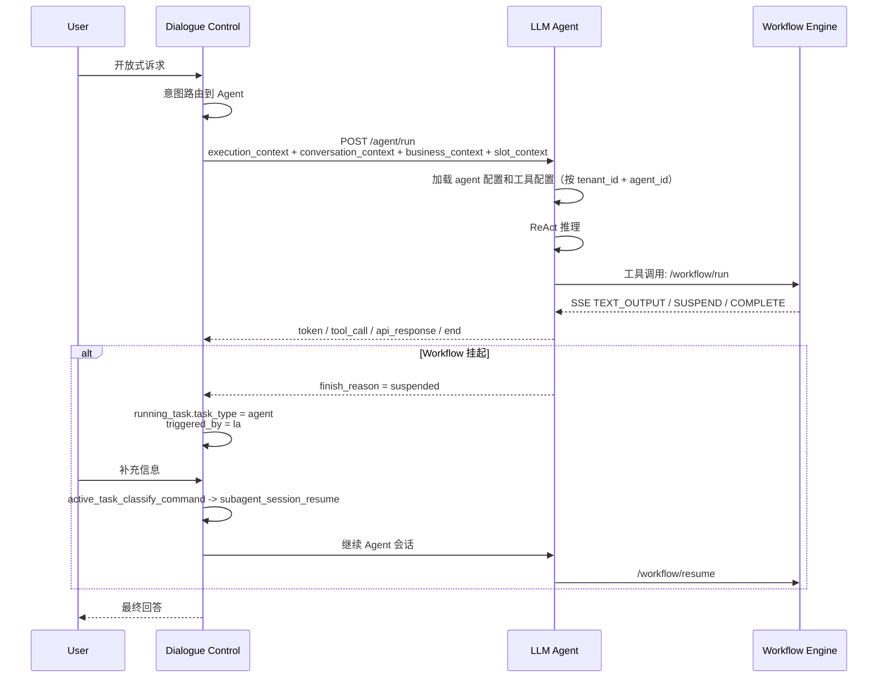
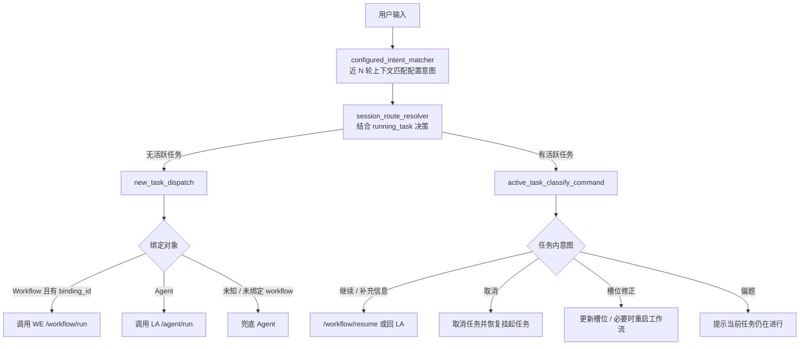
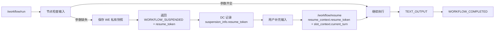
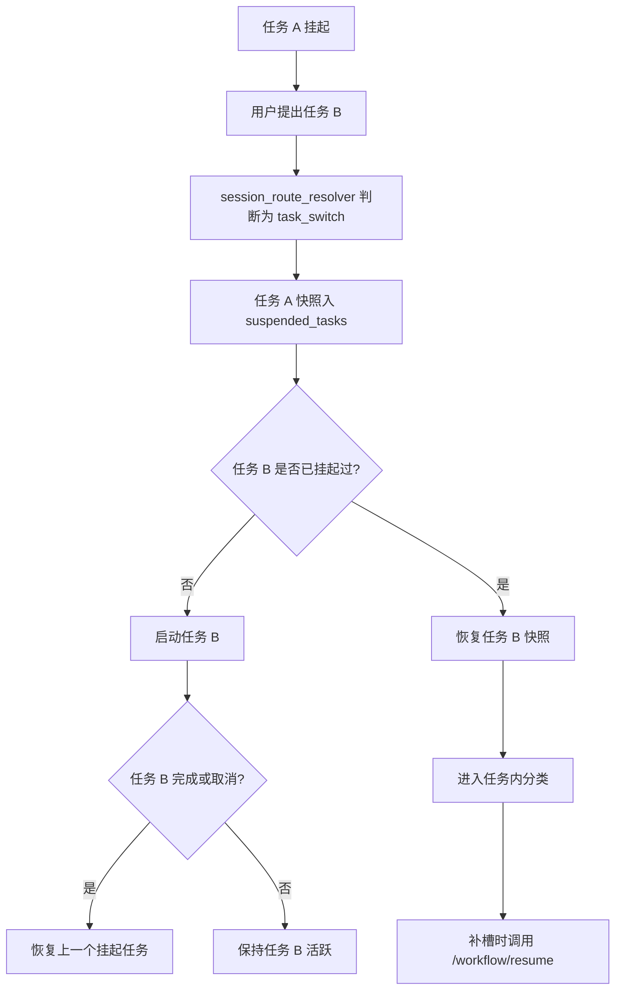

# 模块架构与职责说明

**日期**：2026-07-06
**状态**：已依据 ARCH-06 更新
**适用范围**：当前实现阶段架构说明

---

## 1. 背景与定位

本项目是一个混合 AI 助手平台，核心目标是在同一套对话入口中同时支持两类能力：

- **确定性业务执行**：适合退款、账单查询、审批、提交工单等需要稳定流程、明确审计、可控集成的场景，由 Workflow Engine 承担。
- **概率性自然语言处理**：适合开放问答、解释、推荐、信息整合、工具选择等需要 LLM 推理灵活性的场景，由 LLM Agent 承担。

平台不把所有事情都交给 Agent，也不把所有事情都做成固定流程，而是通过 Dialogue Control 在两者之间做路由、状态管理和上下文隔离。

---

## 2. 总体架构

### 2.1 模块全景

### 2.2 核心设计判断

系统采用“控制面 + 执行面”拆分：

- **Dialogue Control 是控制面**：负责理解当前用户处于什么状态、该路由到哪里、哪些上下文能传给下游、下游结果如何回到会话。
- **Workflow Engine 是确定性执行面**：负责按 DAG 执行稳定业务逻辑，维护工作流运行时状态。
- **LLM Agent 是概率性执行面**：负责开放式语言推理和工具选择，维护自身推理过程。
- **Frontend 是交互与配置面**：负责终端聊天、调试观察和管理员配置。

这个拆分的价值在于：业务安全逻辑不被 Agent 私自改写，Agent 的推理过程不污染全局会话，工作流内部状态不暴露给前端，模块之间通过稳定协议解耦。

---

## 3. 上下文分层与边界

边界原则：

- DC 是 L1 的唯一写入者。
- WE 和 LA 不直接读写 DC 的会话状态。
- DC 调用下游时只传递裁剪后的 L2。
- WE 的节点输出、局部变量、执行日志属于 L3，不进入用户会话。
- LA 的推理链路、scratchpad、内部工具轨迹属于 L3，不进入用户会话。
- 只有用户可见、可审计、经过协议约束的文本或 UI payload 可以写入对话历史。

---

## 4. 模块职责与能力

### 4.1 Frontend：交互与配置面

#### 模块定位

Frontend 是用户和管理员接触系统的入口。它不负责业务编排，也不执行工作流和 Agent，只负责把用户输入、配置操作和实时事件展示出来。

#### 当前能力

- 聊天测试界面：与 DC 的 AGUI 入口交互，展示对话流。
- 调试事件展示：可看到 `dc_log`、`workflow_log`、`subagent_log` 等运行过程事件。
- 意图配置：维护 Intent，并将 Intent 绑定到 Workflow 或 Agent。
- Agent 配置：维护子 Agent 的基础属性、提示词、模型参数和工具列表。
- API 注册：维护外部 API 的 URL、方法、header、request/response schema。
- Workflow 配置：React Flow 画布展示 DAG；支持节点拖拽、节点点击右侧抽屉编辑、节点输出引用复制、连线创建、校验和发布。
- 主题切换：支持暗色与明亮两套主题，聊天测试页、配置卡片、Workflow 画布和节点抽屉使用统一 CSS 变量。

#### 后续应补齐能力

- Slot Registry：统一槽位定义、校验规则、缺失提示语和版本治理。
- 用户可见事件和调试事件分层：普通用户只看业务状态，管理员或开发模式才看 trace。
- 鉴权与角色：终端用户、管理员、运维人员的权限需要分离。

#### 责任边界

Frontend 不应直接调用 WE 或 LA。所有运行时对话都应经由 DC，以保证会话状态、上下文裁剪、权限控制和审计链路一致。

---

### 4.2 Dialogue Control：会话状态与任务路由控制面

#### 模块定位

Dialogue Control 是系统的“大脑”和“交通枢纽”。它不亲自执行业务 DAG，也不亲自完成 Agent 推理，而是负责判断当前用户输入应该如何被处理。

#### 当前实现形态

- 技术栈：FastAPI + LangGraph + LangChain + Redis Checkpointer + SQLAlchemy。
- 入口协议：通过 CopilotKit / AGUI 相关能力挂载 `/copilotkit`，同时提供管理端 REST API。
- 状态模型：`AgentState` 维护 `messages`、`global_slots`、`submitted_slots`、`pending_workflow`、`running_task`、`suspended_tasks`、`matched_intent`、`session_route`、`active_intent_id`、`active_agent_id` 等 DC 内部字段。这些字段均属于 L1 内部状态，不作为对外协议字段传递给 LA 或 WE。
- 状态图：每轮统一从 `configured_intent_matcher` 进入，再由 `session_route_resolver` 结合会话状态决定进入顶层路由、任务内分类、task switch 或 active_task_block。
- 上下文窗口：DC 的意图匹配、顶层 fallback、任务内指令识别使用最近 `DC_CONTEXT_TURNS` 个用户回合的 User/Assistant 上下文，默认 4 轮；ToolMessage 默认不进入分类上下文。
- L2 协议：DC 调用 LA 使用 `execution_context / conversation_context / business_context / slot_context` 四块标准结构，由 `context_builders.build_agent_request` 组装。LA 自己按 `tenant_id + agent_id` 加载工具配置，DC 不传工具目录。

#### 核心能力

1. **意图识别与路由**
   - 从数据库读取 Intent 配置。
   - 使用 LLM 将近 N 轮上下文中的当前用户诉求匹配到绑定的 Workflow 或 Agent。
   - `configured_intent_matcher` 只产出 `matched_intent` 事实；`session_route_resolver` 负责结合任务状态做决策。
   - 匹配到 Workflow 时生成 `pending_workflow`。
   - 匹配到 Agent 时设置 `active_agent_id`。
   - 未绑定具体 workflow 的业务诉求不启动 `wf_unknown`，而是转 LA 兜底。

2. **对话状态管理**
   - 使用 LangGraph Checkpointer 保存会话状态。
   - 跟踪当前是否有 `running_task`。
   - 支持当前任务挂起、恢复、取消。
   - `suspended_tasks` 保存完整任务快照，包括 `running_task`、意图上下文、`global_slots` 和 `submitted_slots`。
   - 支持用户在挂起任务之间切换：命中已挂起任务时恢复快照并继续 resume，而不是重新 start。
   - 当前任务处于 running 时不允许本地伪挂起切换，避免 DC 状态与 WE 执行状态不一致。

3. **工作流调度**
   - 调用 WE 的 `/workflow/run`、`/workflow/resume`、`/workflow/cancel`。
   - 消费 WE 的 SSE 事件。
   - 将 `TEXT_OUTPUT` 写回对话消息。
   - 将 `WORKFLOW_SUSPENDED` 转换为 `running_task.status = suspended`，并把 `resume_token` 存入 `suspension_info`。
   - 将 `WORKFLOW_COMPLETED` 转换为任务结束和会话恢复。

4. **Agent 委派**
   - 为 LA 构造标准 L2 上下文（`execution_context / conversation_context / business_context / slot_context`）。
   - 调用 LA 的 `/agent/run`。
   - 转发 LA 的 token、tool_call、api_response 等事件。
   - 将 LA 最终输出写入对话消息。
   - LA 自己加载工具配置，DC 不传工具目录。

5. **槽位处理**
   - Workflow 参数缺失统一由 WE `slot` 节点判断和挂起，DC 不再读取 start 节点输入配置做启动前提槽。
   - WE 缺槽时返回 `WORKFLOW_SUSPENDED`，DC 使用近 N 轮 User/Assistant 上下文抽取挂起节点所需槽位，再通过 `/workflow/resume` 恢复。
   - slot schema 优先来自 workflow slot 节点与全局 Slot Registry。
   - 对 `SLOT_CORRECT` 的模型分类结果，DC 会做工程侧校验：只有该槽位在 `global_slots` 或 `submitted_slots` 中已有旧值时才进入纠正；否则降级为普通补槽继续。
   - DC 已经具备 `global_slots` 和 `submitted_slots` 的状态设计。
   - DC-triggered workflow 的缺参恢复由 DC 接管，LA-triggered workflow 的恢复由 LA 接管。

6. **配置管理**
   - 提供 Intent、SubAgent、Workflow、API 的 CRUD。
   - 数据模型已覆盖 Intent 树、Workflow 节点/边、SubAgent、Slot、API。

#### DC 内部状态机示意

#### 当前 Graph 节点职责

| 节点 | 当前职责 |
|---|---|
| `configured_intent_matcher` | 每轮入口，使用近 `DC_CONTEXT_TURNS` 轮 User/Assistant 上下文匹配 DB 中配置意图，写入 `matched_intent`。 |
| `session_route_resolver` | 结合 `matched_intent` 与 `running_task` 状态，决定进入顶层路由、任务内分类、task switch 或 active_task_block。 |
| `new_task_dispatch` | 无活跃任务时把配置意图解析为 workflow / agent 路由；未绑定 workflow 的业务诉求转 LA 兜底。 |
| `task_switch` | 当前任务已挂起时切换目标；若目标已在 `suspended_tasks` 中，恢复其完整快照并继续任务内分类。 |
| `active_task_classify_command` | 当前任务内识别继续、取消、槽位纠正、跑题、阻塞；LA 引导任务直接回 LA。 |
| `workflow_dispatch` | 调用 WE `/workflow/run` 并消费 SSE，维护 `messages`、`running_task`、`submitted_slots`。 |
| `workflow_slot_resume_prepare` | DC 收集挂起 workflow 正在等待的槽位；只抽取、校验并准备执行请求。 |
| `workflow_resume_dispatch` | 调用 WE `/workflow/resume` 恢复已挂起 workflow。 |
| `workflow_slot_correction` | 处理槽位纠正；已提交槽位执行 cancel + restart，未提交槽位只更新本地状态。 |
| `workflow_cancel` | 调用 WE `/workflow/cancel`，清理当前任务并恢复挂起任务。 |
| `subagent_executor` | 构造 LA 请求、调用 `/agent/run`、转发 LA 事件并写回消息。 |
| `post_task_engagement` | workflow/subagent 完成后的统一后处理节点，基于配置与 LLM 判断调用营销 Agent。 |
| `active_task_block` | 当前 workflow running 中无法安全处理新输入时提示等待或取消。 |

#### 责任边界

DC 应该负责：

- 会话级状态。
- 顶层意图路由。
- 活跃任务生命周期。
- 下游调用协议适配。
- 下游输出的用户安全过滤与写回。
- L2 上下文组装。

DC 不应该负责：

- 执行 Workflow DAG 节点。
- 读取或解析 WE 私有执行快照。
- 执行 Agent 的 ReAct 推理链路。
- 直接执行外部 API 业务调用。
- 保存明文密钥或越权暴露调试 trace。

#### 当前主要风险

- `orchestrator/nodes.py` 已开始拆分任务生命周期、slot 生命周期和 WE 流式事件处理，但意图匹配、DB 查询、LA 客户端、调试事件封装仍集中在节点文件中，后续仍需要继续服务化。
- Slot Extraction 已有 LLM 初版，但 Slot Registry、schema 版本、严格校验和真实 workflow 契约仍需完善。
- Workflow 参数缺失职责已收敛到 WE slot 节点；DC 只处理 WE 挂起后的补槽和恢复。
- LA 工具配置归属已收敛：LA 按 `tenant_id + agent_id` 自加载工具配置，DC 不再向 LA 传 `available_tools`。后续重点转为 Tool Registry 的权限、版本和审计治理。
- AGUI 入口存在适配性中间件，当前实现对 request body 做了较底层的改写，MVP 可接受，生产需要收敛。
- 用户可见事件与调试事件目前混在同一条前端流里，后续要按角色和环境隔离。

---

### 4.3 Workflow Engine：确定性业务执行面

#### 模块定位

Workflow Engine 负责执行稳定、可审计、可配置的业务流程。它关注的是“流程是否按规则正确推进”，而不是“用户这句话到底是什么意思”。

#### 当前实现形态

- 当前为 Python / FastAPI 配置化 DAG 执行器。
- 暴露 `/workflow/run`、`/workflow/resume`、`/workflow/cancel`。
- 通过 HTTP SSE 向调用方输出工作流事件。
- 从 MySQL 读取 `published` workflow 定义，按节点和边执行。
- 支持 start / slot / message / python / api / condition / end 节点。
- 节点可以声明输出项，后续节点可通过 `{{nodes.node_key.output_name}}` 引用。
- 使用 Redis 保存运行时快照，Redis 不可用时以内存 fallback。
- 退款、账单查询、账单分期三条示例流程已配置到数据库，不再由 WE 代码按 `workflow_id` 写死。

#### 目标能力

1. **DAG 执行**
   - 读取已发布的工作流配置。
   - 按节点和边推进执行。
   - 支持 Start、End、Input、Output、API、Python、Slot、Human-Feedback、Condition、LLM 等节点类型。

2. **确定性节点运行**
   - Slot 节点检查必填参数。
   - Condition 节点做规则分支。
   - API 节点调用注册 API。
   - Python 节点做受控数据处理。
   - LLM 节点做局部、受约束的文本生成。
   - Output 节点产生用户安全输出。

3. **挂起与恢复**
   - 缺少槽位时保存执行快照。
   - 返回 `WORKFLOW_SUSPENDED`，包含 `required_input` 和 `resume_token`（协议级恢复令牌）。
   - 收到 `/workflow/resume` 后从快照继续。

4. **取消与幂等**
   - 支持取消正在执行或挂起的流程。
   - 后续需要补充 idempotency key，避免重复提交导致业务副作用。

5. **流式输出协议**
   - 面向 DC/LA 的运行时事件应收敛为三类业务事件：
     - `TEXT_OUTPUT`
     - `WORKFLOW_SUSPENDED`
     - `WORKFLOW_COMPLETED`
   - 节点日志、局部变量、内部执行轨迹不进入用户协议。

#### WE 交互时序

#### 责任边界

WE 应该负责：

- DAG 运行时。
- 节点执行。
- 工作流运行时状态。
- 快照、挂起、恢复。
- 确定性业务输出。

WE 不应该负责：

- 顶层自然语言意图识别。
- 管理全局对话历史。
- 操作 DC 的 session 状态。
- 暴露内部节点输出、局部变量和执行日志给普通用户。

#### 当前主要风险

- 当前 WE 已是配置化 DAG 执行器，但仍是 MVP 实现，版本治理、重试、幂等、审计和安全沙箱仍未生产化。
- 后续无论继续演进 Python 实现，还是替换为其他正式技术栈，都需要保持 HTTP/SSE 协议兼容，避免 DC/LA/FE 重复改造。
- Human-Feedback、LLM 节点、并行网关、子流程等仍是目标设计；API 节点、Python 节点已作为 MVP 基础节点落地，但安全治理、重试、审计和沙箱仍需生产化。
- 需要设计工作流发布版本、执行版本、幂等键、重试策略和审计日志。

---

### 4.4 LLM Agent：概率性推理与工具执行面

#### 模块定位

LLM Agent 负责处理开放式、非严格流程化的问题。它可以使用工具，但不应该成为所有业务逻辑的唯一承载者。对于强业务约束场景，Agent 应触发 Workflow，而不是直接自由发挥。

#### 当前实现形态

- 技术栈：FastAPI + LangGraph / LangChain 风格 ReAct。
- 暴露 `/agent/run`。
- 从 DB 加载 Agent 配置，包括 system prompt、模型、temperature、工具绑定。LA 自己按 `tenant_id + agent_id` 加载配置，DC 不传工具目录。
- DC 调用 LA 时使用标准 `execution_context / conversation_context / business_context / slot_context` 四块结构。
- 支持工具类型：
  - 已注册 API。
  - 已发布 Workflow。
  - 系统工具，例如触发/恢复工作流。
- 支持流式返回 token、tool_call、api_call、api_response、end 等事件。
- 可通过工具触发 WE，并消费 WE 的 SSE。

#### 核心能力

1. **子 Agent 配置化**
   - 管理员可以配置不同 Agent 的名称、展示名、系统提示词、模型参数、工具列表。
   - DC 根据意图将用户路由到指定 Agent。

2. **自然语言推理**
   - 对开放问题进行回答。
   - 对复杂指令做任务分解。
   - 根据上下文判断是否需要调用工具。

3. **工具调用**
   - 调用注册 API 获取外部数据。
   - 把 Workflow 当成工具触发。
   - 在 Workflow 挂起时保留自身工具调用上下文。

4. **与 DC 的上下文隔离**
   - DC 只传递裁剪后的对话历史和必要槽位。
   - LA 内部推理链路不回写 DC。
   - LA 返回的最终用户可见消息，以及协议化后的 assistant/tool 消息，才由 DC 写回会话历史。

#### Agent 调用工作流时序

#### 责任边界

LA 应该负责：

- Agent 推理。
- Agent 私有上下文。
- 根据可用工具做工具选择。
- 执行绑定给 Agent 的 API / Workflow 工具。
- 将最终用户可见结果返回 DC。

LA 不应该负责：

- 写 DC 的全局会话状态。
- 绕过 DC 直接对前端输出最终协议。
- 自行决定全局任务队列和任务恢复策略。
- 将 scratchpad 或 chain-of-thought 暴露给用户。

#### 当前主要风险

- LA 工具加载边界已明确：LA 自加载工具，DC 只选择是否调度到 LA。后续需要形成统一 Tool Registry 的权限、版本和发布语义。
- LA-triggered workflow 的恢复链路已经使用 `resume_token`，但 tool_call 幂等、失败恢复和异常补偿仍需继续生产化。
- RAG / Vector DB 当前更多是目标能力，MVP 尚未完整实现。
- 外部 API 调用需要补齐认证、密钥管理、超时、重试、审计和脱敏。

---

### 4.5 Config DB：配置资产中心

#### 模块定位

MySQL 当前承载平台配置资产，不承载所有运行时状态。运行时会话和工作流快照优先放 Redis。

#### 当前数据资产

- Intent：意图树、绑定类型、绑定目标。
- Workflow：工作流基础信息、节点、边。
- SubAgent：Agent 配置、模型参数、工具列表。
- Slot：槽位名称、描述、正则校验、缺失提示。
- API：外部 API 的 URL、方法、header、request schema、response schema。

## 5. 关键运行链路

### 5.1 顶层意图路由

### 5.2 工作流挂起恢复

### 5.3 任务切换与挂起队列

当前设计允许用户在一个任务挂起时切换到另一个话题。DC 会把当前任务的完整快照放入 `suspended_tasks`。如果用户之后输入命中某个已挂起任务，DC 会按 `task_id` 恢复该任务快照并继续 resume，不会重新 start。

当前实现还做了两点约束：

- 当前任务仍是 `running` 时，不允许直接切换并本地标记 suspended，只能提示等待或取消。
- 若 `suspended_tasks` 中存在同一 `task_id` 的重复快照，恢复时取最近一个并清理旧重复项，避免历史异常状态继续污染会话。

该能力体验较好，但仍需要补充队列上限、过期策略和用户确认机制。

---

## 6. 当前 MVP 完成度判断

| 模块 | 当前状态 | 说明 |
|---|---|---|
| Frontend | MVP 可用 | 有聊天、意图、Agent、API 配置界面；Workflow 已支持 React Flow 画布、节点编辑抽屉、拖拽位置、连线、校验和发布 |
| Dialogue Control | 主链路已成型 | LangGraph 状态、意图路由、WE/LA 调用、挂起恢复已有；内部职责需要拆分 |
| Workflow Engine | 配置化 DAG MVP | 支持 run/resume/cancel、SSE、slot 挂起恢复、节点输出引用、python/api/condition 等基础节点 |
| LLM Agent | MVP 可用 | 支持 Agent 配置、工具调用、Workflow tool；RAG 和工具治理仍需完善 |
| Config DB | 基础模型具备 | Intent、Workflow、Agent、Slot、API 已建模；版本、权限、密钥治理待补齐 |
| Observability | 调试可见 | 前端可见 debug logs；生产级日志、指标、trace、审计待建设 |
| Security | 尚未开始 | CORS、鉴权、密钥、租户隔离、权限控制需要作为后续重点 |

---

## 7. 建议拍板的架构决策

### 决策 1：DC 是否定位为“会话状态与任务路由控制面”

建议确认：DC 只做控制，不做业务执行。业务 DAG 在 WE，Agent 推理在 LA。

拍板意义：避免 DC 越做越厚，后续可以独立扩展 WE 和 LA。

### 决策 2：Workflow Engine 是否保持协议稳定、实现可演进

建议确认：当前 Python WE 已承担配置化 DAG MVP 执行；后续可以继续生产化，也可以替换为其他正式实现，但必须兼容当前 HTTP/SSE 协议。

拍板意义：前后端和 DC 可以围绕协议稳定推进，不被 WE 技术栈演进阻塞。

### 决策 3：WE 面向 DC/LA 的业务事件是否收敛为三类

建议确认：只允许 `TEXT_OUTPUT`、`WORKFLOW_SUSPENDED`、`WORKFLOW_COMPLETED` 进入用户链路。

拍板意义：防止工作流内部状态泄漏，降低前端协议复杂度。

### 决策 4：槽位收集权按触发方归属

建议确认：

- DC 触发的 Workflow，由 DC 收集缺失槽位并 resume。
- LA 作为工具触发的 Workflow，由 LA 维护工具调用上下文并 resume，DC 只管理会话级活跃任务。

拍板意义：避免 DC 解析 LA 的工具私有状态，也避免 LA 越权管理全局会话。

### 决策 5：配置资产是否统一由 DC 暴露管理 API

建议确认：管理端配置走 DC REST API，运行时执行由 DC 分发给 WE/LA。

拍板意义：统一权限、审计、租户隔离和配置版本治理入口。

### 决策 6：MVP Workflow 配置化执行边界

建议确认：MVP 已进入配置化 DAG 执行阶段；短期业务示例可以继续使用 seed 中的配置和受限 Python 节点，但新增业务流程不应再写死在 WE 代码中。

拍板意义：保证短期可演示、可配置，同时避免业务逻辑重新回流到执行器代码里。

---

## 8. 近期重构建议

### 8.1 DC 内部拆分

建议将 `orchestrator/nodes.py` 按职责拆分：

- `intent_service`：Intent 加载、配置意图匹配、顶层 fallback 分类。
- `slot_service`：槽位抽取、校验、修正、`submitted_slots` 判断。
- `task_lifecycle`：`running_task`、`suspended_tasks`、任务快照、恢复和并发策略。当前已抽出 `orchestrator/task_lifecycle.py`，后续可继续补齐单测和边界。
- `workflow_client`：WE `/workflow/run`、`/workflow/resume`、`/workflow/cancel` 调用。
- `workflow_event_adapter`：WE SSE 事件解析、`AIMessage` 拼装、`running_task` reducer。当前已抽出 `orchestrator/workflow_stream.py`。
- `agent_client`：LA `/agent/run` 调用和 SSE 事件转发。
- `debug_events`：`dc_log`、`workflow_log`、`subagent_log` 的统一封装。
- `config_repository`：DB 查询封装。

### 8.2 协议模型显式化

建议把 DC/WE/LA 的请求响应定义成 Pydantic model：

- WorkflowRunRequest
- WorkflowResumeRequest
- WorkflowCancelRequest
- WorkflowEvent
- AgentRunRequest
- AgentEvent
- UserSafeUiPayload

### 8.3 观测事件分层

建议区分三类事件：

- 用户业务事件：普通聊天与业务状态。
- 管理员观察事件：可解释的流程节点、耗时、调用状态。
- 开发调试事件：trace、原始 payload、错误堆栈，只在开发环境打开。

### 8.4 安全与治理补齐

建议优先补：

- 管理端鉴权。
- API 密钥加密或外部密钥服务。
- 租户隔离。
- CORS 收敛。
- 工作流/Agent/API 配置版本。
- 审计日志。

---

## 9. 一句话总结

本系统的合理边界是：**Frontend 负责交互与配置，Dialogue Control 负责会话状态和任务路由，Workflow Engine 负责确定性业务执行，LLM Agent 负责概率性推理和工具选择，MySQL 管配置，Redis 管运行时状态。**

MVP 当前已经打通了主链路，但要在继续开发前明确 DC、WE、LA 的边界，尤其是工作流协议、槽位归属、上下文隔离、配置治理和调试事件分层。这些点一旦拍板，后续实现就能更稳地往生产形态演进。
