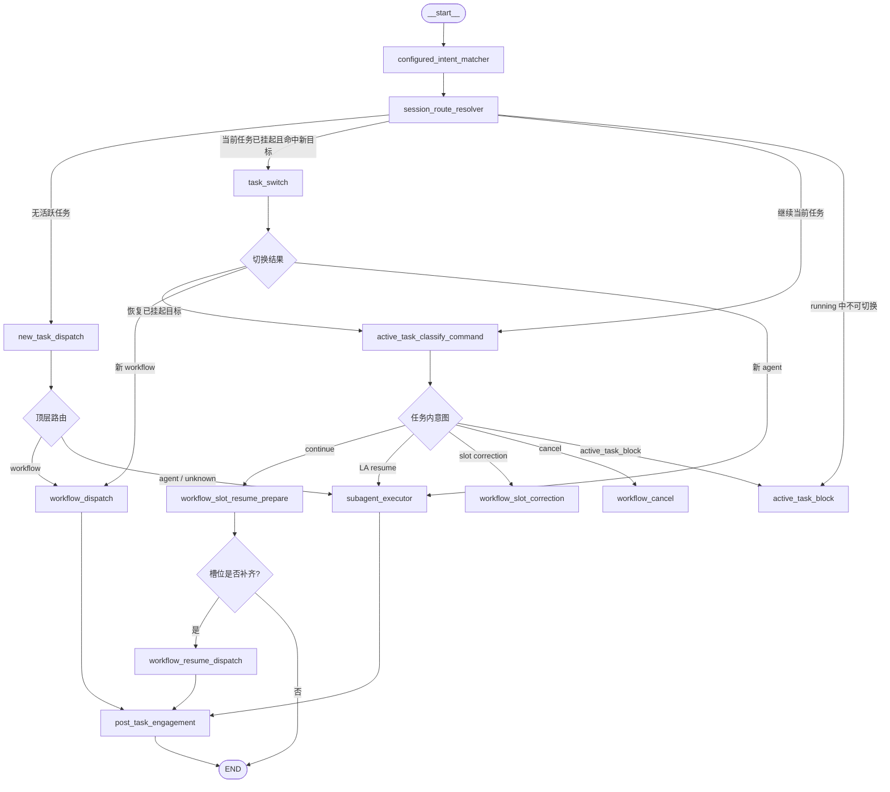
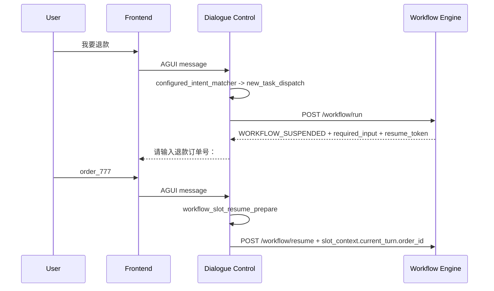
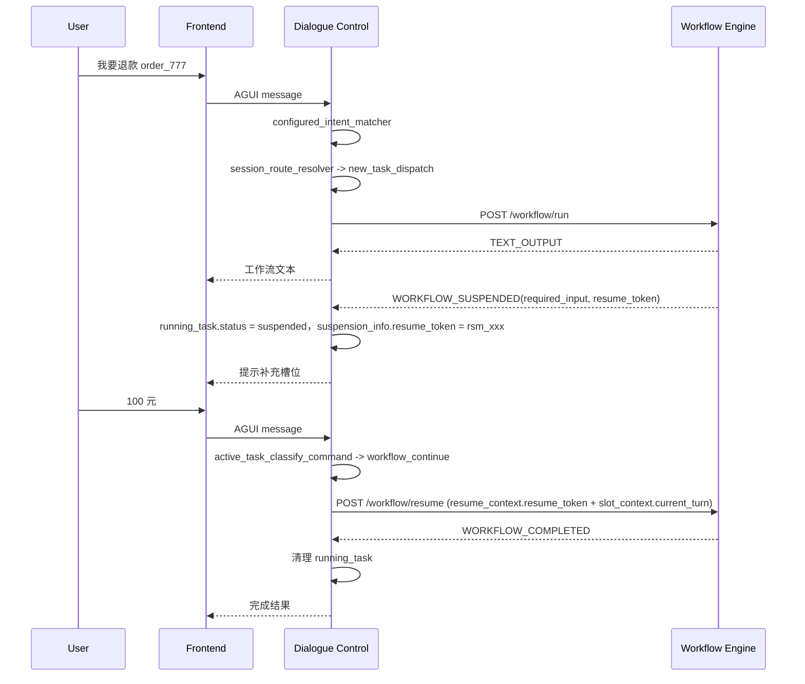
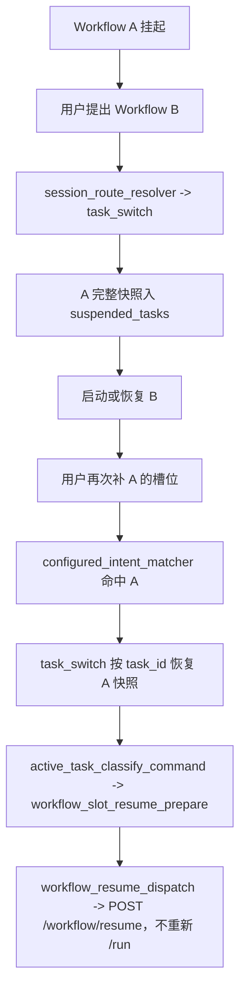

# 上下文模型与交互协议设计

**日期**：2026-07-06
**状态**：已依据 ARCH-06 更新
**适用范围**：当前实现与近期演进

---

## 1. 文档定位

本文是 `ARCH-01-模块架构与职责说明.md` 的详细设计补充，重点说明：

- DC、WE、LA 之间的上下文分层。
- 当前代码中的 `AgentState` 字段语义。
- DC LangGraph 的节点职责和路由规则。
- DC 与 WE、LA、Frontend 的交互协议。
- 挂起、恢复、切换、取消、槽位纠正等关键场景。

ARCH-01 负责回答"系统上层怎么拆、模块边界是什么"；本文负责回答"当前代码如何落地这些边界"。

**协议字段以 ARCH-06 为准。本文不再描述已废弃的旧字段。**

---

## 2. 三层上下文模型

系统上下文分为 L1、L2、L3 三层。

| 层级 | 名称 | 归属 | 当前载体 | 说明 |
|---|---|---|---|---|
| L1 | 全局会话上下文 | Dialogue Control | LangGraph `AgentState` + Redis Checkpointer | 用户会话级状态，DC 唯一写入 |
| L2 | 执行调用上下文 | 每次调用临时组装 | HTTP JSON 请求体 / SSE 事件 | DC 发给 WE/LA 的裁剪上下文 |
| L3 | 模块私有上下文 | WE / LA 各自维护 | WE Redis/内存快照、LA ReAct 状态 | 不直接进入 DC 会话，也不面向前端展示 |

核心原则：

- DC 是 L1 的唯一写入者。
- WE 和 LA 不直接读写 DC 的会话状态。
- DC 调用下游时只传 L2，不传完整 L1。
- WE 的节点输出、局部变量、执行日志属于 L3，不进入用户会话。
- LA 的 scratchpad、chain-of-thought、内部工具轨迹属于 L3，不进入用户会话。
- 只有用户可见文本、协议化工具消息、A2UI 可读摘要和安全 UI payload 才允许写入 `messages`。

---

## 3. L1：AgentState

当前 DC 的 L1 状态定义在 `dialogue-control/orchestrator/state.py`。它是 Graph 节点之间共享的会话状态。

### 3.1 字段总览

```python
class AgentState(dict):
    # 身份
    session_id: str
    user_id: str
    tenant_id: str
    request_id: Optional[str]
    channel_id: Optional[str]
    session_started_at: Optional[str]
    # 租户自定义业务上下文，平台只透传不解析
    business_context: Dict[str, Any]
    # 意图
    active_intent_id: Optional[str]
    active_agent_id: Optional[str]
    agent_version: Optional[str]
    intent_path: List[str]
    # 槽位
    global_slots: Dict[str, Any]
    submitted_slots: Dict[str, Any]
    # 任务管理
    pending_workflow: Optional[Dict[str, Any]]
    running_task: Optional[Dict[str, Any]]
    suspended_tasks: List[Dict[str, Any]]
    # 对话历史
    messages: Annotated[List[Any], add_messages]
    # 单轮路由辅助字段（每轮重置）
    matched_intent: Optional[Dict[str, Any]]
    session_route: str
    intent_classification: str
    slot_correction: Optional[Dict[str, Any]]
    workflow_resume_payload: Optional[Dict[str, Any]]
    task_completion: Optional[Dict[str, Any]]
    workflow_slot_resume_prepare_route: str
    trace_id: str
```

> **注意**：`AgentState` 中的 `global_slots`、`submitted_slots`、`pending_workflow`、`intent_path`、`intent_classification`、`slot_correction` 等字段是 DC 内部状态，不作为下游调用的外部协议字段。下游 LA/WE 通过标准 L2 上下文（`execution_context` / `conversation_context` / `business_context` / `slot_context`）获取所需数据。

### 3.2 关键字段语义

| 字段 | 语义 | 生命周期 |
|---|---|---|
| `messages` | 用户和 assistant/tool 的会话历史。WE `TEXT_OUTPUT`、A2UI 富摘要和 LA 最终回复会写入这里。 | 跨轮持久 |
| `global_slots` | DC 在会话中累计识别到的可复用槽位值。只有 Slot Registry 或 workflow slot schema 显式标记为 `is_global=true` 的槽位，才在任务完成/取消后继续保留；未标记的只在当前任务生命周期内使用。 | 跨轮持久，任务切换时随快照保存；任务结束时清理非 global 槽位 |
| `submitted_slots` | 已提交给 WE 的槽位快照，用于判断槽位纠正是否需要 cancel + restart。 | 当前任务相关，任务完成/取消后清理 |
| `pending_workflow` | 顶层路由阶段刚解析出的待启动 workflow。 | 单 turn 临时字段，`workflow_dispatch` 后清空 |
| `running_task` | 当前唯一活跃任务，可以是 workflow 或 agent。 | 任务运行/挂起期间存在 |
| `suspended_tasks` | 被 task switch 或任务恢复机制挂起的完整任务快照列表。 | 跨轮持久，恢复后移除对应快照 |
| `matched_intent` | `configured_intent_matcher` 每轮产出的配置意图事实。 | 单 turn 辅助字段 |
| `session_route` | `session_route_resolver` 决定的图分支。 | 单 turn 辅助字段 |
| `intent_classification` | Graph 条件边使用的路由分类。 | 单 turn 辅助字段 |
| `slot_correction` | 任务内分类识别出的槽位纠正信息。 | 单 turn 辅助字段，处理后清空 |
| `active_intent_id` | 当前任务关联的 DB Intent。 | 当前任务相关 |
| `active_agent_id` | 当前路由到的 SubAgent。 | 当前 Agent 或 Agent 绑定意图相关 |
| `intent_path` | 当前意图路径。 | 当前任务相关 |
| `trace_id` | 每轮生成的链路追踪 id。 | 单 turn 或一次下游调用链路 |

### 3.3 pending_workflow 与 running_task 的边界

`pending_workflow` 不是任务运行态，它只是"本轮已经决定要启动的 workflow"。

- 由 `new_task_dispatch` 或 `task_switch` 根据配置意图生成。
- 由 `workflow_dispatch` 转换为实际 WE `/workflow/run` 请求。
- 一旦 WE 开始执行、挂起或完成，`pending_workflow` 应清空。

`running_task` 才表示当前会话真实的活跃任务：

- WE 返回 `WORKFLOW_SUSPENDED` 时，DC 写入 `running_task.status = "suspended"`。
- WE 正在执行但未完成时，语义上是 `running`。
- LA 挂起时，DC 写入 `running_task.task_type = "agent"`、`triggered_by = "la"`。

因此二者不可合并：`pending_workflow` 是路由决策过程的短暂意图，`running_task` 是会话生命周期事实。

### 3.4 RunningTask

```python
{
  "task_type": "workflow" | "agent",
  "task_id": "refund_process",
  "workflow_name": "refund_process",
  "triggered_by": "dc" | "la",
  "status": "running" | "suspended" | "completed" | "cancelled",
  "tool_call_id": null,
  "tool_call_status": null,
  "tool_name": null,
  "agent_id": null,
  "idempotency_key": null,
  "task_version": null,
  "suspension_info": {}
}
```

当前 MVP 已使用的字段主要是：

- `task_type`
- `task_id`
- `workflow_name`
- `triggered_by`
- `status`
- `suspension_info`

`tool_call_id`、`tool_call_status`、`idempotency_key` 是为 LA tool call 生命周期和幂等治理预留的字段，当前链路尚未完整实现。

### 3.5 SuspensionInfo

```python
{
  "suspended_node": "refund_amount",
  "suspension_reason": "MISSING_PARAMETER",
  "required_input_schema": {
    "param_name": "refund_amount",
    "prompt": "请问需要退款多少金额？"
  },
  "resume_token": "rsm_9a87524dee594021",
  "human_task_id": null,
  "human_task": null
}
```

`resume_token` 是 WE 返回的协议级恢复令牌，由 `make_suspension_info` 写入。DC 只保存和原样回传，不读取、不解析、不修改内部快照细节。WE 内部的执行快照 key 属于 L3，对 DC 不可见。

### 3.6 SuspendedTask

`suspended_tasks` 保存的是完整任务快照，而不是单个 `running_task` 指针。

```python
{
  "running_task": {},
  "active_intent_id": "...",
  "active_agent_id": "...",
  "intent_path": [],
  "global_slots": {},
  "submitted_slots": {},
  "suspend_reason": "task_switch",
  "suspended_at": "..."
}
```

这样做的原因是：用户在多个挂起任务之间切换时，DC 必须恢复该任务对应的意图、槽位和 submitted snapshot，否则会出现"补槽时重新 start workflow"或"槽位纠正判断错误"的问题。

当前实现还会在按 `task_id` 恢复时清理重复快照，避免历史异常状态污染会话。

---

## 4. L2：模块调用上下文（标准协议）

DC 向下游传递的 L2 上下文统一包含以下四块对象：

```text
execution_context
conversation_context
business_context
slot_context
```

其中 `resume_context` 仅在 `/workflow/resume` 时出现。字段定义参见 ARCH-06。

### 4.1 DC → WE：启动工作流

接口：`POST /workflow/run`

```json
{
  "execution_context": {
    "tenant_id": "default",
    "user_id": "robbie",
    "session_id": "sess_001",
    "request_id": "req_001",
    "channel_id": "console_test",
    "trace_id": "trace_abc123",
    "workflow_id": "refund_process",
    "workflow_version": null,
    "triggered_by": "dc"
  },
  "conversation_context": {
    "history_messages": [
      {"role": "user", "content": "我要退款"}
    ],
    "current_message": "order_777",
    "session_started_at": "2026-07-06 16:21:12.185"
  },
  "business_context": {
    "customerLevel": "gold"
  },
  "slot_context": {
    "global": {},
    "current_turn": {
      "order_id": "order_777"
    }
  }
}
```

当前由 `workflow_dispatch` 和 `workflow_slot_correction` 的重启路径调用。DC 不做启动前提槽；workflow 参数缺失由 WE `slot` 节点挂起后再通过 `/workflow/resume` 补齐。

### 4.2 DC → WE：恢复工作流

接口：`POST /workflow/resume`

```json
{
  "execution_context": {
    "tenant_id": "default",
    "user_id": "robbie",
    "session_id": "sess_001",
    "request_id": "req_002",
    "channel_id": "console_test",
    "trace_id": "trace_abc123",
    "workflow_id": "refund_process",
    "workflow_version": null,
    "triggered_by": "dc"
  },
  "conversation_context": {
    "history_messages": [
      {"role": "user", "content": "我要退款"},
      {"role": "assistant", "content": "请问需要退款多少金额？"}
    ],
    "current_message": "100",
    "session_started_at": "2026-07-06 16:21:12.185"
  },
  "resume_context": {
    "resume_token": "rsm_9a87524dee594021"
  },
  "business_context": {
    "customerLevel": "gold"
  },
  "slot_context": {
    "global": {
      "order_id": "order_777"
    },
    "current_turn": {
      "refund_amount": "100"
    }
  }
}
```

`resume_token` 来自 `running_task.suspension_info.resume_token`（即 WE 在 `WORKFLOW_SUSPENDED` 事件中返回的令牌）。补充的槽位值放入 `slot_context.current_turn`，由 `workflow_slot_resume_prepare` 抽取后由 `workflow_resume_dispatch` 调用。

### 4.3 DC → WE：取消工作流

接口：`POST /workflow/cancel`

```json
{
  "session_id": "sess_001",
  "workflow_id": "refund_process",
  "tenant_id": "default",
  "trace_id": "trace_abc123"
}
```

当前由 `workflow_cancel` 和 `workflow_slot_correction` 的 cancel + restart 路径调用。

### 4.4 WE → DC：SSE 业务事件

WE 通过 SSE 返回三类业务事件。

#### TEXT_OUTPUT

```json
{
  "event": "TEXT_OUTPUT",
  "workflow_id": "refund_process",
  "trace_id": "trace_abc123",
  "message_id": "wf_msg_xxx",
  "text": "开始执行退款工作流..."
}
```

DC 处理方式：

- 转发为前端 `workflow_log token`。
- 写入 `messages`，成为用户可见 `AIMessage`。
- 同时发一条 `workflow_log api_response` 供调试面板展示。

#### WORKFLOW_SUSPENDED

```json
{
  "event": "WORKFLOW_SUSPENDED",
  "workflow_id": "refund_process",
  "trace_id": "trace_abc123",
  "message_id": "wf_msg_xxx",
  "suspension_type": "SLOT_MISSING",
  "required_input": {
    "param_name": "refund_amount",
    "prompt": "请问需要退款多少金额？",
    "param_type": "string",
    "description": "退款金额",
    "missing_prompt": "请问需要退款多少金额？"
  },
  "resume_token": "rsm_9a87524dee594021"
}
```

DC 处理方式：

- 将 `required_input.prompt` 转为用户可见消息。
- 写入 `running_task.status = "suspended"`。
- 将 `resume_token` 放入 `suspension_info.resume_token`。
- 继续保持当前任务为活跃任务，等待用户补槽或取消。

#### WORKFLOW_COMPLETED

```json
{
  "event": "WORKFLOW_COMPLETED",
  "workflow_id": "refund_process",
  "trace_id": "trace_abc123",
  "message_id": "wf_msg_xxx",
  "summary_text": "退款申请已完成。",
  "final_outputs": {}
}
```

DC 处理方式：

- 将 `summary_text` 写入用户消息。
- 清理当前 `running_task`。
- 如果 `suspended_tasks` 非空，恢复上一个挂起任务并追加用户可见提示。
- 如果无挂起任务，则清空 `active_intent_id`、`active_agent_id`、`intent_path`、`submitted_slots`。

### 4.5 DC → LA：Agent 执行请求

接口：`POST /agent/run`

DC 通过 `build_agent_request`（位于 `context_builders.py`）组装请求：

```json
{
  "execution_context": {
    "session_id": "sess_001",
    "user_id": "robbie",
    "agent_id": "general_qa_agent",
    "agent_version": null,
    "request_id": "req_001",
    "channel_id": "console_test",
    "trace_id": "trace_abc123",
    "tenant_id": "default"
  },
  "conversation_context": {
    "history_messages": [],
    "current_message": "用户当前输入",
    "session_started_at": "2026-07-06 16:21:12.185"
  },
  "business_context": {},
  "slot_context": {
    "global": {},
    "current_turn": {}
  }
}
```

LA 自己按 `tenant_id + agent_id` 加载 SubAgent 配置和工具配置，DC 不传工具目录。

### 4.6 LA → DC：SSE 事件

LA 当前通过 SSE 返回以下事件类型：

- `start`
- `token`
- `tool_call`
- `api_call`
- `api_response`
- `a2ui_event`
- `end`

DC 处理方式：

- 原样转发为前端 `subagent_log`。
- `token` 累加为用户可见文本。
- `execution_context.finish_reason = "suspended"` 时，写入 `running_task.task_type = "agent"`。
- `finish_reason = "stop"` 时，清理当前任务或恢复 `suspended_tasks` 中的上一个任务。
- LA 输出的 assistant/tool 消息经过协议化后写回 L1 `messages`。

---

## 5. DC LangGraph 当前设计

### 5.1 总图



### 5.2 节点职责

| 节点 | 当前职责 |
|---|---|
| `configured_intent_matcher` | 每轮入口，使用近 `DC_CONTEXT_TURNS` 轮 User/Assistant 上下文匹配 DB 中配置意图，写入 `matched_intent`。 |
| `session_route_resolver` | 结合 `matched_intent` 与 `running_task` 状态，决定进入顶层路由、任务内分类、task switch 或 active_task_block。 |
| `new_task_dispatch` | 无活跃任务时把配置意图解析为 workflow / agent 路由；未绑定 workflow 的业务诉求转 LA 兜底。 |
| `task_switch` | 当前任务已挂起时切换目标；若目标已在 `suspended_tasks` 中，恢复其完整快照并继续任务内分类。 |
| `active_task_classify_command` | 当前任务内识别继续、取消、槽位纠正、跑题、阻塞；LA 引导任务直接回 LA。 |
| `workflow_dispatch` | 调用 WE `/workflow/run` 并消费 SSE，维护 `messages`、`running_task`、`submitted_slots`。 |
| `workflow_slot_resume_prepare` | DC 收集挂起 workflow 正在等待的槽位；只抽取、校验并准备执行请求。 |
| `workflow_resume_dispatch` | 调用 WE `/workflow/resume` 恢复已挂起 workflow。 |
| `workflow_slot_correction` | 处理槽位纠正；已提交槽位执行 cancel + restart，未提交槽位只更新本地状态。 |
| `workflow_cancel` | 调用 WE `/workflow/cancel`，清理当前任务并恢复挂起任务。 |
| `subagent_executor` | 构造 LA 请求、调用 `/agent/run`、转发 LA 事件并写回消息。 |
| `post_task_engagement` | workflow/subagent 完成后的统一后处理节点，基于配置与 LLM 判断调用营销 Agent。 |
| `active_task_block` | 当前 workflow running 中无法安全处理新输入时提示等待或取消。 |

### 5.3 路由规则

#### session_route_resolver

```text
running_task 不存在或状态不是 running/suspended
  -> new_task_dispatch

存在 running_task，且 matched_intent.binding_id 与 running_task.task_id 不同
  running_task.status == suspended -> task_switch
  running_task.status == running   -> active_task_block

其他情况
  -> active_task_classify_command
```

#### new_task_dispatch

```text
matched_intent.binding_type == workflow 且有 binding_id
  -> workflow_trigger -> workflow_dispatch

matched_intent.binding_type == agent
  -> subagent_routing -> subagent_executor

没有命中配置意图
  -> LLM fallback 判断 workflow / agent / unknown
  -> 当前无具体 workflow 绑定时统一转 LA 兜底，不启动 wf_unknown
```

#### task_switch

```text
1. 当前任务快照进入 suspended_tasks。
2. 如果目标 task_id 已存在于 suspended_tasks：
     恢复目标快照 -> active_task_classify_command。
3. 如果目标是新 workflow：
     设置 pending_workflow -> workflow_dispatch。
4. 如果目标是 agent：
     设置 active_agent_id -> subagent_executor。
```

#### workflow_dispatch

```text
读取 pending_workflow.workflow_id
  -> 组装 execution_context / conversation_context / business_context / slot_context
  -> POST /workflow/run
  -> 消费 WE SSE 事件
```

工作流参数是否缺失由 WE 的 `slot` 节点判断。WE 返回 `WORKFLOW_SUSPENDED` 后，DC 再进入 `workflow_slot_resume_prepare` 做补槽和 `/workflow/resume`。

槽位作用域由配置显式声明：

- `is_global = true`：Session global 槽位，适合用户身份、手机号、常用地址、偏好等跨任务复用信息；任务完成或取消后继续保留。
- `is_global = false` 或未配置：Workflow/Agent 局部槽位，适合订单号、退款金额、确认语等本次任务输入；任务完成或取消后清理。

#### active_task_classify_command

```text
running_task.triggered_by == la
  -> subagent_session_resume

否则用近 N 轮 User/Assistant 上下文识别：
  CANCEL       -> workflow_cancel
  SLOT_CORRECT -> 先校验槽位是否已有旧值；有旧值才进入 workflow_slot_correction，否则降级为 workflow_continue
  CONTINUE     -> suspended 时 workflow_slot_resume_prepare -> workflow_resume_dispatch；running 时 active_task_block
```

---

## 6. 上下文窗口规则

当前 DC 分类相关节点使用 `_recent_dialogue_context` 构造上下文。

规则：

- 只保留 `HumanMessage` 和 `AIMessage`。
- 默认取最近 `DC_CONTEXT_TURNS` 个用户回合，当前默认 4。
- `ToolMessage` 默认不进入分类上下文，避免工具 payload 重复、冗长或污染意图判断。
- 每条消息会做最大字符截断，防止 prompt 过长。

使用位置：

- `configured_intent_matcher`
- `new_task_dispatch` fallback
- `active_task_classify_command`
- `workflow_slot_resume_prepare` 挂起补槽抽取
- `active_task_classify_command` 的取消、纠正、继续、跑题判断

---

## 7. 调试事件与用户事件

当前前端聊天测试页同时展示三类运行时事件：

| 事件名 | 生产方 | 用途 |
|---|---|---|
| `dc_log` | DC Graph nodes | 展示 DC 节点输入、输出、summary |
| `workflow_log` | DC 的 WE event adapter | 展示 workflow start/token/tool/api/end |
| `subagent_log` | LA 或 DC 转发 | 展示 Agent start/token/tool/api/end |

当前 DC 已对 `dc_log` 做调试序列化：

- LangChain Message 会转为普通 JSON。
- dict/list 使用路径级循环检测，避免调试面板出现真实递归。
- `dc_log` 是开发/管理调试事件，不等同于普通用户业务事件。

后续建议将事件分为：

- 用户业务事件：普通用户可见。
- 管理员观察事件：节点名、耗时、状态、摘要。
- 开发调试事件：原始 payload、trace、错误堆栈，仅开发环境开启。

---

## 8. 关键场景

### 8.1 DC 触发 Workflow 并由 WE 挂起补槽



DC 不再读取 start 节点输入配置做启动前提槽。参数缺失由 WE `slot` 节点挂起，DC 只负责解释 `required_input`、抽取用户补充值并调用 `/workflow/resume`。

### 8.2 DC 触发 Workflow 并在流程中间挂起补槽



### 8.3 槽位纠正

槽位纠正有两条路径：

| 情况 | 判断依据 | 处理 |
|---|---|---|
| 模型误判纠正但槽位无旧值 | `slot_name not in global_slots and slot_name not in submitted_slots` | 降级为 `workflow_continue`，按补槽处理 |
| 未提交给 WE | `slot_name not in submitted_slots` | 只更新 `global_slots`，提示用户已更正 |
| 已提交给 WE | `slot_name in submitted_slots` | 先 `/workflow/cancel`，再带新 `global_slots` `/workflow/run` 重启 |

已提交槽位重启时，DC 会给用户一条明确可见提示：

```text
检测到您将已提交的信息「xxx」改为「yyy」，我已取消当前 [workflow]，并使用新信息重新启动。
```

### 8.4 挂起任务之间切换



这个设计解决了早期问题：用户从 workflow 切到 agent，再回来补 workflow 槽位时，系统不能重新 start 一个新 workflow，而应恢复旧快照并 resume。

### 8.5 用户取消任务

```text
用户输入取消
  -> active_task_classify_command 识别 CANCEL
  -> workflow_cancel
  -> POST /workflow/cancel
  -> 清理 running_task 和 submitted_slots
  -> 如果 suspended_tasks 非空，恢复上一个挂起任务
  -> 给用户可见提示
```

### 8.6 LA 触发或恢复 Workflow

当前原则：槽位收集权跟随触发方。

| 触发方 | 槽位收集者 | DC 角色 |
|---|---|---|
| DC 直接触发 Workflow | DC | 负责问槽、resume、状态更新 |
| LA 通过工具触发 Workflow | LA | DC 维护会话级 `running_task`，用户补充时路由回 LA |

当前代码中，`running_task.triggered_by == "la"` 时，`active_task_classify_command` 直接输出 `subagent_session_resume`，后续进入 `subagent_executor`。

---

## 9. 当前 MVP 与目标设计差异

| 领域 | 当前 MVP | 目标设计 |
|---|---|---|
| Slot Extraction | 已接入 LLM 抽取初版；WE slot 挂起后由 DC/LA 按触发方抽取补槽；schema 来自 workflow slot 节点或 Slot Registry | 完整 Slot Registry、schema 版本、严格校验和发布契约 |
| Workflow Engine | Python FastAPI 配置化 DAG 执行器；从 MySQL 读取 published workflow | 可继续生产化或替换实现，但保持 HTTP/SSE 协议兼容 |
| WE 节点类型 | 已支持 start / slot / message / python / api / condition / end | 继续补齐 Human / LLM / 子流程 / 并行网关等节点 |
| LA tool call 幂等 | 字段预留，链路未完整闭环 | `idempotency_key` 全链路去重 |
| Human Feedback | 协议字段预留 | 管理端任务协议和审批 API |
| 观测事件 | 调试事件与业务事件共用前端流 | 按用户/管理员/开发环境隔离 |
| 安全治理 | MVP 基础 | 鉴权、租户隔离、密钥管理、审计 |

---

## 10. 设计原则总结

| 原则 | 说明 |
|---|---|
| DC 是 L1 唯一写入者 | 全局会话状态只能由 DC 更新 |
| pending 不等于 running | `pending_workflow` 是本轮待启动意图，`running_task` 是真实活跃任务 |
| 快照完整保存 | `suspended_tasks` 必须保存任务、意图和槽位上下文 |
| 不伪造挂起 | workflow running 时不能在 DC 本地强行挂起切换 |
| 槽位收集权跟随触发方 | DC 触发 DC 收集，LA 触发 LA 收集 |
| WE 快照不透明 | DC 只保存和回传 `resume_token`，不感知内部快照 key |
| ToolMessage 默认不进分类上下文 | 分类只看用户可见对话，减少噪音 |
| 用户可见输出进历史 | WE `TEXT_OUTPUT`、A2UI 可读摘要和 LA 最终回复写入 `messages` |
| 调试事件不等于业务协议 | `dc_log` 等只用于开发/管理观察 |
| LA 自主加载工具配置 | DC 不向 LA 传递工具目录；LA 自己按 `tenant_id + agent_id` 加载 |
