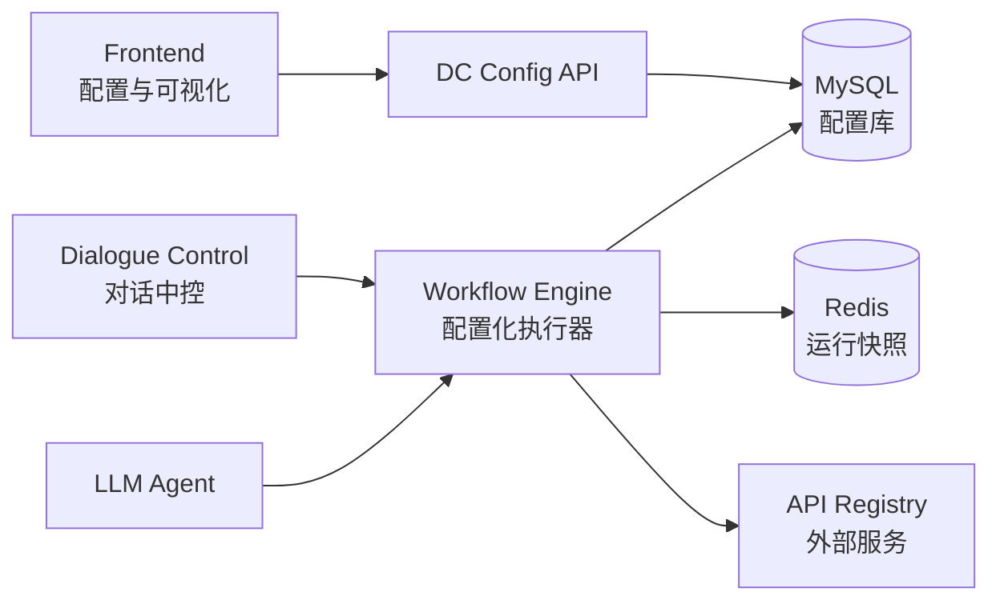
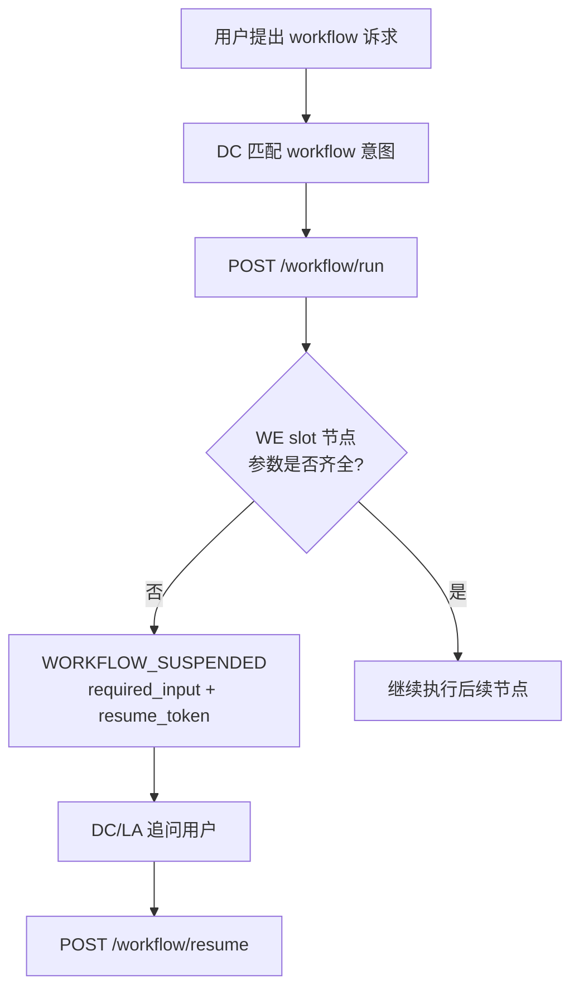
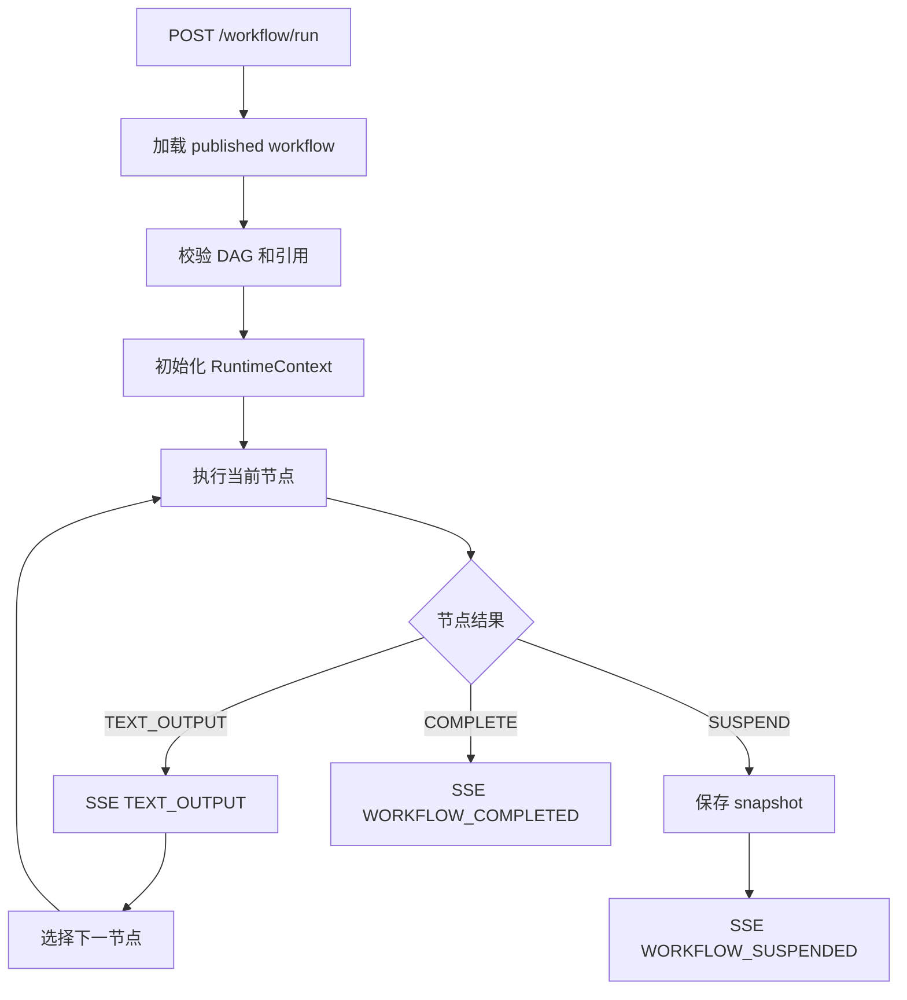
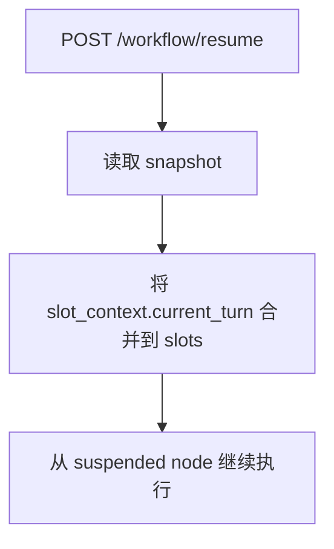

# ARCH-03 Workflow 配置化执行与可视化 MVP 设计

**日期**：2026-07-06
**状态**：已依据 ARCH-06 更新

当前 Workflow Engine 已从 Python 代码硬编码业务流程升级为配置化 DAG 执行器。WE 运行时从 MySQL 加载已发布 workflow，按节点和连线执行，并继续通过 `run/resume/cancel` 与 HTTP/SSE 协议对接 DC/LA。

本阶段不追求生产级工作流平台，但新增业务流程应进入 Workflow 配置库，不应再写死在 Workflow Engine 代码中。

## 2. 目标

MVP 必须具备：

1. Workflow 定义来自数据库，WE 按发布后的节点和连线执行。
2. 节点拥有显式输出项，后续节点可以通过引用读取。
3. 至少支持 `start`、`slot`、`message`、`python`、`api`、`condition`、`end` 节点。
4. Slot 缺失时 WE 保存运行快照并返回 `WORKFLOW_SUSPENDED`。
5. 用户补槽后 `/workflow/resume` 从快照恢复，不重新开始。
6. Workflow 参数缺失由 `slot` 节点负责挂起，DC/LA 只根据 WE 的 `required_input` 做补槽恢复。
7. 前端可以查看和编辑 workflow、节点、节点输出和关键 properties，并支持在画布上创建基础连线。
8. DC 继续保持中控职责，不解析 DAG 执行逻辑，也不读取 start 输入 schema；只调用 WE 协议并消费 WE 事件。

暂不纳入：

1. 并行网关、循环、子流程。
2. 任意第三方依赖的 Python 脚本执行。
3. 完整人工审批任务中心。
4. 版本回滚、灰度发布。

## 3. 模块边界



| 模块 | 职责 |
|---|---|
| Frontend | Workflow/Slot/API 配置，可视化展示节点和关系线，编辑节点属性与输出项，并创建基础连线。 |
| DC Config API | 统一维护配置资产，包括 workflow、node、edge、slot、api。 |
| Dialogue Control | 会话路由、slot 预提取、任务切换、调用 WE `run/resume/cancel`。 |
| Workflow Engine | 加载已发布 workflow，执行 DAG，管理快照，输出 SSE 事件。 |
| MySQL | 配置事实源。 |
| Redis | 运行态快照，不作为配置源。 |

## 4. Workflow 数据结构

现有表继续使用：

- `workflows`
- `workflow_nodes`
- `workflow_edges`
- `slots`
- `apis`

MVP 以 `workflow_nodes.properties` 承载节点配置，避免过早拆分多张节点类型表。

### 4.1 Workflow

```json
{
  "id": "refund_process",
  "name": "商品退款工作流",
  "description": "用户申请退款",
  "status": "draft | published"
}
```

### 4.2 WorkflowNode

```json
{
  "node_key": "query_order",
  "type": "api",
  "properties": {
    "label": "查询订单",
    "outputs": [
      {
        "name": "order",
        "type": "object",
        "description": "订单详情"
      }
    ]
  }
}
```

节点输出统一写入：

```text
nodes.<node_key>.<output_name>
```

例如：

```text
{{nodes.query_order.order.pay_amount}}
```

### 4.3 WorkflowEdge

```json
{
  "source_node_key": "check_amount",
  "target_node_key": "submit_refund",
  "condition_expression": "true"
}
```

普通节点通常只有一条出边。`condition` 节点可以有多条出边，按 `condition_expression` 从上到下匹配，支持 `default`。

## 5. 节点类型

### 5.1 start

入口节点，不产生业务输出，也不声明启动前输入。Workflow 参数缺失统一由后续 `slot` 节点判断并挂起。

### 5.2 slot

检查指定 slot 是否存在。不存在则由 WE 保存快照并返回 `WORKFLOW_SUSPENDED`。

```json
{
  "slot_name": "order_id",
  "required": true,
  "prompt": "请输入退款订单号：",
  "is_global": false,
  "outputs": [
    {
      "name": "value",
      "type": "string",
      "description": "用户提供的订单号"
    }
  ]
}
```

执行结果：

```text
slots.order_id = "order_777"
nodes.order_id.value = "order_777"
```

### 5.3 message

向用户输出文本，支持模板引用。

```json
{
  "template": "已识别订单号 {{slots.order_id}}，正在查询订单详情...",
  "outputs": [
    {
      "name": "text",
      "type": "string",
      "description": "已发送文本"
    }
  ]
}
```

### 5.4 python

受限 Python 节点，用于轻量数据转换、计算、拼装输出。节点必须通过 `outputs` 字典返回结果。

```json
{
  "code": "amount = float(slots.get('refund_amount', 0))\norder = nodes.get('query_order', {}).get('order', {})\noutputs = {'valid': amount <= float(order.get('pay_amount', 0)), 'amount': amount}",
  "outputs": [
    {
      "name": "valid",
      "type": "boolean",
      "description": "退款金额是否合法"
    },
    {
      "name": "amount",
      "type": "number",
      "description": "标准化退款金额"
    }
  ]
}
```

MVP 安全约束：

1. 不允许 `import`、`open`、`eval`、`exec`、`compile`。
2. 只提供有限 builtins：`str`、`int`、`float`、`bool`、`len`、`min`、`max`、`sum`、`round`、`dict`、`list`。
3. Python 节点只适合轻量计算，不适合调用外部系统。

### 5.5 api

引用 API Registry 中的 API，并把响应映射到节点输出。

```json
{
  "api_id": "query_order",
  "input_mapping": {
    "order_id": "{{slots.order_id}}"
  },
  "output_mapping": {
    "order": "$"
  },
  "outputs": [
    {
      "name": "order",
      "type": "object",
      "description": "订单详情"
    }
  ]
}
```

### 5.6 condition

根据表达式选择下一条边。

```json
{
  "expression": "nodes.check_amount.valid == true"
}
```

### 5.7 end

结束 workflow，输出完成事件。

```json
{
  "summary_template": "退款申请已提交，订单 {{slots.order_id}}，金额 {{nodes.check_amount.amount}} 元。",
  "final_outputs": {
    "order_id": "{{slots.order_id}}",
    "amount": "{{nodes.check_amount.amount}}"
  }
}
```

## 6. 引用规则

模板语法：

```text
{{slots.order_id}}
{{nodes.query_order.order.pay_amount}}
{{context.some_key}}
```

引用缺失时返回空字符串，不中断 message/end；在 python/condition 中引用缺失则按 Python 表达式结果处理。

## 7. 运行态快照

Redis 保存：

```json
{
  "session_id": "session_1",
  "workflow_id": "refund_process",
  "workflow_status": "suspended",
  "current_node_key": "refund_amount",
  "slots": {
    "order_id": "order_777"
  },
  "context": {},
  "nodes": {
    "query_order": {
      "order": {
        "pay_amount": 299
      }
    }
  },
  "visited_nodes": ["start", "order_id", "query_order"]
}
```

WE 内部快照使用 Redis key 格式：

```text
wf:ctx:<session_id>:<workflow_id>:<node_key>
```

这个内部 key 属于 WE L3 私有实现细节，DC 不感知。对外协议側，WE 在 `WORKFLOW_SUSPENDED` 事件中返回 `resume_token`（格式如 `rsm_xxx`），DC 只保存和原样回传给 `/workflow/resume`。

## 8. 执行流程

### 8.1 启动与挂起恢复



参数校验和缺槽挂起属于 WE 执行职责。DC 不读取 start 输入配置，只消费 WE 返回的 `required_input` 并在用户补槽后调用 `/workflow/resume`。

### 8.2 WE 执行与挂起





## 9. 前端可视化 MVP

前端使用 React Flow 实现 workflow 画布，交互形态参考 Dify 等编排框架：左侧选择 workflow，中间是可拖拽节点画布，点击节点后从右侧弹出编辑抽屉查看和修改配置。整体视觉跟随项目主题变量，支持暗色与明亮两套主题。

```text
左侧：Workflow 列表
中间：React Flow 画布，展示节点类型、slot 配置、输出项、缩略图和缩放控制
右侧：点击节点后弹出的节点属性编辑 Drawer，可查看和编辑 slot_name、prompt、outputs、properties JSON
弹层：节点属性编辑 Drawer、Workflow 新建 Modal
```

当前不提供独立的连线配置面板；基础连线可以通过画布拖拽创建，复杂条件表达式和删除能力后续可在边抽屉或独立边管理中补齐。

必要能力：

1. 新建/编辑/删除 workflow。
2. 新建/编辑/删除节点。
3. 配置节点类型、properties、outputs。
4. 拖拽节点并保存 `position`。
5. 从节点 handle 连线创建 workflow edge。
6. 发布前校验。
7. 查看并复制节点输出引用。

节点位置通过 API 的 `position` 字段暴露给前端，后端落库到 `workflow_nodes.properties.ui.position`，避免为了 MVP 强行迁移表结构。后续若画布能力稳定，可以再把 position、尺寸、折叠状态等 UI metadata 拆成独立字段或独立表。

## 10. 验收标准

1. 不修改 `workflow-engine` 业务代码，仅改 DB 配置，可以改变 workflow 文案、slot、Python 计算逻辑和 API 引用。
2. `refund_process` 通过配置执行，缺槽会挂起，补槽会 resume。
3. Python 节点能输出 `valid/amount`，后续 condition/end 能引用。
4. 前端能展示节点、slot 配置和输出项，并能编辑节点 properties JSON。
5. DC 的 `workflow_slot_resume_prepare` 能基于挂起节点的 required input 做补槽。
