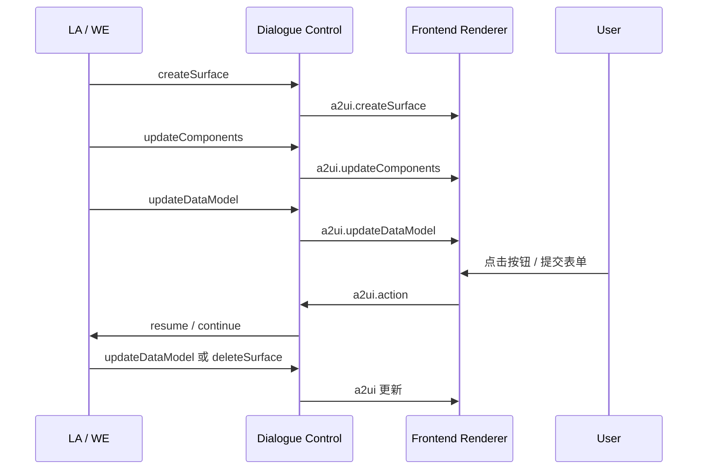
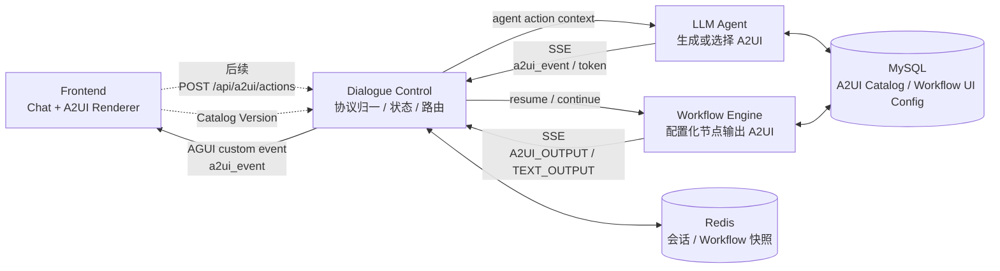
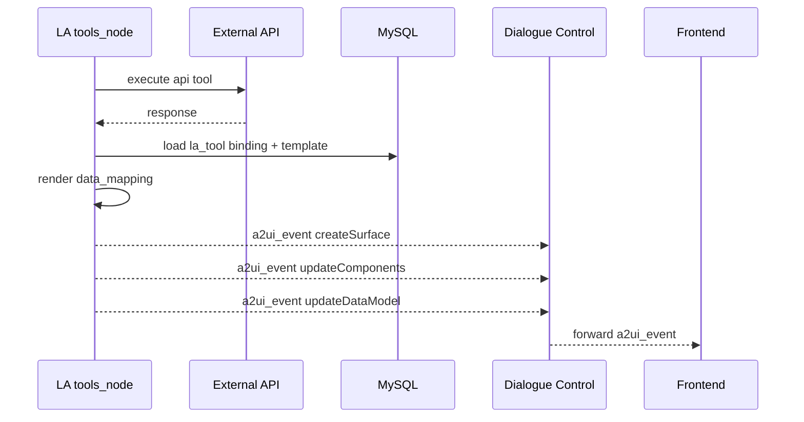

# ARCH-04 A2UI 富交互输出协议设计

**日期**：2026-06-29
**状态**：MVP 已落地，持续演进
**适用范围**：在现有 DC / LA / WE / Frontend 架构中引入统一 UI ViewModel 输出能力

---

## 1. 背景

当前系统的对话输出主要是文本：

- WE 通过 `TEXT_OUTPUT`、`WORKFLOW_SUSPENDED`、`WORKFLOW_COMPLETED` 输出文本和少量结构化结果。
- LA 通过 `token`、`tool_call`、`api_response`、`end` 输出文本和调试事件。
- DC 负责把 WE / LA 的文本和 A2UI 可读摘要写入 `messages`，并转发给前端。
- Frontend 当前只渲染聊天气泡和调试面板，不渲染业务 UI。

下一阶段希望让 Agent 和 Workflow 不只输出文本，还能输出可交互 UI，比如：

- 订单详情卡片。
- 退款金额确认表单。
- 多方案对比卡片。
- 审批确认面板。
- 数据列表、指标、图表、后续操作按钮。

这类能力不能让 LLM 直接输出 HTML / JS / React 代码。更合理的方式是引入声明式 UI 协议：下游模块只输出结构化 UI ViewModel，端侧基于可信组件目录渲染。

本方案重点参考 [a2ui-project/a2ui](https://github.com/a2ui-project/a2ui)。

---

## 2. A2UI 调研结论

### 2.1 A2UI 的核心定位

A2UI 是 Agent-to-User Interface 协议与库集合。它的核心目标是让 agent 能够“说 UI”：agent 输出声明式 JSON，客户端用自己的原生组件库渲染。

它强调几个设计点：

| 设计点 | 含义 | 对本项目的启发 |
|---|---|---|
| 声明式 JSON | Agent 输出的是数据，不是可执行代码。 | LA/WE 输出 UI ViewModel，前端只渲染白名单组件。 |
| 组件目录 Catalog | 客户端维护可信组件目录。 | 需要定义本项目自己的基础业务组件目录。 |
| Surface | UI 不是单条文本，而是可创建、更新、删除的 UI 区域。 | 每个 assistant 消息可承载一个或多个 UI surface。 |
| Components + DataModel 分离 | UI 结构和业务数据分开更新。 | WE 可先发骨架，再发订单详情、金额校验结果等数据。 |
| 流式增量更新 | 服务端连续发送 JSON envelope，客户端渐进式渲染。 | 适配现有 HTTP/SSE 链路。 |
| Action 回传 | 用户点击按钮或提交表单后，通过独立 action 通道回传。 | 前端 action 必须回到 DC，由 DC 决定恢复 workflow 或继续 LA。 |
| Transport Agnostic | A2UI 不绑定传输，可走 A2A、AG-UI、SSE、WebSocket 等。 | 当前 MVP 可以复用已有 SSE，不必一次性替换传输层。 |

### 2.2 A2UI v0.9 的协议骨架

A2UI v0.9 的 server-to-client envelope 主要有四类：

| Envelope | 作用 |
|---|---|
| `createSurface` | 创建一个 UI surface。 |
| `updateComponents` | 添加或更新某个 surface 的组件定义。 |
| `updateDataModel` | 更新某个 surface 的数据模型。 |
| `deleteSurface` | 删除某个 surface。 |

一个典型流是：



### 2.3 和本项目已有协议的关系

当前项目已经有三类流：

- `dc_log`：DC 调试事件。
- `workflow_log`：WE 事件经 DC 适配后给前端。
- `subagent_log`：LA 事件经 DC 转发给前端。

A2UI 不应塞进调试日志，也不应伪装成文本 token。它应该成为新的用户可见业务事件：

```text
a2ui_event
```

这样可以保持三层输出清晰：

| 类型 | 是否用户可见 | 用途 |
|---|---|---|
| `token` / `TEXT_OUTPUT` | 是 | 文本气泡 |
| `a2ui_event` | 是 | 富交互 UI |
| `dc_log` / `workflow_log` / `subagent_log` 中的调试事件 | 管理端可见 | 链路观察 |

---

## 3. 设计目标

### 3.1 MVP 目标

1. LA 和 WE 都能输出统一格式的 A2UI ViewModel。
2. DC 不关心 UI 业务细节，只做协议校验、归一化、转发和会话审计。
3. Frontend 能在聊天消息中渲染 A2UI surface。
4. 用户在 UI 上触发 action 后，统一回到 DC。
5. Workflow 挂起补槽可以从纯文本追问升级为表单式 UI。
6. 保持文本协议兼容：不支持 A2UI 的端侧仍可降级展示 `fallback_text`。

### 3.2 非目标

1. 不允许 LA 输出 HTML、JS、CSS、React 代码。
2. 不让前端根据任意远程组件名动态 import 代码。
3. 不在第一阶段实现复杂布局系统、图表 DSL、跨端完整一致性。
4. 不把 A2UI action 绕过 DC 直接发给 LA 或 WE。
5. 不在第一阶段替换 CopilotKit / AGUI 入口。

---

## 4. 总体架构



### 4.1 模块新增职责

| 模块 | 新增职责 |
|---|---|
| LA | API 工具执行成功后按 `a2ui_bindings` 选择模板、映射工具结果并输出 `a2ui_event`；同时透传 LA 触发 workflow 后 WE 产生的 A2UI，并把可读摘要写回上下文。 |
| WE | `slot` / `message` / `end` 节点按 `a2ui_bindings` 生成 `A2UI_OUTPUT`，并附带 `visible_text` 供 DC/LA 写入 `messages`。 |
| DC | 维护 A2UI 模板和绑定配置 API；接收 LA/WE 的 A2UI 事件并转发前端；保存配置时将页面内联配置同步到 `a2ui_bindings`。 |
| Frontend | 维护轻量 `hybrid-basic@v1` renderer；聊天消息优先渲染 A2UI surface，文本作为 fallback；配置页显式选择模板和编辑数据映射。 |
| Config DB | 当前已落地 `a2ui_templates`、`a2ui_bindings` 两张表，作为 LA 工具和 WE 节点的统一 UI 配置源。 |

---

## 5. 协议设计

### 5.1 项目内统一事件：A2UIEnvelope

建议不要直接裸转 A2UI 原始 envelope，而是在外层包一层项目元信息。

```json
{
  "event": "A2UI_OUTPUT",
  "trace_id": "trace_xxx",
  "session_id": "session_xxx",
  "message_id": "msg_xxx",
  "producer": {
    "module": "workflow",
    "id": "refund_process",
    "node_key": "refund_confirm"
  },
  "a2ui": {
    "version": "v0.9",
    "createSurface": {
      "surfaceId": "wf_refund_confirm_1",
      "catalogId": "hybrid-basic@v1",
      "title": "退款确认"
    }
  },
  "fallback_text": "请确认退款信息。",
  "visible_text": "退款确认\n请确认退款信息。\n..."
}
```

DC 对前端转发时使用统一 custom event：

```json
{
  "type": "a2ui_event",
  "message_id": "msg_xxx",
  "surface_id": "wf_refund_confirm_1",
  "producer": {
    "module": "workflow",
    "id": "refund_process",
    "node_key": "refund_confirm"
  },
  "a2ui": {}
}
```

### 5.2 A2UI 原始 envelope 约束

内部 `a2ui` 字段保持 A2UI 风格，只允许四种 envelope：

```json
{
  "version": "v0.9",
  "createSurface": {}
}
```

```json
{
  "version": "v0.9",
  "updateComponents": {}
}
```

```json
{
  "version": "v0.9",
  "updateDataModel": {}
}
```

```json
{
  "version": "v0.9",
  "deleteSurface": {}
}
```

### 5.3 Surface 标识规范

`surfaceId` 必须全局可追踪，建议规则：

```text
<scope>_<producer>_<business_id>_<short_id>
```

示例：

```text
chat_wf_refund_confirm_ab12
chat_la_product_compare_3fa9
debug_wf_order_detail_d771
```

字段含义：

| 字段 | 说明 |
|---|---|
| `scope` | `chat`、`drawer`、`debug` 等端侧区域。 |
| `producer` | `wf` 或 `la`。 |
| `business_id` | workflow id、agent id、业务卡片类型。 |
| `short_id` | 防冲突短 id。 |

### 5.4 Component Catalog

第一阶段不直接开放 A2UI Basic Catalog 的全部组件，而是定义项目自己的 `hybrid-basic@v1`。

推荐 MVP 组件：

| 组件 | 用途 |
|---|---|
| `Card` | 业务卡片容器。 |
| `Text` | 标题、说明、正文。 |
| `KeyValueList` | 订单详情、账单详情、参数摘要。 |
| `Alert` | 风险提示、错误提示、成功提示。 |
| `Divider` | 简单分隔。 |
| `Form` | 表单容器。 |
| `TextField` | 文本输入。 |
| `NumberField` | 数值输入。 |
| `Select` | 单选。 |
| `RadioGroup` | 少量选项。 |
| `Button` | 触发 action。 |
| `ButtonGroup` | 确认 / 取消 / 修改。 |
| `Table` | 简单列表。 |
| `StatusSteps` | 流程状态展示。 |

暂不开放：

- 任意 HTML。
- iframe。
- Markdown HTML passthrough。
- 自定义脚本。
- 远程图片 URL 的自由加载，除非经过资源白名单。

### 5.5 Components 与 DataModel 示例

退款确认 UI 可以由三条 envelope 组成。

创建 surface：

```json
{
  "version": "v0.9",
  "createSurface": {
    "surfaceId": "chat_wf_refund_confirm_ab12",
    "catalogId": "hybrid-basic@v1",
    "sendDataModel": true
  }
}
```

更新组件：

```json
{
  "version": "v0.9",
  "updateComponents": {
    "surfaceId": "chat_wf_refund_confirm_ab12",
    "components": [
      {
        "id": "root",
        "component": "Card",
        "title": { "path": "/title" },
        "children": ["order_info", "amount_input", "actions"]
      },
      {
        "id": "order_info",
        "component": "KeyValueList",
        "items": { "path": "/order/items" }
      },
      {
        "id": "amount_input",
        "component": "NumberField",
        "label": "退款金额",
        "path": "/form/refund_amount"
      },
      {
        "id": "actions",
        "component": "ButtonGroup",
        "buttons": [
          {
            "label": "确认退款",
            "action": {
              "event": {
                "name": "workflow.submit_slots",
                "context": {
                  "workflow_id": "refund_process",
                  "slots": {
                    "refund_amount": { "path": "/form/refund_amount" }
                  }
                }
              }
            }
          },
          {
            "label": "取消",
            "action": {
              "event": {
                "name": "workflow.cancel",
                "context": {
                  "workflow_id": "refund_process"
                }
              }
            }
          }
        ]
      }
    ]
  }
}
```

更新数据：

```json
{
  "version": "v0.9",
  "updateDataModel": {
    "surfaceId": "chat_wf_refund_confirm_ab12",
    "path": "/",
    "value": {
      "title": "请确认退款信息",
      "order": {
        "items": [
          { "label": "订单号", "value": "order_655" },
          { "label": "商品", "value": "智能办公键盘 Pro" },
          { "label": "可退金额", "value": "299.00 元" }
        ]
      },
      "form": {
        "refund_amount": 299
      }
    }
  }
}
```

---

## 6. WE 输出 A2UI 的当前实现

### 6.1 生产者模型

WE 不新增独立 `ui` 节点。A2UI 作为已有业务节点的附加输出能力，主路径统一走 `a2ui_bindings`：

| 节点类型 | 触发事件 | 运行时行为 |
|---|---|---|
| `slot` | `slot_missing` | 缺槽时先输出 `WORKFLOW_SUSPENDED`，再输出 A2UI 表单或选择卡。 |
| `message` | `message_output` | 输出 `TEXT_OUTPUT` 后输出 A2UI 只读卡片。 |
| `end` | `workflow_completed` | 输出 `WORKFLOW_COMPLETED` 后输出结果卡片。 |

WE runtime 会优先查统一表：

```text
producer_type = workflow_node
producer_id   = <workflow_id>.<node_key>
trigger_event = slot_missing | message_output | workflow_completed
```

查到绑定后，WE 使用绑定的 `template_id` 找到 `a2ui_templates.components`，再用 `data_mapping` 从 runtime 上下文生成 `data_model`。随后会把用户可见内容压缩为 `visible_text`，让 DC/LA 能把同一条 A2UI 的关键信息写入会话历史。

### 6.2 WE 数据映射上下文

Workflow 节点可映射的数据上下文如下：

| 根路径 | 来源 |
|---|---|
| `$.slots` | workflow 当前槽位。 |
| `$.nodes` | 已执行节点输出。 |
| `$.context` | workflow 运行上下文。 |
| `$.final_outputs` | `end` 节点渲染后的最终输出，仅完成节点有。 |
| `$.workflow` | workflow id 和当前 node_key。 |
| `$.session` | session_id 和 trace_id。 |

示例 binding：

```json
{
  "producer_type": "workflow_node",
  "producer_id": "refund_process.refund_success",
  "trigger_event": "workflow_completed",
  "template_id": "refund_result_card@v1",
  "fallback_text": "退款成功。",
  "data_mapping": {
    "title": "退款结果",
    "result_message": "退款申请已提交",
    "items": [
      { "label": "订单号", "value": "$.slots.order_id" },
      { "label": "退款金额", "value": "$.nodes.check_amount.amount" }
    ]
  }
}
```

### 6.3 兼容旧配置

为了避免已有示例 workflow 立即失效，WE 仍兼容节点内旧配置：

```json
{
  "ui": {
    "enabled": true,
    "catalog_id": "hybrid-basic@v1",
    "components": [],
    "data_model": {}
  }
}
```

优先级为：

1. 节点 `properties.a2ui_binding` 指向模板。
2. `a2ui_bindings` 表中的 `workflow_node` 绑定。
3. 旧的 `properties.ui`。

当前前端保存 workflow 节点时，会把 `properties.a2ui_binding` 抽取并同步到 `a2ui_bindings`，再从节点 properties 中剥离，避免配置双源头。

---

## 7. LA 输出 A2UI 的当前实现

### 7.1 API 工具结果卡片

LA 现在可以在普通 API 工具执行成功后产出 A2UI。流程为：



默认天气示例：

```text
producer_type = la_tool
producer_id   = query_weather
trigger_event = on_success
template_id   = weather_current_card@v1
```

`query_weather` 的 API schema 默认携带 `format=j1`，LA 的 HTTP API 执行器会补齐 schema 中声明的默认值，使天气接口优先返回 JSON，避免从终端文本天气报告中做不稳定解析。

### 7.2 LA 数据映射上下文

LA 工具绑定可以使用以下根路径：

| 根路径 | 来源 |
|---|---|
| `$.args` | LLM 调用工具时传入的参数。 |
| `$.response` | API 工具返回结果。 |
| `$.tool` | 工具名、api_id 等元信息。 |
| `$.agent` | session_id、trace_id 等运行元信息。 |

示例：

```json
{
  "producer_type": "la_tool",
  "producer_id": "query_weather",
  "trigger_event": "on_success",
  "template_id": "weather_current_card@v1",
  "fallback_text": "天气查询成功。",
  "data_mapping": {
    "title": "$.args.city",
    "summary": "$.response.current_condition[0].weatherDesc[0].value",
    "items": [
      { "label": "当前温度", "value": "$.response.current_condition[0].temp_C" },
      { "label": "体感温度", "value": "$.response.current_condition[0].FeelsLikeC" }
    ]
  }
}
```

### 7.3 不开放自由 UI 生成

当前 LA 不让模型自由输出 UI DSL，也不让模型直接生成 React / HTML。LA 只执行两类受控路径：

1. API 工具成功后按 `a2ui_bindings` 渲染模板。
2. LA 调用 workflow tool 时透传 WE 返回的 `A2UI_OUTPUT`。

后续若要开放模型自由生成 UI，仍需要 JSON Schema 校验、组件白名单、action 白名单和降级策略。

---

## 8. DC 归一化与状态设计

### 8.1 DC 的职责

DC 对 A2UI 的职责应该很克制：

- 提供 `a2ui_templates`、`a2ui_bindings` 的管理 API。
- 在 SubAgent 工具与 Workflow 节点配置页保存时，将内联 `a2ui_binding` 同步到统一 binding 表。
- 在 SubAgent / Workflow 详情读取时，从统一 binding 表合并出前端需要展示的 `a2ui_binding`。
- 校验 envelope 基础结构。
- 补充 `trace_id`、`session_id`、`message_id`、`producer`。
- 转发 `a2ui_event` 给前端。
- 当前 action 先由前端转换为普通用户消息，复用既有 DC graph；独立 action API 尚未落地。

DC 不应该：

- 理解具体组件业务含义。
- 执行组件 action 的业务逻辑。
- 动态生成复杂 UI。
- 让前端 action 直接绕过任务状态机。

### 8.2 AgentState 新增字段

建议新增：

```python
ui_surfaces: Dict[str, Dict[str, Any]]
pending_ui_actions: List[Dict[str, Any]]
```

`ui_surfaces` 示例：

```json
{
  "chat_wf_refund_confirm_ab12": {
    "surface_id": "chat_wf_refund_confirm_ab12",
    "message_id": "wf_msg_xxx",
    "producer": {
      "module": "workflow",
      "id": "refund_process",
      "node_key": "refund_amount"
    },
    "status": "active",
    "created_at": "2026-06-28T12:00:00Z",
    "last_event_seq": 3
  }
}
```

### 8.3 UI 消息写入方式

当前 `messages` 是 LangChain `AIMessage`。为了兼容现状，建议短期用 `AIMessage.additional_kwargs` 承载 UI 元信息：

```python
AIMessage(
    id="wf_msg_xxx",
    content="请确认退款信息。",
    additional_kwargs={
        "ui_surfaces": ["chat_wf_refund_confirm_ab12"]
    }
)
```

中期可以抽象成项目自己的 `ConversationMessage`，把 `text_parts`、`ui_parts`、`tool_parts` 分开。

### 8.4 A2UI Action 入口

目标形态是新增 DC API：

```http
POST /api/a2ui/actions
```

请求：

```json
{
  "session_id": "session_xxx",
  "surface_id": "chat_wf_refund_confirm_ab12",
  "message_id": "wf_msg_xxx",
  "action": {
    "name": "workflow.submit_slots",
    "context": {
      "workflow_id": "refund_process",
      "slots": {
        "refund_amount": 299
      }
    }
  },
  "client_data_model": {}
}
```

DC 路由规则：

| action.name | DC 处理 |
|---|---|
| `workflow.submit_slots` | 转成一次用户补槽输入，进入 `workflow_slot_resume_prepare` / `workflow_resume_dispatch`。 |
| `workflow.cancel` | 进入 `workflow_cancel`。 |
| `agent.reply` | 构造用户消息，回到 LA。 |
| `ui.dismiss` | 标记 surface 为 closed，不触发下游业务。 |

当前 MVP 暂未新增独立 `/api/a2ui/actions`。前端 `A2UISurfaceRenderer` 先在本地处理 action：

| action.name | 当前处理 |
|---|---|
| `workflow.submit_slots` | 从本地 dataModel 解析 `{ "path": "..." }`，发送一条普通用户消息。 |
| `workflow.cancel` | 发送普通用户消息 `取消`。 |
| `workflow.start_bill_installment` | 发送普通用户消息 `我想办理账单分期`，由 DC/LA 重新路由。 |
| `workflow.dismiss_suggestion` | 本地忽略。 |

---

## 9. Frontend 渲染设计

### 9.1 渲染位置

前端聊天消息应支持两类内容：

```ts
type ChatMsg = {
  id: string;
  role: 'user' | 'assistant';
  content: string;
  uiSurfaces?: string[];
}
```

渲染效果：

```text
assistant bubble
  A2UI surface renderer
  fallback text only when no renderable A2UI exists
```

当前前端会保留 `fallback_text/content`，但当同一条 assistant 消息已经有可渲染 A2UI surface 时，聊天气泡优先显示 UI，不再同时展示文本，避免“卡片和 fallback 文本重复”。

### 9.2 Renderer 选择

有两种路线：

| 路线 | 优点 | 风险 |
|---|---|---|
| 使用 a2ui 官方 React / Web renderer | 贴近协议，少造轮子。 | 当前项目 React 19 + Ant Design，依赖兼容性需要验证。 |
| 自建轻量 renderer | 可快速贴合现有 UI 风格和组件。 | 需要自己维护协议子集。 |

建议 MVP 采用“轻量 renderer + 协议兼容”的方式：

- 只实现 `hybrid-basic@v1` catalog。
- 内部数据结构尽量保持 A2UI v0.9 envelope。
- 后续如果官方 React renderer 成熟且兼容，再替换 renderer。

### 9.3 前端本地状态

前端维护：

```ts
type SurfaceState = {
  surfaceId: string;
  catalogId: string;
  components: Record<string, A2UIComponent>;
  dataModel: Record<string, unknown>;
  status: 'active' | 'deleted';
}
```

处理事件：

| 事件 | 前端行为 |
|---|---|
| `createSurface` | 创建 `SurfaceState`。 |
| `updateComponents` | merge 到 components map。 |
| `updateDataModel` | 按 JSON Pointer 更新 dataModel。 |
| `deleteSurface` | 标记删除或从 UI 移除。 |

### 9.4 Action 提交

用户点击按钮时：

1. Renderer 解析 action context 中的 `{ "path": "/form/refund_amount" }`。
2. 从本地 dataModel 取真实值。
3. 当前 MVP 先转成普通用户消息发送，复用现有 DC / AGUI 入口。
4. 后续版本再替换为 `POST /api/a2ui/actions`，以支持提交中状态、action 审计和更严格的会话归属校验。

---

## 10. 安全与治理

### 10.1 必须坚持的安全边界

1. A2UI 是数据协议，不是代码协议。
2. 前端只渲染白名单组件。
3. 组件 action 只能发到 DC。
4. action name 必须白名单校验。
5. 客户端回传的 dataModel 只能作为用户输入，不能直接信任。
6. DC / WE 仍要做槽位校验、权限校验和业务校验。

### 10.2 校验层级

| 层级 | 校验内容 |
|---|---|
| LA / WE 输出前 | envelope 结构、组件 catalog、action name、surfaceId。 |
| DC 转发前 | 协议版本、producer、surface session 归属、fallback_text。 |
| Frontend 渲染前 | catalog 是否支持、组件字段类型、children 引用是否存在。 |
| DC 接收 action 后 | session、surface、action 白名单、running_task 归属、payload schema。 |
| WE / LA 执行业务前 | slot schema、权限、业务规则。 |

---

## 11. 数据库与配置

### 11.1 当前已落地表

当前已落地两张核心表。

`a2ui_templates` 定义“卡片长什么样”：

```text
a2ui_templates
```

字段：

| 字段 | 说明 |
|---|---|
| `id` | 模板 id，例如 `weather_current_card@v1`。 |
| `name` | 模板显示名称。 |
| `description` | 模板说明。 |
| `catalog_id` | 当前为 `hybrid-basic@v1`。 |
| `title` | 默认 surface 标题。 |
| `components` | A2UI 组件结构。 |
| `data_schema` | 模板期望的数据模型说明。 |

`a2ui_bindings` 定义“谁在什么时机用哪个模板，如何映射数据”：

```text
a2ui_bindings
```

字段：

| 字段 | 说明 |
|---|---|
| `id` | binding id，建议 `<producer_type>.<producer_id>.<trigger_event>`。 |
| `producer_type` | `la_tool` 或 `workflow_node`。 |
| `producer_id` | `query_weather` 或 `refund_process.refund_success`。 |
| `trigger_event` | `on_success`、`slot_missing`、`message_output`、`workflow_completed`。 |
| `template_id` | 引用 `a2ui_templates.id`。 |
| `data_mapping` | 从 producer 上下文映射到模板 dataModel。 |
| `fallback_text` | 不支持 UI 或 UI 未渲染时的兜底文本。 |
| `enabled` | 是否启用。 |

### 11.2 默认 seed 配置

当前 seed 会初始化三套模板：

| 模板 | 用途 |
|---|---|
| `weather_current_card@v1` | LA `query_weather` 工具结果卡。 |
| `refund_result_card@v1` | 退款成功结果卡，并引导办理账单分期。 |
| `slot_choice_card@v1` | 账单分期期数选择卡。 |

当前 seed 会初始化三条 binding：

| binding | producer | 触发 |
|---|---|---|
| `la_tool.query_weather.on_success` | `query_weather` | API 成功。 |
| `workflow_node.refund_process.refund_success.workflow_completed` | `refund_process.refund_success` | workflow 完成。 |
| `workflow_node.bill_installment.installment_count.slot_missing` | `bill_installment.installment_count` | slot 缺失挂起。 |

### 11.3 前端显式配置入口

SubAgent 工具配置页：

- 工具绑定区域可选择 A2UI 模板。
- 可编辑 `trigger_event`、`fallback_text`、`data_mapping`。
- 保存时 DC 将 `tools[].a2ui_binding` 同步到 `a2ui_bindings`。
- 读取时 DC 从 `a2ui_bindings` 合并回 `tools[].a2ui_binding`，因此开关状态与表一致。

Workflow 节点抽屉：

- 节点配置区域可启用 A2UI。
- 可选择模板、触发事件、fallback 文本和 data mapping。
- 保存时 DC 将 `properties.a2ui_binding` 同步到 `a2ui_bindings`。
- 读取 workflow detail 时 DC 从表合并回 node properties 供页面展示。

### 11.4 兼容字段

旧的 workflow node 内嵌 `properties.ui` 仍被 WE runtime 兼容：

```json
{
  "ui": {
    "enabled": true,
    "components": [],
    "data_model": {}
  }
}
```

但它不再是推荐配置方式。新配置统一走 `a2ui_templates` + `a2ui_bindings`。

---

## 12. 与现有协议的兼容方案

### 12.1 WE SSE

新增事件：

```json
{
  "event": "A2UI_OUTPUT",
  "message_id": "wf_msg_xxx",
  "a2ui": {},
  "fallback_text": "请确认退款信息。"
}
```

保留：

- `TEXT_OUTPUT`
- `WORKFLOW_SUSPENDED`
- `WORKFLOW_COMPLETED`

### 12.2 LA SSE

新增 chunk 类型：

```json
{
  "type": "a2ui_event",
  "message_id": "la_msg_xxx",
  "a2ui": {},
  "fallback_text": "已生成结果卡片。"
}
```

保留：

- `token`
- `tool_call`
- `api_call`
- `api_response`
- `end`

### 12.3 DC 到 Frontend

统一转成：

```json
{
  "type": "a2ui_event",
  "source": "workflow",
  "message_id": "wf_msg_xxx",
  "a2ui": {},
  "fallback_text": "请确认退款信息。"
}
```

---

## 13. 分阶段实施计划

### 当前已落地范围

截至当前代码版本，已完成 A2UI MVP 主链路：

1. WE 支持从 `a2ui_bindings` 生成 `A2UI_OUTPUT`，并为 `updateDataModel` 事件附带 `visible_text`。
2. WE 支持 `slot_missing`、`message_output`、`workflow_completed` 三类触发点。
3. DC 支持把 WE 的 `A2UI_OUTPUT` 转成前端 `a2ui_event`，并把 `visible_text` 合并进 `messages`。
4. LA 通过 workflow tool 触发 WE 时，可以透传 WE 的 `A2UI_OUTPUT`，并把 `visible_text` 合并进工具上下文。
5. LA 支持 API 工具成功后按 `la_tool` binding 生成 `a2ui_event`，天气查询已接入 `weather_current_card@v1`。
6. Frontend 已实现轻量 `A2UISurfaceRenderer`，支持 `Card`、`Text`、`KeyValueList`、`Alert`、`Divider`、`NumberField`、`TextField`、`RadioGroup`、`ButtonGroup`。
7. Frontend 聊天气泡已支持同一消息挂多个 surface；有可渲染 UI 时隐藏 fallback 文本，避免重复展示。
8. DC 已提供 `/api/a2ui/templates`、`/api/a2ui/bindings` 管理接口。
9. SubAgent 工具配置页和 Workflow 节点抽屉已支持显式选择 A2UI 模板并配置 data mapping。
10. 当前表单 action 先转换为一条普通用户消息，复用现有 CopilotKit / DC graph 入口，保证 LangGraph 会话状态一致。

尚未落地：

1. 独立 `/api/a2ui/actions`。
2. 由 DC 显式管理的 action pending / submitting / result 状态。
3. A2UI 模板可视化编辑器，当前模板通过 DB/seed 和 JSON 配置维护。
4. Catalog schema 校验、模板发布状态、版本治理。
5. LA 自由生成 UI 的受控校验链路。

### 阶段 1：协议骨架与只读卡片

目标：先让 WE / LA 能输出只读 UI。

范围：

1. 定义 Python / TypeScript A2UI envelope 类型。
2. Frontend 实现轻量 `A2UISurfaceRenderer`。
3. DC 支持转发 `A2UI_OUTPUT` / `a2ui_event`。
4. WE `message` 或 `end` 节点支持附加只读 UI。
5. 示例：退款订单详情卡片、完成结果卡片。

验收：

- 文本仍正常展示。
- 支持端侧渲染 `Card + KeyValueList + Alert`。
- 不支持 A2UI 的情况下能显示 `fallback_text`。

### 阶段 2：表单与 action 回传

目标：把 workflow 补槽从文本升级为可交互表单。

范围：

1. 新增 `/api/a2ui/actions`。
2. Frontend 支持 `TextField`、`NumberField`、`Select`、`Button`。
3. DC 将 `workflow.submit_slots` 转换为 workflow resume。
4. `slot` 节点支持 `properties.ui` 仅作为历史兼容，新配置推荐走模板绑定。

验收：

- 退款金额可以通过 UI 表单提交。
- 提交后 WE 从 snapshot resume。
- 取消按钮进入 `workflow_cancel`。

### 阶段 3：LA 模板化 UI

目标：让 LA 能输出对比卡、列表、API 结果卡。

范围：

1. 增加 `a2ui_templates`。
2. LA 在 API 工具成功后按 binding 渲染模板。
3. DC 转发 LA 的 `a2ui_event`。
4. 前端支持更多只读组件。

验收：

- LA 查询天气 API 后可以生成天气结果卡。
- LA 不直接生成 React / HTML。

当前状态：已完成天气工具卡片 MVP。

### 阶段 4：Catalog 治理与可视化配置

目标：把 A2UI 从能力变成可治理资产。

范围：

1. A2UI Template 注册表页面。
2. Workflow 节点和 SubAgent 工具配置页显式选择模板。
3. 字段映射从 JSON 编辑升级为可视化选择器。
4. schema 校验、发布、版本管理。

验收：

- 管理员可以配置和发布 UI 模板。
- Workflow 节点可选择模板并映射数据。

当前状态：Workflow 节点和 SubAgent 工具已能显式配置模板和 JSON mapping；独立模板管理页面尚未实现。

---

## 14. 建议拍板点

### 决策 1：是否采用 A2UI v0.9 风格作为项目 UI 协议基础

建议采用，但只实现协议子集，并定义项目自己的 `hybrid-basic@v1` Catalog。

### 决策 2：MVP 是否优先自建轻量 React Renderer

建议先自建轻量 renderer。理由是当前前端已基于 React 19 + Ant Design，先实现小 catalog 更可控。

### 决策 3：A2UI action 是否必须回 DC

建议必须回 DC。DC 是会话和任务状态唯一控制面，不能让 UI 直接调用 WE / LA。

### 决策 4：WE 和 LA 谁先接入

建议 WE 先接入。Workflow 的 UI 边界更确定，最适合验证订单详情、补槽表单、完成结果卡片。

### 决策 5：是否允许 LLM 直接生成 UI

建议第一阶段不允许自由生成，只允许模板化生成；后续再开放受控生成。

---

## 15. 当前 MVP 范围

当前已形成的最小闭环：

1. `A2UI_OUTPUT` SSE 事件。
2. DC 转发 `a2ui_event`。
3. Frontend 渲染 `Card / Text / KeyValueList / Alert / Divider / TextField / NumberField / RadioGroup / ButtonGroup`。
4. `a2ui_templates` 定义 UI 结构。
5. `a2ui_bindings` 将 LA 工具或 WE 节点绑定到模板。
6. WE `slot/message/end` 节点可按 binding 输出 UI。
7. LA API 工具可按 binding 输出 UI。
8. SubAgent 工具和 Workflow 节点配置页可显式配置 A2UI。

这版已经覆盖“agent/workflow 输出 UI”的核心价值。下一步重点不再是证明协议能跑，而是完善模板治理、mapping 体验、action API 和更严格的协议校验。

---

## 16. 参考资料

- [a2ui-project/a2ui README](https://github.com/a2ui-project/a2ui)
- [A2UI Protocol v0.9 文档](https://github.com/a2ui-project/a2ui/blob/main/specification/v0_9_1/docs/a2ui_protocol.md)
- [A2UI v0.9.1 specification](https://github.com/a2ui-project/a2ui/tree/main/specification/v0_9_1)
