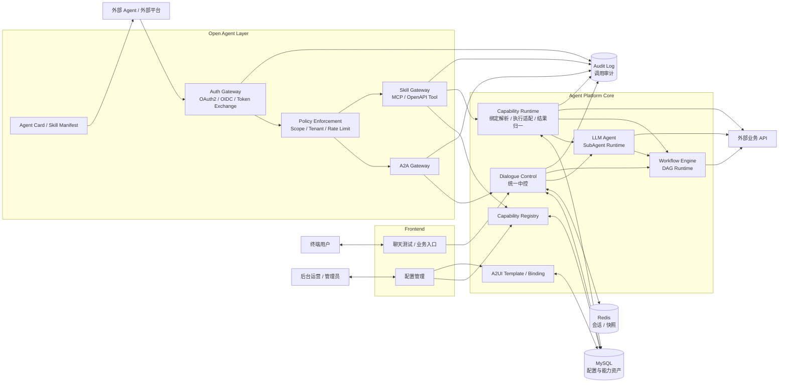
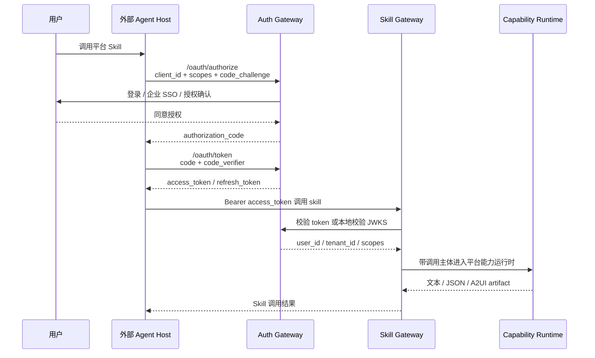
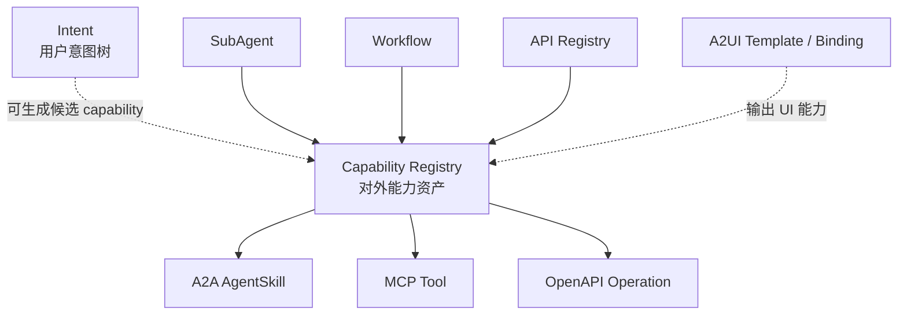
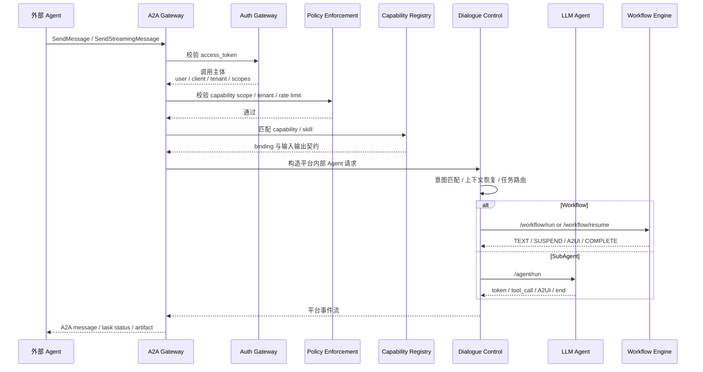
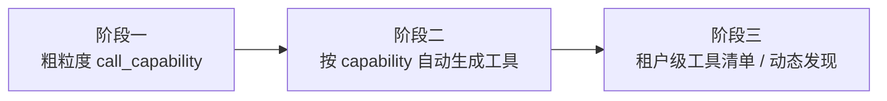
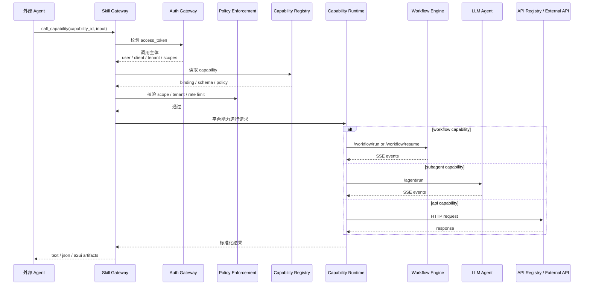

# ARCH-05 Agent 能力开放与 Skill 接入架构设计

**日期**：2026-06-30  
**状态**：方案设计稿  
**适用范围**：在现有 DC / LA / WE / A2UI 能力基础上，设计平台级 Agent 能力开放、A2A 对接和 Skill Gateway 演进路线

---

## 1. 背景

当前平台已经具备初步 Agent 平台能力：

- 后台运营可以配置 `SubAgent`，定义模型、提示词、工具和 A2UI 输出。
- 后台运营可以配置 `Workflow`，通过可视化 DAG 编排确定性业务流程。
- `Dialogue Control` 作为统一中控，对外提供同一个 Agent 入口，内部完成意图识别、任务路由、上下文裁剪、Workflow 启动/恢复/取消、SubAgent 委派和任务完成后处理。
- `A2UI` 已经让 LA 和 WE 能输出结构化 UI ViewModel，不再局限于纯文本。

下一阶段平台需要从“内部配置和运行 Agent”进一步升级为“企业 Agent 能力平台”。这里有两个方向：

1. **外部 Agent 通过 A2A 协议调用我们已经配置好的 Agent**：外部 Agent 把一个业务任务委托给本平台，由本平台的 DC、SubAgent、Workflow 共同完成。
2. **本平台把内部能力发布成 Skill，供外部 Agent 快速接入**：外部 Agent 不一定要进入完整多轮对话，只想把某个 workflow、subagent、API 或组合能力当成工具调用。

这两个方向不是互斥关系，而是两种不同的开放方式：

| 开放方式 | 适合场景 | 核心问题 |
|---|---|---|
| A2A Gateway | 外部 Agent 把任务交给我们的 Agent 处理，需要多轮、状态、挂起、恢复和结果产物。 | 如何把平台包装成一个可发现、可委托、可流式交互的 Agent。 |
| Skill Gateway | 外部 Agent 只想快速调用一个明确能力，比如退款、账单查询、分期办理、天气查询。 | 如何把内部 capability 发布成标准化工具。 |

---

## 2. 设计目标

### 2.1 平台级目标

1. 建立统一的 `Capability Registry`，把 Intent、SubAgent、Workflow、API、A2UI 模板绑定抽象成可治理的能力资产。
2. 对外支持 A2A 入站协议，让外部 Agent 可以发现和调用本平台 Agent。
3. 对外支持 Skill / MCP / OpenAPI 风格的工具发布，让外部 Agent 可以把平台能力当工具接入。
4. 对内保持平台治理边界：聊天与 A2A 委托进入 DC；Skill / MCP / OpenAPI 工具调用进入 Capability Runtime，不能绕过 Auth、Policy、Capability Registry 和审计直接访问底层执行面。
5. 保持 A2UI 输出能力可外放，但必须提供文本 fallback，兼容不支持 UI 渲染的外部 Agent。
6. 引入 `Auth Gateway`，支持外部 Agent 的用户授权、服务端授权、token exchange、scope 校验和租户解析。
7. 补齐租户、权限、审计、版本、限流、幂等治理能力。

### 2.2 MVP 目标

第一阶段不追求完整生态级协议实现，先验证以下闭环：

1. 能从现有配置自动生成平台级 Agent Card。
2. 能把已发布 workflow / subagent 发布为 capability。
3. 外部调用 A2A Gateway 后，统一进入 DC 现有对话主链路。
4. 外部调用 Skill Gateway 后，能触发 capability 并拿到文本、结构化 JSON、A2UI artifact。
5. 外部调用需要通过 Auth Gateway 获取或校验 token，调用链路能识别 `user_id`、`external_client_id`、`tenant_id` 和 `scopes`。
6. 所有外部调用都有 `trace_id`、`caller_id`、`capability_id`、`tenant_id` 和审计记录。

### 2.3 非目标

1. 不在第一阶段替换现有 AGUI / CopilotKit 聊天入口。
2. 不让外部 Agent 直接调用 WE 的内部 DAG 节点。
3. 不把 A2UI 变成远程代码执行能力，仍只允许声明式 ViewModel。
4. 不在第一阶段实现完整外部 Agent Marketplace。
5. 不把平台内所有配置默认公开，必须显式发布 capability。

---

## 3. 总体架构



### 3.1 架构判断

平台开放层不应该直接等同于 DC、LA 或 WE。更合理的拆分是：

- `A2A Gateway`：负责把外部 A2A 请求转成平台内部对话请求。
- `Skill Gateway`：负责把 capability 暴露成外部可调用工具。
- `Auth Gateway`：负责外部 client 注册、用户登录授权、token 签发/交换、token 校验和租户解析。
- `Capability Registry`：负责定义什么能力可以被发布、如何描述、如何鉴权、如何路由。
- `Capability Runtime`：负责读取 capability 绑定，按 `workflow` / `subagent` / `api` 分发到对应执行面，并归一化文本、JSON、A2UI artifact、挂起信息和审计结果。
- `Dialogue Control`：继续作为对话运行时中控，承接聊天入口和 A2A 委托入口的会话状态、上下文和任务生命周期。

这样做的核心价值：

1. **开放协议和内部实现解耦**：未来 A2A、MCP、OpenAPI、企业内部协议都可以接入同一个 capability。
2. **能力治理集中**：发布状态、版本、权限、租户、限流、审计都挂在 capability 上。
3. **对话和工具边界清晰**：A2A / 聊天入口走 DC；Skill / MCP / OpenAPI 工具调用走 Capability Runtime。
4. **执行面复用**：Skill Gateway 不重新实现业务逻辑，而是复用 LA、WE 和 API Registry。
5. **A2UI 可复用**：内部聊天端能渲染 A2UI，外部 Agent 也能拿到同样的 UI artifact 或 fallback 文本。

### 3.2 Auth Gateway 定位

Auth Gateway 是开放层的身份与授权边界，不应由 A2A Gateway、Skill Gateway 或 DC 临时兼任。

它负责：

1. 管理外部 Agent Host / 外部应用的 `client_id`、密钥、回调地址和授权范围。
2. 提供 OAuth2 / OIDC 兼容的授权入口，让用户在外部 Agent 中首次调用平台能力时完成登录和授权。
3. 支持机器到机器调用的 `client_credentials`。
4. 支持企业统一身份体系下的 token exchange / on-behalf-of。
5. 签发或校验 access token，并解析 `user_id`、`tenant_id`、`external_client_id`、`scopes`。
6. 向 A2A Gateway / Skill Gateway 输出标准调用主体，而不是把原始身份协议泄漏给下游运行时。

Auth Gateway 不负责：

1. 不执行 capability。
2. 不做意图识别或任务路由。
3. 不保存 DC 的会话状态。
4. 不理解 Workflow DAG 或 LA ReAct 过程。

### 3.3 用户授权流程

外部 Agent 代表用户调用平台能力时，推荐使用 Authorization Code + PKCE。用户不应该手动复制平台 token；用户只需要在外部 Agent Host 中完成一次“连接账号 / 授权”。



机器到机器调用可使用 `client_credentials`。这种 token 代表外部应用，不代表具体用户，适合后台任务、公开数据或系统级能力；涉及订单、账单、退款等用户私有数据时，仍应优先使用用户授权 token。

企业统一身份体系下可以支持 token exchange：

```text
外部 Agent Host 持有企业用户 token
-> Auth Gateway 校验企业 IdP token
-> 换取本平台 access_token
-> 调用 A2A Gateway / Skill Gateway
```

### 3.4 Token 与调用主体

A2A Gateway / Skill Gateway 接收到 token 后，最终应得到统一调用主体：

```json
{
  "subject_type": "user | service",
  "user_id": "user_123",
  "external_client_id": "client_chat_agent",
  "tenant_id": "tenant_a",
  "scopes": [
    "capability:refund_service:run"
  ],
  "auth_method": "authorization_code_pkce",
  "expires_at": "2026-06-30T12:00:00+08:00"
}
```

DC 和 Capability Runtime 都不需要理解 OAuth 细节，只消费 Auth Gateway 解析出的调用主体。DC 在聊天 / A2A 路径写入 request context 和会话审计；Capability Runtime 在 Skill 路径写入 capability invocation 审计。

---

## 4. 核心抽象：Capability

### 4.1 为什么需要 Capability Registry

当前平台里已经有多类配置资产：

- Intent：描述用户意图和绑定目标。
- SubAgent：描述一个可被委派的 Agent。
- Workflow：描述确定性业务流程。
- API：描述外部 API 工具。
- A2UI Template / Binding：描述 UI 输出模板和数据映射。

这些资产都可以形成“能力”，但它们不能直接作为对外契约。原因是：

1. 内部配置字段偏运行时，不适合作为外部协议。
2. Workflow 和 SubAgent 的发布生命周期不同。
3. 外部调用需要更明确的输入输出 schema、权限和版本。
4. 一个对外能力可能由多个内部资产组合而成。

因此需要引入平台级 `Capability`。

### 4.2 Capability 数据模型

建议新增 `capabilities` 表，第一阶段可先用 JSON 字段承载扩展配置。

```json
{
  "id": "refund_service.v1",
  "name": "商品退款",
  "description": "处理商品退款申请，支持订单选择、退款金额校验和退款结果返回。",
  "status": "draft | published | deprecated",
  "version": "1.0.0",
  "binding": {
    "module": "workflow",
    "id": "refund_process"
  },
  "input_schema": {
    "type": "object",
    "properties": {
      "taskId": {
        "type": "string",
        "description": "外部任务 ID。同一个多轮业务处理必须使用同一个 taskId，用于 run/resume/cancel 关联同一任务。"
      },
      "order_id": {
        "type": "string",
        "description": "退款订单号。可以为空，由工作流通过 A2UI 引导用户选择。"
      },
      "refund_amount": {
        "type": "number",
        "description": "退款金额。"
      }
    },
    "required": [
      "taskId"
    ]
  },
  "output_schema": {
    "type": "object",
    "properties": {
      "status": {
        "type": "string"
      },
      "message": {
        "type": "string"
      }
    }
  },
  "input_modes": [
    "text/plain",
    "application/json"
  ],
  "output_modes": [
    "text/plain",
    "application/json",
    "application/vnd.agentic-workflow.a2ui+json"
  ],
  "tags": [
    "refund",
    "after_sale",
    "workflow"
  ],
  "examples": [
    "我要退款",
    "帮用户处理订单 order_655 的退款"
  ],
  "auth": {
    "scopes": [
      "capability:refund_service:run"
    ],
    "tenant_policy": "same_tenant"
  },
  "runtime": {
    "entry": "capability_runtime",
    "supports_streaming": true,
    "supports_resume": true,
    "timeout_seconds": 120
  }
}
```

### 4.3 Capability 类型

| 类型 | 绑定对象 | 典型场景 | 是否多轮 |
|---|---|---|---|
| `workflow` | `workflows.id` | 退款、账单查询、分期办理、工单提交。 | 可多轮，支持挂起恢复。 |
| `subagent` | `sub_agents.id` | 天气助手、账单助手、营销推荐助手。 | 可多轮，由 LA 决定。 |
| `api` | `apis.id` | 查询天气、查询活动、查询库存。 | 通常单轮。 |
| `composite` | 多个内部资产 | 先查订单再退款，先查账单再营销。 | 可多轮。 |

### 4.4 Capability 和现有模块的关系



原则：

- Intent 是内部路由知识，不一定全部对外发布。
- Workflow / SubAgent / API 只有显式发布成 capability 后才对外可见。
- A2UI 是输出能力增强，不单独作为业务 capability。
- Capability 是外部协议生成的事实源。

---

## 5. A2A Gateway 设计

### 5.1 定位

A2A Gateway 面向“外部 Agent 委托任务”的场景。

外部 Agent 不需要知道我们内部有多少 workflow、subagent、slot 节点，也不应该直接调用内部模块。它只需要：

1. 发现我们平台 Agent 的能力。
2. 发送一个任务请求。
3. 接收流式消息、任务状态和产物。
4. 在需要时继续发送用户补充信息、取消任务或查询状态。

### 5.2 Agent Card 生成

平台应提供一个 Agent Card，用于描述本平台作为 Agent 的身份和能力。Agent Card 内容由 `Capability Registry` 自动生成。

```json
{
  "name": "企业业务服务 Agent",
  "description": "提供退款、账单、分期、营销推荐等企业业务处理能力。",
  "version": "1.0.0",
  "skills": [
    {
      "id": "refund_service.v1",
      "name": "商品退款",
      "description": "处理商品退款申请，支持订单选择和金额校验。",
      "tags": [
        "refund",
        "workflow"
      ],
      "examples": [
        "我要退款",
        "帮用户退 order_655"
      ]
    },
    {
      "id": "bill_query.v1",
      "name": "账单类问题",
      "description": "处理账单查询、账单分期办理等账单类业务。",
      "tags": [
        "bill",
        "workflow",
        "agent"
      ],
      "examples": [
        "查询 6 月账单",
        "我要办理账单分期"
      ]
    }
  ],
  "defaultInputModes": [
    "text/plain",
    "application/json"
  ],
  "defaultOutputModes": [
    "text/plain",
    "application/json",
    "application/vnd.agentic-workflow.a2ui+json"
  ]
}
```

### 5.3 A2A 入站运行链路

目标态下，A2A Gateway 承接的是“外部 Agent 委托本平台 Agent 完成任务”，因此应进入 DC 的对话运行时，由 DC 统一处理会话状态、任务切换、挂起恢复和结果产物。



当前 MVP 代码中的 `/a2a/v1/message` 还只是 Agent Card / A2A 外观的简化入口：当请求明确携带 `skill_id` / `capability_id` 时，会先复用 Open Gateway 内置 Capability Runtime 执行，便于快速联调外部工具调用。它不等同于完整 A2A task runtime。后续进入阶段 4 时，应补齐真正的 A2A message / task / artifact 协议适配，并把自然语言委托请求接入 DC 主链路。

### 5.4 A2A 与 DC 的映射

| A2A 概念 | 平台内部映射 |
|---|---|
| Agent Card | 由 `Capability Registry` 生成。 |
| AgentSkill | `Capability` 的对外投影。 |
| Task | `session_id + external_task_id + running_task`。 |
| Message | `messages` 中的用户消息和 assistant 消息。 |
| Part(text) | 普通文本 token / message。 |
| Part(data) | 结构化 JSON、A2UI envelope、workflow final outputs。 |
| Artifact | 任务完成后的结果产物，比如退款结果、账单详情、A2UI surface 快照。 |
| CancelTask | 映射到 DC 的 `workflow_cancel` 或 active subagent cancel。 |

### 5.5 A2UI 在 A2A 中的承载

A2UI 不应作为纯文本塞进外部消息，而应作为结构化 data part 或 artifact。

```json
{
  "mediaType": "application/vnd.agentic-workflow.a2ui+json",
  "data": {
    "a2ui": {
      "version": "v0.9",
      "createSurface": {
        "surfaceId": "refund_order_picker_1",
        "catalogId": "hybrid-basic@v1",
        "title": "选择退款订单"
      }
    },
    "fallback_text": "请选择需要退款的订单。"
  }
}
```

外部 Agent 或端侧如果支持 A2UI，可以渲染 UI；如果不支持，则读取 `fallback_text`。

---

## 6. Skill Gateway 设计

### 6.1 定位

Skill Gateway 面向“外部 Agent 把我们平台能力当工具调用”的场景。

与 A2A 的区别是：

- A2A 更像“委托一个 Agent 完成任务”。
- Skill Gateway 更像“调用一个确定能力，并拿到结果”。

Skill Gateway 可以同时支持两种投影：

1. **MCP Tool 投影**：适合接入支持 MCP 的 Agent Host。
2. **OpenAPI Tool 投影**：适合接入函数调用、企业网关、传统应用。

Skill Gateway 不进入 DC 的 LangGraph 对话编排，也不复用 DC 的意图识别、任务切换或 post task engagement 策略。它读取 capability 后交给 Capability Runtime，由 Runtime 按绑定类型直接调用 WE、LA 或 API Registry。

### 6.2 Skill 暴露粒度

MVP 建议先暴露粗粒度工具，再逐步生成细粒度工具。

#### 粗粒度工具

```text
list_capabilities
get_capability_schema
call_capability
resume_capability_task
cancel_capability_task
```

优势：

- 实现简单。
- 不怕 capability 经常新增和下线。
- 权限和审计集中。

#### 细粒度工具

```text
refund_service_v1
bill_query_v1
bill_installment_v1
weather_query_v1
```

优势：

- 外部 Agent 更容易理解工具语义。
- 工具 schema 更明确。
- 更适合模型函数调用。

建议演进：



### 6.3 MCP Tool 映射

```json
{
  "name": "call_capability",
  "description": "调用企业 Agent 平台中已发布的能力。",
  "inputSchema": {
    "type": "object",
    "properties": {
      "capability_id": {
        "type": "string",
        "description": "能力 ID，例如 refund_service.v1"
      },
      "input": {
        "type": "object",
        "description": "能力输入参数"
      },
      "taskId": {
        "type": "string",
        "description": "workflow / subagent 多轮能力必填；同一业务任务 run/resume/cancel 必须保持一致。"
      },
      "conversation": {
        "type": "object",
        "description": "可选对话上下文"
      }
    },
    "required": [
      "capability_id",
      "input"
    ]
  }
}
```

约束：

- `workflow` 和 `subagent` 类型 capability 必须在 input schema 中声明 `taskId`。
- `taskId` 是外部任务维度 ID，不是业务 slot；Capability Runtime 会用它关联同一多轮任务的 `run`、`resume` 和 `cancel`。
- `api` 类型 capability 通常是单次调用，不强制要求 `taskId`。

### 6.4 OpenAPI Tool 映射

```text
GET  /open/capabilities
GET  /open/capabilities/{capability_id}
POST /open/capabilities/{capability_id}:run
POST /open/capabilities/{capability_id}:resume
POST /open/capabilities/{capability_id}:cancel
```

`run` 响应建议支持两种模式：

- 同步 JSON：适合 API / 单轮工具。
- SSE 流式：适合 workflow / subagent / A2UI。

### 6.5 Skill 调用链路



这条链路与 A2A 最大的不同是：Skill 调用方已经明确指定 `capability_id`，平台不再做开放式意图识别。Capability Runtime 只负责执行、挂起恢复、结果归一和审计，不维护聊天式会话策略。

### 6.6 Skill 返回协议

建议统一返回：

```json
{
  "task_id": "task_xxx",
  "taskId": "refund_task_001",
  "capability_id": "refund_service.v1",
  "status": "completed | suspended | failed",
  "text": "退款金额超过订单可退金额，请重新确认后再发起退款。",
  "data": {
    "workflow_id": "refund_process",
    "final_outputs": {}
  },
  "artifacts": [
    {
      "type": "a2ui",
      "media_type": "application/vnd.agentic-workflow.a2ui+json",
      "payload": {}
    }
  ],
  "suspension": {
    "required_input": {
      "param_name": "refund_amount",
      "description": "退款金额",
      "missing_prompt": "请问需要退款多少金额？"
    },
    "resume_token": "resume_xxx"
  }
}
```

---

## 7. 与现有模块的改造点

开放层代码统一放在 `open-agent-layer/` 下，避免根目录出现过多并列服务模块。MVP 目录建议如下：

```text
open-agent-layer/
  auth-gateway/      # OAuth / OIDC / token introspection
  open-gateway/      # A2A / Skill / MCP / OpenAPI 入口
```

其中 Auth Gateway、A2A Gateway、Skill Gateway 和 Capability Runtime 属于同一个 Open Agent Layer 的内部子域。当前 Capability Runtime 先作为 `open-agent-layer/open-gateway` 内部逻辑模块实现。

### 7.0 Auth Gateway

新增模块职责：

1. 维护外部 Agent Host / 外部应用注册信息。
2. 提供 OAuth2 / OIDC 授权端点、token 端点、JWKS 端点。
3. 支持 `authorization_code + PKCE`、`client_credentials`、token exchange。
4. 校验 access token，输出统一调用主体。
5. 管理用户授权记录、refresh token 生命周期、撤销授权。

不应承担：

1. 不执行 capability。
2. 不直接调用 WE / LA。
3. 不保存业务会话状态。

### 7.1 Capability Runtime

新增模块职责：

1. 读取 capability 的 `binding_type` 和 `binding_id`。
2. 对 `workflow` capability 调用 WE `run/resume/cancel`，收集文本、挂起信息、final outputs 和 A2UI artifact。
3. 对 `subagent` capability 调用 LA `/agent/run`，收集最终文本、工具事件和 A2UI artifact。
4. 对 `api` capability 执行 API Registry 中的 HTTP API，并归一化响应。
5. 写入 capability invocation 审计。
6. 向 Skill Gateway 返回统一 `CapabilityResult`。

当前 MVP 代码中，Capability Runtime 作为 `open-agent-layer/open-gateway` 内的逻辑运行时实现：`/open/capabilities/{id}:run|resume|cancel` 完成鉴权和 scope 校验后，直接根据 capability 绑定调用 WE、LA 或 API Registry，并写入 `capability_invocations`。后续生产化时可以把这部分抽成独立 `capability-runtime` 子模块或服务，但外部协议和职责边界保持不变。

不应承担：

1. 不做意图识别。
2. 不维护聊天式多轮对话状态。
3. 不执行 DC 的 task switch、post_task_engagement 等对话策略。

### 7.2 Dialogue Control

新增职责：

1. 支持来自 `A2A Gateway` 的调用上下文。
2. 在 `AgentState` 或 request context 中记录 `caller_type`、`caller_id`、`user_id`、`external_client_id`、`external_task_id`、`capability_id`。
3. 生成面向外部调用的结果摘要和 artifact。
4. 支持外部 task resume / cancel 映射到内部 running_task。

不变职责：

1. 仍然是会话状态唯一控制面。
2. 仍然负责任务切换、挂起恢复、slot correction、post_task_engagement。
3. 仍然负责裁剪上下文后调用 LA / WE。

### 7.3 LLM Agent

新增职责：

1. 支持从 capability 输入中获得更结构化的 task context。
2. 对外部调用场景减少闲聊式 final answer，优先输出结构化结果。
3. API 工具输出的 A2UI artifact 需要可被 Skill Gateway 收集。

不应承担：

1. 不负责外部协议鉴权。
2. 不直接生成 Agent Card。
3. 不直接暴露给外部 Agent；需要通过 Capability Registry 发布后，由 Capability Runtime 作为 subagent capability 调用。

### 7.4 Workflow Engine

新增职责：

1. Workflow 完成事件需要提供更稳定的 `final_outputs`。
2. Workflow 挂起事件需要提供完整 `required_input`，包括 `description`、`missing_prompt`、`param_type`。
3. Workflow A2UI 输出需要可被 DC 或 Capability Runtime 收集成 artifact。

不应承担：

1. 不理解 A2A / MCP。
2. 不做外部能力发布。
3. 不直接暴露内部节点给外部 Agent。

### 7.5 Frontend

新增职责：

1. 新增 Capability 管理页。
2. 在 Workflow / SubAgent / API 配置页提供“发布为 Capability”的入口。
3. 展示 Agent Card 预览和 Skill Manifest 预览。
4. 提供 capability 的测试调用页面。
5. 管理外部 client、redirect URI、授权方式、scope、租户策略和密钥。
6. 提供用户授权记录和撤销授权入口。

建议 UI 信息架构：

```text
对话测试
对话中控
Workflow
SubAgent
API
A2UI
Capability
开放接入
授权与安全
```

其中：

- `Capability`：能力资产管理。
- `开放接入`：A2A Agent Card、MCP/OpenAPI Endpoint、密钥、审计。
- `授权与安全`：外部 client、OAuth 配置、用户授权、scope、租户策略。

---

## 8. 数据模型建议

### 8.1 capabilities

```sql
capabilities
- id                  varchar primary key
- name                varchar
- description         text
- status              varchar
- version             varchar
- binding_type        varchar
- binding_id          varchar
- input_schema        json
- output_schema       json
- input_modes         json
- output_modes        json
- tags                json
- examples            json
- auth_policy         json
- runtime_policy      json
- metadata_json       json
- created_at          datetime
- updated_at          datetime
```

### 8.2 capability_versions

第二阶段引入：

```sql
capability_versions
- id
- capability_id
- version
- snapshot_json
- status
- created_by
- created_at
```

### 8.3 external_clients

```sql
external_clients
- id
- name
- tenant_id
- client_type         varchar
- auth_type           varchar
- enabled             int
- auth_config         json
- redirect_uris       json
- allowed_scopes      json
- rate_limit_policy   json
- created_at
- updated_at
```

### 8.4 external_user_grants

记录用户授权给外部 Agent Host 的能力范围。

```sql
external_user_grants
- id
- user_id
- tenant_id
- external_client_id
- granted_scopes      json
- grant_type          varchar
- status              varchar
- expires_at          datetime
- created_at
- updated_at
```

### 8.5 external_tokens

MVP 可以只保存 refresh token 的哈希和授权关系，不保存明文 access token。

```sql
external_tokens
- id
- external_client_id
- user_id
- tenant_id
- grant_id
- token_type          varchar
- token_hash          varchar
- scopes              json
- expires_at          datetime
- revoked_at          datetime
- created_at
```

### 8.6 capability_invocations

```sql
capability_invocations
- id
- trace_id
- tenant_id
- caller_id
- caller_type
- user_id
- external_client_id
- auth_method
- scopes              json
- protocol            varchar
- capability_id
- capability_version
- session_id
- external_task_id
- status
- input_snapshot      json
- output_snapshot     json
- error_message       text
- started_at
- finished_at
```

### 8.7 external_task_bindings

```sql
external_task_bindings
- id
- protocol
- external_task_id
- internal_session_id
- capability_id
- running_task_snapshot json
- status
- resume_token
- created_at
- updated_at
```

---

## 9. 安全与治理

### 9.1 权限模型

建议按四层控制：

| 层级 | 控制对象 | 示例 |
|---|---|---|
| Auth | 用户或外部 client 是否已经完成登录、授权或 token exchange。 | `authorization_code_pkce`、`client_credentials` |
| Client | 哪个外部系统可以调用平台。 | `external_client_id` |
| Scope | 可以调用哪些 capability。 | `capability:refund_service:run` |
| Runtime Policy | 调用时的运行限制。 | 超时、限流、是否允许 resume、是否允许 A2UI。 |

### 9.2 Token 获取方式

| 场景 | 推荐方式 | 说明 |
|---|---|---|
| 外部 Agent 代表用户调用 | OAuth2 Authorization Code + PKCE | 用户首次使用时授权，外部 Agent Host 持有 access token / refresh token。 |
| 外部系统后台调用 | Client Credentials | token 代表外部应用，不代表具体用户。 |
| 企业统一登录体系 | Token Exchange / On-Behalf-Of | 外部 Agent Host 用企业 IdP token 向 Auth Gateway 换取本平台 token。 |
| 本地开发联调 | Personal Access Token / API Key | 仅用于开发和内部测试，生产用户场景不推荐。 |

Skill Manifest / Agent Card 的安全扩展中应明确授权入口：

```json
{
  "auth": {
    "type": "oauth2",
    "authorization_url": "https://agent-platform.example.com/oauth/authorize",
    "token_url": "https://agent-platform.example.com/oauth/token",
    "jwks_url": "https://agent-platform.example.com/.well-known/jwks.json",
    "scopes": [
      "capability:refund_service:run",
      "capability:bill_query:run"
    ]
  }
}
```

外部 Agent 调用前并不是“让用户获取 token”，而是由外部 Agent Host 根据 manifest 发起授权；token 的申请、刷新和携带由 Host 和 Auth Gateway 自动完成。

### 9.3 租户隔离

所有外部调用必须携带或解析出 `tenant_id`。

规则：

1. capability 可以配置租户可见范围。
2. 外部 client 只能调用授权租户下的 capability。
3. DC 的 session、Capability Runtime 的 invocation、WE 的 snapshot、审计日志都要带 tenant。

### 9.4 审计

最小审计字段：

```json
{
  "trace_id": "trace_xxx",
  "protocol": "a2a | mcp | openapi",
  "caller_id": "external_client_xxx",
  "user_id": "user_123",
  "tenant_id": "tenant_a",
  "capability_id": "refund_service.v1",
  "input": {},
  "status": "completed",
  "started_at": "2026-06-30T10:00:00+08:00",
  "finished_at": "2026-06-30T10:00:03+08:00"
}
```

### 9.5 A2UI 安全

1. A2UI 只允许使用平台白名单组件目录。
2. A2UI payload 只允许 JSON，不允许 HTML / JS / CSS。
3. 外部输出时必须携带 `fallback_text`。
4. A2A / 聊天场景下的外部 action 回传必须经过 DC；Skill 场景下的 action / resume 必须经过 Skill Gateway 和 Capability Runtime，不允许端侧直接调用 WE / LA。

---

## 10. 演进路线

### 阶段 0：设计冻结与现有能力梳理

目标：

1. 明确 capability 是平台级能力资产。
2. 明确 A2A 和 Skill Gateway 都从 capability 生成。
3. 明确 Auth Gateway 是外部调用的身份与授权边界。
4. 明确 A2A / 聊天入口进入 DC，Skill / MCP / OpenAPI 工具调用进入 Capability Runtime。

产出：

1. 本 ARCH 文档评审通过。
2. 确认 capability 数据模型。
3. 确认 Auth Gateway MVP 支持的授权模式。
4. 确认第一批发布能力：退款、账单查询、账单分期、天气查询。

### 阶段 1：Capability Registry MVP

目标：

1. 新增 capability 表和配置 API。
2. 前端新增 Capability 管理页。
3. 支持从 Workflow / SubAgent / API 一键生成 capability 草稿。
4. 支持发布、下线、预览 input/output schema。

验收：

1. 后台能看到已发布能力列表。
2. 每个 capability 能明确绑定内部资产。
3. capability 能关联 A2UI output modes。

### 阶段 2：Auth Gateway MVP

目标：

1. 新增 external client 注册和管理能力。
2. 支持开发期 API Key / Bearer Token。
3. 支持 OAuth2 Authorization Code + PKCE 的接口骨架。
4. 支持 token 校验后输出统一调用主体。
5. 支持 scope 与 capability 授权关系校验。

验收：

1. 外部测试 client 能注册并获得调用凭证。
2. Skill Gateway / A2A Gateway 可以基于 token 解析 `user_id`、`tenant_id`、`external_client_id`、`scopes`。
3. 用户授权记录可查询和撤销。

### 阶段 3：Skill Gateway MVP

目标：

1. 实现粗粒度 `list_capabilities`、`get_capability_schema`、`call_capability`。
2. `call_capability` 统一进入 Capability Runtime。
3. 支持 SSE 返回文本、JSON、A2UI artifact。
4. 支持挂起时返回 `resume_token`。
5. 所有调用必须通过 Auth Gateway token 校验和 scope 校验。

验收：

1. 外部脚本可以调用 `refund_service.v1`。
2. 缺槽时返回明确 `required_input`。
3. 补槽后可以 resume，不重新 start。
4. 审计表能看到完整调用记录。

### 阶段 4：A2A Gateway MVP

目标：

1. 生成平台级 Agent Card。
2. Agent Card 的 skills 来自 published capability。
3. 支持 A2A 风格的 send message / stream message / cancel / task status。
4. A2A 请求进入 DC 主链路。
5. Agent Card / manifest 中暴露 Auth Gateway 授权端点和 scopes。

验收：

1. 外部 Agent 能发现平台能力。
2. 外部 Agent 能把退款任务委托给平台。
3. 平台能返回文本和 A2UI artifact。
4. 挂起任务可以继续补充消息。

### 阶段 5：细粒度 Skill 自动生成

目标：

1. 根据 capability 自动生成 MCP Tool / OpenAPI Operation。
2. 不同租户看到不同工具清单。
3. 支持版本化工具名，例如 `refund_service_v1`。

验收：

1. 外部 Agent 不需要传 capability_id，也能直接调用具体工具。
2. capability 下线后工具清单自动更新。
3. 老版本 capability 可以保留兼容窗口。

### 阶段 6：A2A Outbound 与外部 Agent 注册

目标：

1. 平台内部也能注册外部 A2A Agent。
2. LA 可以把外部 A2A Agent 当工具调用。
3. DC 能管理外部 Agent 调用状态。

验收：

1. 本平台可作为 A2A Client 调用第三方 Agent。
2. 外部 Agent 调用结果能进入当前会话上下文。
3. 支持外部 Agent 超时、失败、取消和审计。

### 阶段 7：企业级治理

目标：

1. 完整权限、租户、额度、限流。
2. 审计检索和调用回放。
3. capability 灰度、版本回滚。
4. OAuth client 生命周期、refresh token 轮换、授权撤销、密钥轮换。
5. SLA、监控、告警。

---

## 11. MVP 开发拆分建议

### 11.1 后端

1. 新增 `capabilities` ORM model 和 CRUD API。
2. 新增 Auth Gateway，提供 `/oauth/*`、`/.well-known/jwks.json`、`/auth/introspect`。
3. 新增 external client、user grants、token 相关 ORM model 和 API。
4. 新增 `open-agent-layer/open-gateway` 和 Capability Runtime；MVP 已先把 Runtime 作为 Open Gateway 内部逻辑模块实现，后续可按部署需要拆独立服务。
5. 实现 `list_capabilities`、`get_capability_schema`、`call_capability`。
6. Capability Runtime 输出标准化 capability result。
7. DC request context 增加 A2A 外部调用字段。
8. 新增审计表和写入逻辑。

### 11.2 前端

1. 新增 Capability tab。
2. Workflow / SubAgent / API 页增加“发布为 Capability”操作。
3. Capability 详情抽屉展示 schema、binding、output modes、auth policy。
4. 新增 Agent Card 预览。
5. 新增 Skill 调用测试面板。
6. 新增 external client 管理、OAuth redirect URI、scope 选择、授权记录和撤销页面。

### 11.3 数据初始化

第一批 capability：

| capability_id | 类型 | 绑定 |
|---|---|---|
| `refund_service.v1` | workflow | `refund_process` |
| `bill_query.v1` | workflow | `bill_query` |
| `bill_installment.v1` | workflow | `bill_installment` |
| `weather_query.v1` | api/subagent | `query_weather` 或日常问答 Agent |

### 11.4 文档

1. README 增加平台开放能力说明。
2. ARCH-02 补充外部调用上下文字段。
3. ARCH-01 补充 Open Agent Layer。
4. ARCH-04 补充 A2A / Skill 输出 A2UI artifact 的关系。
5. 新增 Auth Gateway 接入说明和外部 Agent 授权指南。

---

## 12. 风险与决策点

### 12.1 A2A 与 Skill Gateway 是否同时做

建议同时设计，分阶段实现。

- 先实现 Skill Gateway，因为它更容易测试和接入。
- 再实现 A2A Gateway，因为它需要更完整的任务状态和协议适配。

### 12.2 Auth Gateway 是否独立

建议独立作为开放层基础模块，不建议让 Skill Gateway 或 A2A Gateway 直接承担 token 签发和用户授权。

原因：

1. 身份协议变化频率和开放协议不同，需要独立演进。
2. OAuth client、用户授权、refresh token、密钥轮换是安全域职责，不应混入能力调用逻辑。
3. A2A Gateway 和 Skill Gateway 都需要同一套调用主体和 scope 校验。
4. 未来接企业 IdP、OIDC、token exchange 时，独立 Auth Gateway 更容易替换或集成。

建议：

- Auth Gateway 负责签发、校验、交换 token。
- Gateway 层只消费标准调用主体。
- A2A / 聊天路径下，DC 只接收已解析后的 `user_id`、`tenant_id`、`external_client_id`、`scopes`。
- Skill 路径下，Capability Runtime 接收同样的调用主体并写入审计。

### 12.3 Capability 是否绑定 Intent

不建议第一阶段直接绑定 Intent。

原因：

1. Intent 是内部路由知识，适合 DC 使用。
2. Capability 是外部契约，应该更稳定。
3. 一个 capability 可以通过多个 intent 触发。

建议：

- Capability 绑定 Workflow / SubAgent / API。
- Intent 可以引用 capability，但不是 capability 的事实源。

### 12.4 Skill Gateway 是否绕过 DC

建议绕过“对话中控 graph”，但不绕过平台治理。

原因：

1. Skill Manifest 暴露的是工具化能力，不是一次自然语言对话委托。
2. 外部 Agent 已经负责自己的对话上下文和规划，本平台只需要执行被调用的 capability。
3. DC 的意图识别、task switch、post_task_engagement 是聊天中控策略，默认不应介入工具调用。
4. Workflow / SubAgent / API 都可以通过 Capability Runtime 直接执行，并统一输出文本、JSON、A2UI artifact。

边界：

- A2A Gateway 仍然进入 DC，因为 A2A 是 Agent-to-Agent 任务委托，天然包含多轮任务状态和消息上下文。
- Skill Gateway 进入 Capability Runtime，因为 Skill 是工具调用，应尽量保持强 schema、低策略干预和可预测输出。
- MVP 阶段 Capability Runtime 可以先作为 `open-agent-layer/open-gateway` 内的逻辑模块，复用 WE / LA 的 HTTP/SSE 协议；当运行策略、限流、审计和异步任务能力变复杂后，再抽成独立子模块或服务。

### 12.5 A2UI 是否作为独立协议对外

建议 A2UI 作为 output mode 和 artifact，不作为独立业务协议。

原因：

1. 外部 Agent 主要关心任务和能力，不一定关心 UI。
2. A2UI 是结果表达方式，不是任务入口。
3. 必须有 fallback text 保证兼容。

---

## 13. 推荐结论

平台下一阶段应从“可配置 Agent 平台”升级为“可开放 Agent 能力平台”。

推荐目标架构：

```text
Capability Registry 作为能力资产事实源
Auth Gateway 作为身份授权与 token 边界
Dialogue Control 作为对话 / A2A 运行时中控
Capability Runtime 作为 Skill 工具化运行时
A2A Gateway 负责 Agent 委托接入
Skill Gateway 负责工具化能力发布
A2UI 作为统一富交互结果表达
```

推荐实施顺序：

```text
Capability Registry -> Auth Gateway -> Skill Gateway -> A2A Gateway -> 细粒度工具生成 -> A2A Outbound -> 企业级治理
```

这样既能复用当前已经落地的 DC / LA / WE / A2UI 能力，又能把平台能力向外部 Agent 生态开放，形成更上层的平台价值。
