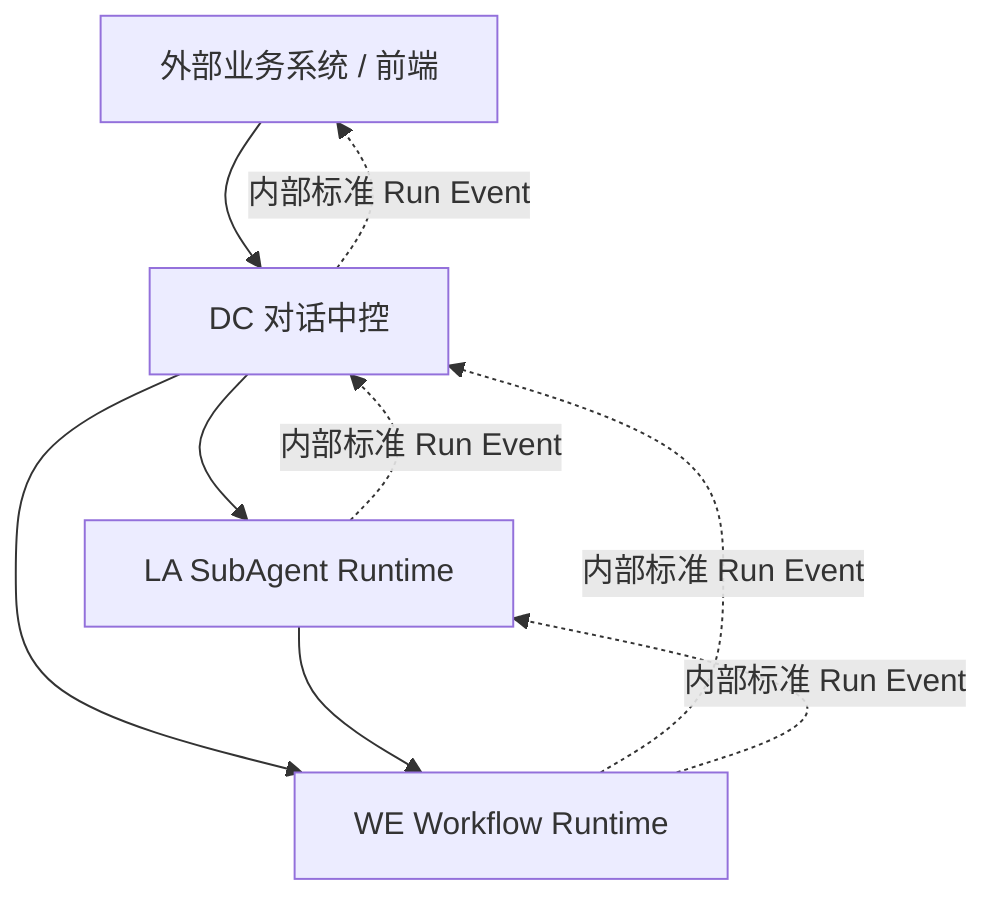
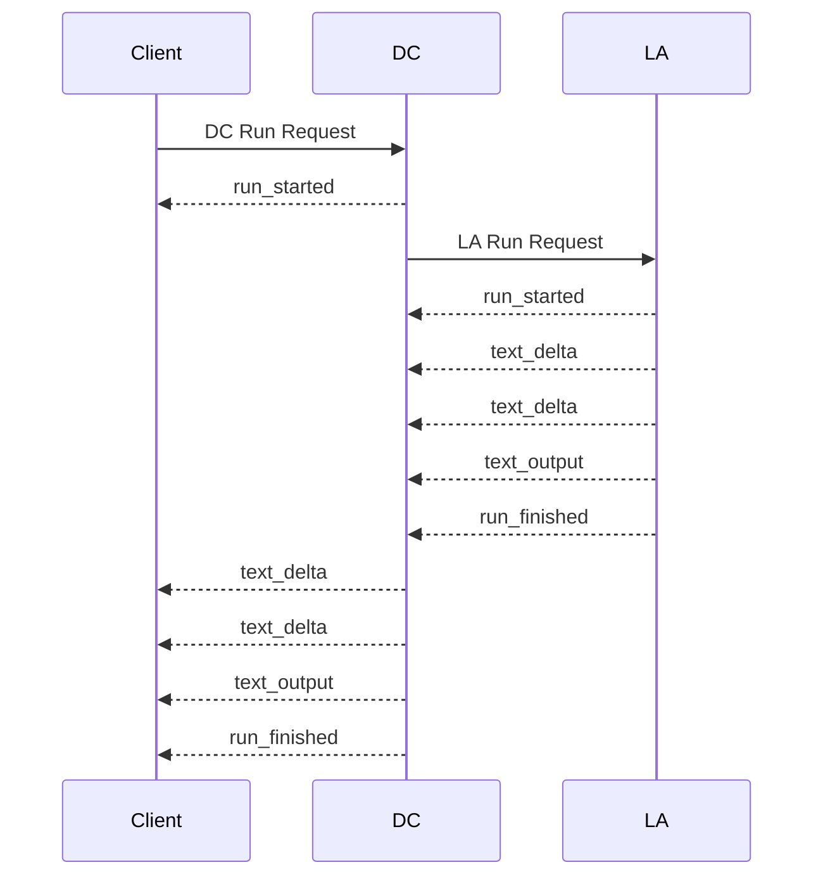
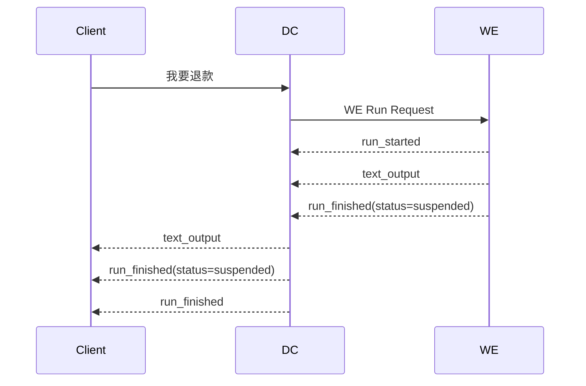
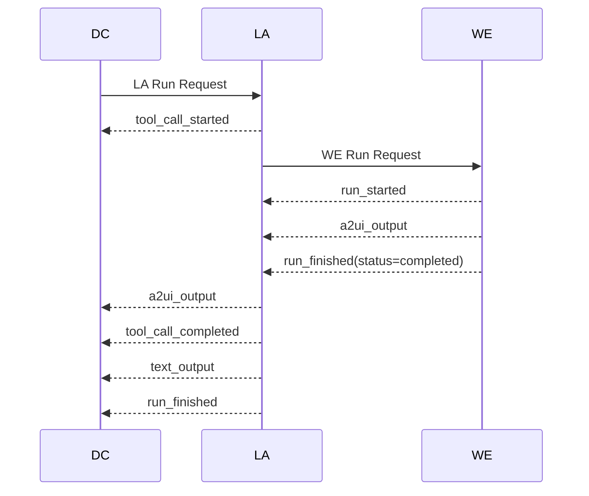

# ARCH-06 内部标准事件协议

本文定义 Agent 平台 DC、LA、WE 之间的标准运行时报文协议。协议目标是让不同模块对“开始、结束、文本输出、A2UI 输出、工具调用、Workflow 挂起、错误”等相同概念使用同一套事件语义、字段结构和枚举定义。

本文只描述目标标准协议，不描述旧报文和兼容逻辑。

## 1. 设计目标

1. DC、LA、WE 内部通信统一使用标准 Run Request、Run Event、Run Result。
2. 相同业务语义必须使用相同 `event_type` 和 `payload` 结构。
3. 模块特有信息放入标准字段的扩展对象中，不为同一概念重复定义模块私有事件。
4. 输入上下文与输出事件分离，避免把 graph 日志、调试快照、模型原始 chunk 当成业务协议。
5. A2UI 统一使用 `display_text` 作为可读降级文本和历史摘要文本。
6. DC 对外输出可以基于内部标准事件再转换为 AGUI、控制台或开放平台协议。

## 2. 协议分层



协议分为三类对象：

| 对象 | 说明 |
| --- | --- |
| `Run Request` | 模块调用输入。用于启动一次 DC、LA 或 WE 执行。 |
| `Run Event` | 模块执行过程中的标准事件。支持流式传输。 |
| `Run Result` | 非流式聚合结果。由标准事件聚合而来。 |

## 3. 通用上下文对象

DC、LA、WE 的 Run Request 统一由以下上下文对象组成。模块可按需使用，但字段含义保持一致。

```json
{
  "execution_context": {},
  "conversation_context": {},
  "business_context": {},
  "slot_context": {},
  "resume_context": {}
}
```

### 3.1 `execution_context`

描述本次执行的身份、租户、请求和链路信息。

```json
{
  "tenant_id": "default",
  "user_id": "robbie",
  "session_id": "sess_001",
  "request_id": "req_001",
  "trace_id": "trace_001",
  "channel_id": "console_test",
  "mode": "direct_agent",
  "agent_id": "bill_agent",
  "agent_version": "v1",
  "workflow_id": "bill_query",
  "workflow_version": "v1",
  "triggered_by": "dc"
}
```

字段说明：

| 字段 | 类型 | 必填 | 说明 |
| --- | --- | --- | --- |
| `tenant_id` | string | 是 | 租户 ID。 |
| `user_id` | string | 否 | 平台用户或外部用户 ID。 |
| `session_id` | string | 是 | 会话 ID。 |
| `request_id` | string | 是 | 本轮请求 ID。 |
| `trace_id` | string | 是 | 链路追踪 ID。 |
| `channel_id` | string | 否 | 渠道 ID，如 `console_test`、`agent_console`。 |
| `mode` | string | 否 | 交互模式，默认 `direct_agent`。 |
| `agent_id` | string | LA 必填 | LA 执行的 Agent ID。 |
| `agent_version` | string/null | 否 | Agent 版本。 |
| `workflow_id` | string | WE 必填 | WE 执行的 Workflow ID。 |
| `workflow_version` | string/null | 否 | Workflow 版本。 |
| `triggered_by` | string | 否 | 触发来源，如 `dc`、`la`、`skill_gateway`。 |

`mode` 枚举：

| 值 | 说明 |
| --- | --- |
| `direct_agent` | Agent 直接面向用户输出。 |
| `agent_assist` | 坐席辅助模式，Agent 输出默认仅展示给人工坐席。 |

### 3.2 `conversation_context`

描述当前执行可感知的对话上下文。

```json
{
  "history_messages": [
    {
      "role": "user",
      "content": "我要退款",
      "message_id": "msg_001",
      "created_at": "2026-07-08 10:10:00.000",
      "source": "customer"
    },
    {
      "role": "assistant",
      "content": "请提供订单号。",
      "message_id": "msg_002",
      "created_at": "2026-07-08 10:10:15.000",
      "source": "human_agent"
    }
  ],
  "current_message": {
    "role": "user",
    "content": "order_777",
    "message_id": "msg_003",
    "created_at": "2026-07-08 10:10:30.000",
    "source": "customer"
  },
  "session_started_at": "2026-07-08 10:00:00.000"
}
```

字段说明：

| 字段 | 类型 | 必填 | 说明 |
| --- | --- | --- | --- |
| `history_messages` | array | 否 | 当前轮之前的对话历史。 |
| `current_message` | object | 是 | 当前消息对象，结构与 `history_messages[]` 一致。 |
| `session_started_at` | string/null | 否 | 会话开始时间，上海时间 yyyy-MM-dd HH:mm:ss.SSS。 |

消息对象字段说明：

| 字段 | 类型 | 必填 | 说明 |
| --- | --- | --- | --- |
| `role` | string | 是 | 消息角色。 |
| `content` | string | 是 | 消息内容。 |
| `message_id` | string/null | 否 | 消息 ID。 |
| `created_at` | string/null | 否 | 消息产生时间。 |
| `source` | string/null | 否 | 消息来源。用于区分坐席辅助场景下消息由客户、人工坐席还是 AI 生成。 |

`role` 枚举：

| 值 | 说明 |
| --- | --- |
| `user` | 用户或客户消息。 |
| `assistant` | Agent 或坐席已对用户可见的回复。 |
| `system` | 系统提示或业务系统注入的会话说明。 |

`source` 枚举：

| 值 | 说明 |
| --- | --- |
| `customer` | 客户或最终用户。 |
| `human_agent` | 人工坐席。 |
| `ai_agent` | AI Agent。 |
| `business_system` | 业务系统。 |
| `system` | 平台或系统消息。 |

agent_assist模式同一会话中可能同时存在客户消息、人工坐席消息和 AI Agent 消息。调用方应优先在消息对象中显式传入 `source`。

### 3.3 `business_context`

租户或业务系统传入的开放 JSON。平台不预设内部字段。

```json
{
  "customerLevel": "gold",
  "customerTags": ["credit_card_holder"],
  "cardLast4": "8888",
  "currentPage": "credit_card_home"
}
```

约束：

1. 字段结构由租户和接入系统自行约定。
2. 不在标准协议中预定义租户业务字段。
3. 下游模块可以读取，但不能假设所有租户都有同名字段。

### 3.4 `slot_context`

描述当前执行可用的全部槽位集合。

```json
{
  "order_id": "order_777",
  "refund_amount": "99"
}
```

字段说明：

| 字段 | 类型 | 必填 | 说明 |
| --- | --- | --- | --- |
| `<slot_name>` | any JSON | 否 | 槽位名和值。值可以是 string、number、boolean、object、array 或 null。 |

约束：

1. `slot_context` 直接表示下游模块本次执行可用的所有槽位。
2. DC 负责根据会话状态、当前输入、任务上下文和槽位配置，按需构造传给 LA 或 WE 的 `slot_context`。
3. LA/WE 不感知槽位来自会话历史、当前输入、业务上下文还是 workflow resume。
4. `slot_context` 不区分 global、current_turn、submitted 等内部管理概念。

### 3.5 `resume_context`

仅在恢复挂起任务时出现。

```json
{
  "resume_token": "rsm_001"
}
```

字段说明：

| 字段 | 类型 | 必填 | 说明 |
| --- | --- | --- | --- |
| `resume_token` | string | 是 | 挂起任务恢复令牌。 |

## 4. Run Request

### 4.1 DC Run Request

DC 是平台统一入口。外部标准请求或 AGUI 适配请求进入 DC 后，会被归一化为 DC 内部 Run Request。

```json
{
  "execution_context": {
    "tenant_id": "default",
    "user_id": "robbie",
    "session_id": "sess_001",
    "request_id": "req_001",
    "trace_id": "trace_001",
    "channel_id": "console_test",
    "mode": "direct_agent"
  },
  "conversation_context": {
    "history_messages": [],
    "current_message": {
      "role": "user",
      "content": "我想查一下这个月账单",
      "message_id": "msg_001",
      "created_at": "2026-07-08 10:10:00.000",
      "source": "customer"
    },
    "session_started_at": "2026-07-08 10:00:00.000"
  },
  "business_context": {
    "customerLevel": "gold"
  },
  "slot_context": {}
}
```

DC Run Request 字段：

| 字段 | 类型 | 必填 | 说明 |
| --- | --- | --- | --- |
| `execution_context` | object | 是 | 通用执行上下文。 |
| `conversation_context` | object | 是 | 当前会话上下文。 |
| `business_context` | object | 否 | 业务上下文。 |
| `slot_context` | object | 否 | 当前可用槽位集合。 |

### 4.2 LA Run Request

LA Run Request 由 DC 或 LA 内部编排方发起。LA 根据 `tenant_id + agent_id + agent_version` 自行加载 Agent 配置和工具。

```json
{
  "execution_context": {
    "tenant_id": "default",
    "user_id": "robbie",
    "session_id": "sess_001",
    "request_id": "req_001",
    "trace_id": "trace_001",
    "channel_id": "console_test",
    "mode": "direct_agent",
    "agent_id": "bill_agent",
    "agent_version": "v1",
    "triggered_by": "dc"
  },
  "conversation_context": {
    "history_messages": [
      {
        "role": "user",
        "content": "你好",
        "message_id": "msg_001",
        "created_at": "2026-07-08 10:01:00.000",
        "source": "customer"
      },
      {
        "role": "assistant",
        "content": "您好，请问有什么可以帮您？",
        "message_id": "msg_002",
        "created_at": "2026-07-08 10:01:03.000",
        "source": "ai_agent"
      }
    ],
    "current_message": {
      "role": "user",
      "content": "查下账单",
      "message_id": "msg_003",
      "created_at": "2026-07-08 10:10:00.000",
      "source": "customer"
    },
    "session_started_at": "2026-07-08 10:00:00.000"
  },
  "business_context": {
    "customerLevel": "gold"
  },
  "slot_context": {}
}
```

LA Run Request 字段：

| 字段 | 类型 | 必填 | 说明 |
| --- | --- | --- | --- |
| `execution_context.agent_id` | string | 是 | LA Agent ID。 |
| `execution_context.agent_version` | string/null | 否 | LA Agent 版本。 |
| `conversation_context` | object | 是 | LA 可感知的对话上下文。 |
| `business_context` | object | 否 | 业务上下文。 |
| `slot_context` | object | 否 | 由 DC 构造的当前可用槽位集合。 |

### 4.3 WE Run Request

WE Run Request 由 DC 或 LA 发起。WE 根据 `tenant_id + workflow_id + workflow_version` 自行加载 workflow 配置。

```json
{
  "execution_context": {
    "tenant_id": "default",
    "user_id": "robbie",
    "session_id": "sess_001",
    "request_id": "req_001",
    "trace_id": "trace_001",
    "channel_id": "console_test",
    "mode": "direct_agent",
    "workflow_id": "refund_process",
    "workflow_version": "v1",
    "triggered_by": "dc"
  },
  "conversation_context": {
    "history_messages": [],
    "current_message": {
      "role": "user",
      "content": "我要退款",
      "message_id": "msg_001",
      "created_at": "2026-07-08 10:10:00.000",
      "source": "customer"
    },
    "session_started_at": "2026-07-08 10:00:00.000"
  },
  "business_context": {
    "customerLevel": "gold"
  },
  "slot_context": {
    "order_id": "order_777"
  }
}
```

WE Resume Request：

```json
{
  "execution_context": {
    "tenant_id": "default",
    "user_id": "robbie",
    "session_id": "sess_001",
    "request_id": "req_002",
    "trace_id": "trace_002",
    "channel_id": "console_test",
    "mode": "direct_agent",
    "workflow_id": "refund_process",
    "workflow_version": "v1",
    "triggered_by": "dc"
  },
  "conversation_context": {
    "history_messages": [],
    "current_message": {
      "role": "user",
      "content": "99",
      "message_id": "msg_002",
      "created_at": "2026-07-08 10:11:00.000",
      "source": "customer"
    },
    "session_started_at": "2026-07-08 10:00:00.000"
  },
  "business_context": {
    "customerLevel": "gold"
  },
  "slot_context": {
    "order_id": "order_777",
    "refund_amount": "99"
  },
  "resume_context": {
    "resume_token": "rsm_001"
  }
}
```

WE Run Request 字段：

| 字段 | 类型 | 必填 | 说明 |
| --- | --- | --- | --- |
| `execution_context.workflow_id` | string | 是 | Workflow ID。 |
| `execution_context.workflow_version` | string/null | 否 | Workflow 版本。 |
| `conversation_context` | object | 是 | Workflow 可感知的对话上下文。 |
| `business_context` | object | 否 | 业务上下文。 |
| `slot_context` | object | 否 | 当前可用槽位。 |
| `resume_context` | object | Resume 必填 | 恢复挂起任务所需上下文。 |

## 5. Run Event

Run Event 是 DC、LA、WE 执行过程中的标准流式事件。所有模块输出事件必须使用统一 envelope。

### 5.1 Event Envelope

```json
{
  "event_id": "evt_001",
  "event_type": "text_output",
  "source": {
    "module": "WE",
    "component": "node:query_order"
  },
  "execution_context": {
    "tenant_id": "default",
    "session_id": "sess_001",
    "request_id": "req_001",
    "trace_id": "trace_001"
  },
  "created_at": "2026-07-08 10:10:30.000",
  "payload": {}
}
```

字段说明：

| 字段 | 类型 | 必填 | 说明 |
| --- | --- | --- | --- |
| `event_id` | string | 是 | 事件 ID，单次执行内唯一。 |
| `event_type` | string | 是 | 标准事件类型。 |
| `source` | object | 是 | 事件来源。 |
| `execution_context` | object | 是 | 事件关联的最小执行上下文。 |
| `created_at` | string | 是 | 事件生成时间，上海时间 yyyy-MM-dd HH:mm:ss.SSS。 |
| `payload` | object | 是 | 事件负载。 |

`source` 字段：

| 字段 | 类型 | 必填 | 说明 |
| --- | --- | --- | --- |
| `module` | string | 是 | 来源模块。 |
| `component` | string | 是 | 模块内组件名，如 DC graph node、`react_agent`、`tool:bill_query`、`node:query_order`。 |
| `id` | string/null | 否 | 业务事件的 Agent ID 或 Workflow ID；`log` 不使用该字段。 |
| `node_id` | string/null | 否 | Workflow 业务事件的节点 ID；`log` 将节点写入 `component`。 |
| `tool_name` | string/null | 否 | 工具业务事件的工具名；`log` 将工具写入 `component` 或 `payload.data`。 |
| `instance_id` | string/null | 否 | 生产环境实例或副本 ID；本地和单实例部署可不传。 |

对于 `log`，`source` 只回答“哪个模块、哪个组件产生了日志”。Agent ID、Workflow ID、节点输入输出、工具名等详情统一放入 `payload.data`，避免日志来源标识随业务字段膨胀。

`source.module` 枚举：

| 值 | 说明 |
| --- | --- |
| `DC` | Dialogue Control，对话中控。 |
| `LA` | LLM Agent/SubAgent Runtime。 |
| `WE` | Workflow Engine。 |
| `OAL` | Open Agent Layer。 |

`execution_context` 最小字段：

| 字段 | 类型 | 必填 | 说明 |
| --- | --- | --- | --- |
| `tenant_id` | string | 是 | 租户 ID。 |
| `session_id` | string | 是 | 会话 ID。 |
| `request_id` | string | 是 | 请求 ID。 |
| `trace_id` | string | 是 | 链路追踪 ID。 |

### 5.2 标准事件类型

| `event_type` | 说明 | DC | LA | WE |
| --- | --- | --- | --- | --- |
| `run_started` | 模块执行开始。 | 是 | 是 | 是 |
| `run_finished` | 模块执行结束。可表达完成、挂起、取消等终态或阶段性结束状态。 | 是 | 是 | 是 |
| `run_failed` | 模块执行失败。 | 是 | 是 | 是 |
| `text_delta` | 流式文本片段。 | 可选 | 是 | 可选 |
| `text_output` | 完整文本输出。 | 是 | 是 | 是 |
| `a2ui_output` | A2UI 输出。 | 是 | 是 | 是 |
| `tool_call_started` | 工具调用开始。 | 可选 | 是 | 可选 |
| `tool_call_completed` | 工具调用完成。 | 可选 | 是 | 可选 |
| `state_snapshot` | 状态快照，仅用于调试。 | 可选 | 可选 | 可选 |
| `log` | 调试日志。 | 可选 | 可选 | 可选 |

## 6. 标准事件 Payload

### 6.1 `run_started`

表示一次模块执行开始。

```json
{
  "event_type": "run_started",
  "payload": {
    "run_id": "req_001",
    "action": "start",
    "target": {
      "type": "workflow",
      "id": "refund_process",
      "version": "v1",
      "display_name": "商品退款工作流"
    }
  }
}
```

字段说明：

| 字段 | 类型 | 必填 | 说明 |
| --- | --- | --- | --- |
| `run_id` | string | 是 | 本次执行 ID，通常等于 `request_id` 或模块内部 run id。 |
| `action` | string | 是 | 执行动作。 |
| `target` | object | 否 | 被执行对象。 |

`action` 枚举：

| 值 | 说明 |
| --- | --- |
| `start` | 新执行开始。 |
| `resume` | 从挂起状态恢复执行。 |

`target.type` 枚举：

| 值 | 说明 |
| --- | --- |
| `dc` | DC 编排执行。 |
| `agent` | LA Agent 执行。 |
| `workflow` | WE Workflow 执行。 |
| `tool` | 工具执行。 |

### 6.2 `run_finished`

表示一次模块执行结束。结束不一定代表业务成功，也可以表示 workflow 挂起、取消或业务拒绝。

```json
{
  "event_type": "run_finished",
  "payload": {
    "run_id": "req_001",
    "status": "completed",
    "target": {
      "type": "workflow",
      "id": "refund_process",
      "version": "v1",
      "display_name": "商品退款工作流"
    },
    "usage": {
      "input_tokens": 1200,
      "output_tokens": 180
    }
  }
}
```

字段说明：

| 字段 | 类型 | 必填 | 说明 |
| --- | --- | --- | --- |
| `run_id` | string | 是 | 执行 ID。 |
| `status` | string | 是 | 结束状态。 |
| `target` | object | 否 | 被执行对象。 |
| `suspension` | object/null | 否 | 挂起信息，仅 `status=suspended` 时出现。 |
| `usage` | object/null | 否 | 模型或执行消耗统计。 |

`status` 枚举：

| 值 | 说明 |
| --- | --- |
| `completed` | 正常完成。 |
| `suspended` | 执行挂起。 |
| `cancelled` | 执行取消。 |
| `rejected` | 业务规则拒绝。 |

挂起示例：

```json
{
  "event_type": "run_finished",
  "payload": {
    "run_id": "req_001",
    "status": "suspended",
    "target": {
      "type": "workflow",
      "id": "refund_process",
      "version": "v1",
      "display_name": "商品退款工作流"
    },
    "suspension": {
      "resume_token": "rsm_001",
      "reason": "slot_missing",
      "suspended_node": "refund_amount",
      "required_slots": [
        {
          "name": "refund_amount",
          "type": "number",
          "description": "退款金额",
          "prompt": "请问需要退款多少金额？"
        }
      ]
    }
  }
}
```

`suspension` 字段：

| 字段 | 类型 | 必填 | 说明 |
| --- | --- | --- | --- |
| `resume_token` | string | 是 | 恢复令牌。 |
| `reason` | string | 是 | 挂起原因。 |
| `suspended_node` | string/null | 否 | 挂起节点。 |
| `required_slots` | array | 否 | 缺失槽位数组。一次挂起可能要求补充多个槽位。 |

`suspension.reason` 枚举：

| 值 | 说明 |
| --- | --- |
| `slot_missing` | 缺少槽位。 |
| `operator_confirm_required` | 需要人工确认。 |
| `external_callback_required` | 需要外部回调。 |

### 6.3 `run_failed`

表示一次模块执行失败。

```json
{
  "event_type": "run_failed",
  "payload": {
    "run_id": "req_001",
    "status": "failed",
    "error": {
      "code": "WORKFLOW_NODE_ERROR",
      "message": "节点执行失败"
    }
  }
}
```

`error` 字段：

| 字段 | 类型 | 必填 | 说明 |
| --- | --- | --- | --- |
| `code` | string | 是 | 错误码。 |
| `message` | string | 是 | 错误说明。 |
| `details` | object/null | 否 | 调试详情，只在调试模式输出。 |

### 6.4 `text_delta`

表示流式文本片段。主要由 LA 模型流式输出产生。

```json
{
  "event_type": "text_delta",
  "payload": {
    "message_id": "msg_100",
    "role": "assistant",
    "delta": "您好"
  }
}
```

字段说明：

| 字段 | 类型 | 必填 | 说明 |
| --- | --- | --- | --- |
| `message_id` | string | 是 | 关联消息 ID。 |
| `role` | string | 是 | 输出角色，通常为 `assistant`。 |
| `delta` | string | 是 | 本次增量文本。 |

### 6.5 `text_output`

表示完整文本输出。WE 节点文本、DC 自身提示、LA 非流式最终文本都使用该事件。

```json
{
  "event_type": "text_output",
  "payload": {
    "message_id": "msg_101",
    "role": "assistant",
    "text": "请问需要退款多少金额？"
  }
}
```

字段说明：

| 字段 | 类型 | 必填 | 说明 |
| --- | --- | --- | --- |
| `message_id` | string | 是 | 消息 ID。 |
| `role` | string | 是 | 输出角色。 |
| `text` | string | 是 | 完整文本。 |

### 6.6 `a2ui_output`

表示 A2UI 富交互输出。A2UI 事件可以分多片输出，但同一个 `surface_id` 表示同一个 UI surface。

```json
{
  "event_type": "a2ui_output",
  "payload": {
    "message_id": "msg_102",
    "surface_id": "surface_refund_order",
    "a2ui": {
      "version": "v0.9",
      "updateDataModel": {
        "surfaceId": "surface_refund_order",
        "path": "/",
        "value": {
          "title": "请选择退款订单",
          "orders": [
            {
              "order_id": "order_777",
              "product_name": "人体工学鼠标 Air",
              "amount": 129
            }
          ]
        }
      }
    },
    "display_text": "请选择需要退款的订单。"
  }
}
```

字段说明：

| 字段 | 类型 | 必填 | 说明 |
| --- | --- | --- | --- |
| `message_id` | string | 是 | 关联消息 ID。 |
| `surface_id` | string | 是 | A2UI surface ID。 |
| `a2ui` | object | 是 | A2UI envelope。 |
| `display_text` | string | 否 | UI 降级展示文本，也可作为历史摘要文本。 |

约束：

1. 不支持 A2UI 的消费方展示 `display_text`。
2. 支持 A2UI 的消费方渲染 `a2ui`，同时可把 `display_text` 用于无障碍、审计和对话历史摘要。
3. 同一个 `surface_id` 的多片 A2UI 事件按接收顺序合并。

### 6.7 `tool_call_started`

表示 LA 或其他模块开始调用工具。

```json
{
  "event_type": "tool_call_started",
  "payload": {
    "tool_call_id": "call_001",
    "tool_name": "weather_query",
    "tool_type": "api",
    "input": {
      "city": "上海"
    }
  }
}
```

字段说明：

| 字段 | 类型 | 必填 | 说明 |
| --- | --- | --- | --- |
| `tool_call_id` | string | 是 | 工具调用 ID。 |
| `tool_name` | string | 是 | 工具名。 |
| `tool_type` | string | 是 | 工具类型。 |
| `input` | object | 否 | 工具输入。 |

`tool_type` 枚举：

| 值 | 说明 |
| --- | --- |
| `api` | API 工具。 |
| `workflow` | Workflow 工具。 |
| `python` | Python 工具或代码执行工具。 |
| `mcp` | MCP 工具。 |

### 6.8 `tool_call_completed`

表示工具调用完成。

```json
{
  "event_type": "tool_call_completed",
  "payload": {
    "tool_call_id": "call_001",
    "tool_name": "weather_query",
    "tool_type": "api",
    "status": "success",
    "output": {
      "temperature": 31,
      "condition": "附近有雷阵雨"
    }
  }
}
```

字段说明：

| 字段 | 类型 | 必填 | 说明 |
| --- | --- | --- | --- |
| `tool_call_id` | string | 是 | 工具调用 ID。 |
| `tool_name` | string | 是 | 工具名。 |
| `tool_type` | string | 是 | 工具类型。 |
| `status` | string | 是 | 工具执行状态。 |
| `output` | any JSON/null | 否 | 工具输出。可以是 object、array、string、number、boolean 或 null。 |
| `error` | object/null | 否 | 失败信息。 |

`status` 枚举：

| 值 | 说明 |
| --- | --- |
| `success` | 执行成功。 |
| `failed` | 执行失败。 |
| `cancelled` | 执行取消。 |

约束：

1. 工具不负责生成面向用户的展示文案。
2. 非字符串 `output` 或 `error` 在进入模型上下文、日志或调试面板时，由调用方按 JSON 序列化。
3. 若工具结果需要面向用户展示，由 LA/DC/WE 继续输出 `text_output` 或 `a2ui_output`。

### 6.9 `state_snapshot`

调试事件，展示模块内部状态快照。该事件不作为正式业务输出使用。

```json
{
  "event_type": "state_snapshot",
  "payload": {
    "name": "dc_state_after_workflow_dispatch",
    "state": {
      "running_task": {
        "task_type": "workflow",
        "task_id": "refund_process",
        "status": "suspended"
      }
    }
  }
}
```

约束：

1. 只在调试模式、控制台或内部链路追踪中输出。
2. 不作为外部业务系统的稳定依赖。

### 6.10 `log`

调试日志事件。

```json
{
  "event_type": "log",
  "source": {
    "module": "DC",
    "component": "workflow_dispatch"
  },
  "execution_context": {
    "tenant_id": "default",
    "session_id": "sess_001",
    "request_id": "req_001",
    "trace_id": "trace_001"
  },
  "created_at": "2026-07-09 10:10:30.000",
  "payload": {
    "level": "info",
    "category": "dc.downstream.request",
    "message": "准备调用 WE 启动工作流: refund_process",
    "data": {
      "workflow_id": "refund_process",
      "outbound_request": {
        "method": "POST",
        "url": "http://localhost:8002/workflow/run"
      }
    }
  }
}
```

字段说明：

| 字段 | 类型 | 必填 | 说明 |
| --- | --- | --- | --- |
| `level` | string | 是 | 日志级别。 |
| `category` | string | 是 | 稳定的机器可读分类，格式为 `<module>.<area>.<action>`。 |
| `message` | string | 是 | 面向开发人员的简短说明，不参与程序分支判断。 |
| `data` | object | 是 | 结构化详情；无详情时使用空对象。 |

`level` 枚举：

| 值 | 说明 |
| --- | --- |
| `debug` | 调试信息。 |
| `info` | 普通信息。 |
| `warn` | 警告。 |
| `error` | 错误。 |

核心 `category`：

| 模块 | 分类 |
| --- | --- |
| DC | `dc.intent.match`、`dc.route.decision`、`dc.task.dispatch`、`dc.task.switch`、`dc.task.command`、`dc.task.block`、`dc.task.engagement` |
| DC | `dc.slot.prepare`、`dc.slot.extract`、`dc.slot.correct`、`dc.slot.clean` |
| DC | `dc.downstream.request`、`dc.downstream.response`、`dc.state.update`、`dc.error` |
| LA | `la.model.request`、`la.model.response`、`la.downstream.request`、`la.downstream.response`、`la.state.update`、`la.error` |
| WE | `we.node.started`、`we.node.completed`、`we.node.failed`、`we.slot.missing`、`we.slot.accepted`、`we.state.saved`、`we.state.cleared`、`we.error` |

LA ReAct 模型日志约定：

1. 每次进入 `call_model` 都生成新的 `model_call_id`，分别输出一条 `la.model.request` 和 `la.model.response`。
2. `la.model.request.data.messages` 是该次实际提交给模型的有序消息数组，包含 system prompt、DC 对话历史消息、LA 私有历史和当前轮消息；`data.tools` 是该次绑定的工具定义。
3. `la.model.response.data.message` 是模型本次直接返回的消息，保留文本、tool calls、response metadata 和 usage metadata。
4. 请求与响应通过相同的 `model_call_id` 关联。模型调用异常时仍输出 `la.model.response`，其 `level=error`，随后 LA 按原异常流程处理。
5. 日志按每次模型调用记录，不使用 LA 整次 Run 的开始、结束事件冒充模型调用边界。

日志汇聚规则：

1. DC、LA、WE 均直接产出相同结构的 `log`，DC 转发下游日志时不改写 `source` 和 `category`。
2. LA 调用 WE 时，必须将 WE 返回的 `log` 原样写入 LA SSE；LA 不把 WE 日志包装成 LA 日志。DC 收到后继续原样转发，因此嵌套链路仍保留 `source.module=WE`。
3. 控制台按 `execution_context.trace_id` 聚合，按 `created_at` 排序；时间相同时以接收顺序为准。
4. `run_started`、`run_finished`、`text_output`、`a2ui_output`、`tool_call_*` 保持独立业务事件，不为了填充时间线而重复生成同义日志。
5. 前端使用 `source.module` 呈现来源标识，使用 `category` 选择展示方式，不解析 `message`。
6. 调试控制台的完整执行链路同时展示 `log` 和非增量标准事件，并允许展开查看完整 Event Envelope；`text_delta` 仅用于流式渲染，不逐条进入链路时间线。
7. LA 调用 WE 时，除原样透传 WE `log` 外，也原样旁路 WE 的非增量标准事件。LA 对这些事件的业务消费、A2UI 转发和 ToolMessage 构造不改变原始事件。
8. LA 调用 WE 时，WE 的 `text_output` 和 `a2ui_output` 由 LA 原样透传，不重新包装成 LA 展示事件。若 WE 已输出 A2UI，LA 不再补同义槽位提示文本；只有 WE 未产生可见输出时，LA 才补充必要文本。
9. 每个 LA `tool_call_started` 必须有且仅有一个同 `tool_call_id` 的 `tool_call_completed`。Workflow 挂起表示本次工具调用成功返回挂起结果，因此 completed 的 `status=success`，具体 Workflow 状态放在 `output.status=suspended`。
10. 工具选择事实统一使用 `tool_call_started` 表达。

## 7. Run Result

Run Result 是非流式聚合结果，用于 HTTP 非流式调用、测试工具或开放平台能力调用。Run Result 由 Run Event 聚合产生。

```json
{
  "status": "completed",
  "execution_context": {
    "tenant_id": "default",
    "session_id": "sess_001",
    "request_id": "req_001",
    "trace_id": "trace_001"
  },
  "messages": [
    {
      "message_id": "msg_101",
      "role": "assistant",
      "text": "账单查询完成。"
    }
  ],
  "artifacts": [
    {
      "type": "a2ui",
      "message_id": "msg_102",
      "surface_id": "surface_bill",
      "payload": {},
      "display_text": "这是您的账单信息。"
    }
  ],
  "task": {
    "type": "workflow",
    "id": "bill_query",
    "status": "completed"
  },
  "error": null
}
```

字段说明：

| 字段 | 类型 | 必填 | 说明 |
| --- | --- | --- | --- |
| `status` | string | 是 | 聚合结果状态。 |
| `execution_context` | object | 是 | 最小执行上下文。 |
| `messages` | array | 否 | 聚合后的文本消息。 |
| `artifacts` | array | 否 | 聚合后的非文本产物，如 A2UI。 |
| `task` | object/null | 否 | 当前任务状态。 |
| `error` | object/null | 否 | 错误信息。 |

`status` 枚举：

| 值 | 说明 |
| --- | --- |
| `completed` | 执行完成。 |
| `suspended` | 执行挂起。 |
| `failed` | 执行失败。 |
| `cancelled` | 执行取消。 |

挂起结果示例：

```json
{
  "status": "suspended",
  "execution_context": {
    "tenant_id": "default",
    "session_id": "sess_001",
    "request_id": "req_001",
    "trace_id": "trace_001"
  },
  "messages": [
    {
      "message_id": "msg_201",
      "role": "assistant",
      "text": "请问需要退款多少金额？"
    }
  ],
  "artifacts": [],
  "task": {
    "type": "workflow",
    "id": "refund_process",
    "status": "suspended",
    "resume_token": "rsm_001",
    "required_slots": [
      {
        "name": "refund_amount",
        "type": "number",
        "description": "退款金额",
        "prompt": "请问需要退款多少金额？"
      }
    ]
  },
  "error": null
}
```

## 8. 模块事件使用约定

### 8.1 DC

DC 负责对外入口、意图路由、任务生命周期管理和 LA/WE 调度。

DC 标准事件：

| 场景 | 事件 |
| --- | --- |
| 本轮 DC 编排开始 | `run_started` |
| DC 自己输出提示文本 | `text_output` |
| DC 主动追问缺失槽位 | `text_output` + `run_finished(status=suspended)` |
| DC 转发 LA 文本增量 | `text_delta` |
| DC 转发 LA/WE 文本输出 | `text_output` |
| DC 转发 LA/WE A2UI | `a2ui_output` |
| DC 标记 workflow 挂起 | `run_finished(status=suspended)` |
| DC 编排结束 | `run_finished` |
| DC 编排失败 | `run_failed` |
| 控制台调试 | `state_snapshot` / `log` |

约束：

1. DC 对外输出必须使用标准 Run Event 或由标准 Run Event 转换后的外部事件。
2. LA/WE 原始事件进入 DC 后，DC 可以补充 `source`、`execution_context`，但不能改变标准事件语义。
3. DC graph node 日志只属于 `log` 或 `state_snapshot`，不作为业务事件。

### 8.2 LA

LA 负责 SubAgent 推理、工具调用和模型输出。

LA 标准事件：

| 场景 | 事件 |
| --- | --- |
| Agent 开始执行 | `run_started` |
| 模型流式输出 | `text_delta` |
| 模型最终文本 | `text_output` |
| 开始调用 API / Workflow / MCP 工具 | `tool_call_started` |
| 工具调用完成 | `tool_call_completed` |
| 工具产出 A2UI | `a2ui_output` |
| Workflow 工具挂起 | `run_finished(status=suspended)` |
| Agent 执行完成 | `run_finished` |
| Agent 执行失败 | `run_failed` |

约束：

1. LA 自己根据 `tenant_id + agent_id + agent_version` 加载工具配置。
2. LA 调 WE 时必须使用 WE Run Request。
3. LA 收到 WE Run Event 后，可以作为工具结果消费，也可以按原事件语义向上游转发。
4. LA ReAct 内部消息、模型原始 chunk 和工具原始响应不直接作为业务事件输出；需要转换为标准事件。

### 8.3 WE

WE 负责 Workflow 配置化执行、节点调度、槽位挂起和 A2UI 输出。

WE 标准事件：

| 场景 | 事件 |
| --- | --- |
| Workflow 开始执行 | `run_started(action=start)` |
| Workflow 恢复 | `run_started(action=resume)` |
| 节点输出文本 | `text_output` |
| 节点输出 A2UI | `a2ui_output` |
| 缺槽追问 | `text_output` + `run_finished(status=suspended)` |
| Workflow 挂起 | `run_finished(status=suspended)` |
| Workflow 完成 | `run_finished(status=completed)` |
| Workflow 失败 | `run_failed` |
| 调试节点状态 | `state_snapshot` / `log` |

约束：

1. WE 自己根据 `tenant_id + workflow_id + workflow_version` 加载 workflow 配置。
2. WE 不接收外部 DAG 定义作为运行时报文。
3. WE 缺槽时必须输出 `run_finished(status=suspended)`，并在 `suspension.required_slots` 中说明缺失槽位。
4. WE 文本和 A2UI 必须使用 `message_id` 关联，便于 DC 合并会话历史。

## 9. 标准链路示例

### 9.1 DC 调 LA 纯文本回复



LA `text_delta` 示例：

```json
{
  "event_id": "evt_101",
  "event_type": "text_delta",
  "source": {
    "module": "LA",
    "component": "react_agent",
    "id": "general_qa_agent"
  },
  "execution_context": {
    "tenant_id": "default",
    "session_id": "sess_001",
    "request_id": "req_001",
    "trace_id": "trace_001"
  },
  "created_at": "2026-07-08 10:10:01.000",
  "payload": {
    "message_id": "msg_101",
    "role": "assistant",
    "delta": "您好"
  }
}
```

### 9.2 DC 调 WE 并挂起补槽



挂起 `run_finished` 示例：

```json
{
  "event_id": "evt_205",
  "event_type": "run_finished",
  "source": {
    "module": "WE",
    "component": "workflow_runtime",
    "id": "refund_process",
    "node_id": "refund_amount"
  },
  "execution_context": {
    "tenant_id": "default",
    "session_id": "sess_001",
    "request_id": "req_001",
    "trace_id": "trace_001"
  },
  "created_at": "2026-07-08 10:10:05.000",
  "payload": {
    "run_id": "req_001",
    "status": "suspended",
    "target": {
      "type": "workflow",
      "id": "refund_process",
      "version": "v1",
      "display_name": "商品退款工作流"
    },
    "suspension": {
      "resume_token": "rsm_001",
      "reason": "slot_missing",
      "suspended_node": "refund_amount",
      "required_slots": [
        {
          "name": "refund_amount",
          "type": "number",
          "description": "退款金额",
          "prompt": "请问需要退款多少金额？"
        }
      ]
    }
  }
}
```

### 9.3 LA 调 WE 工具并输出 A2UI



LA 转发的 `a2ui_output` 示例：

```json
{
  "event_id": "evt_310",
  "event_type": "a2ui_output",
  "source": {
    "module": "WE",
    "component": "workflow_runtime",
    "id": "bill_installment",
    "node_id": "select_terms"
  },
  "execution_context": {
    "tenant_id": "default",
    "session_id": "sess_001",
    "request_id": "req_001",
    "trace_id": "trace_001"
  },
  "created_at": "2026-07-08 10:10:08.000",
  "payload": {
    "message_id": "msg_310",
    "surface_id": "surface_installment_terms",
    "a2ui": {
      "version": "v0.9",
      "updateDataModel": {
        "surfaceId": "surface_installment_terms",
        "path": "/",
        "value": {
          "terms": [3, 6, 12]
        }
      }
    },
    "display_text": "请选择账单分期期数。"
  }
}
```

## 10. DC 对外事件输出原则

DC 对外输出事件沿用本文定义的标准 `event_type`，不再额外定义一套 `dc.*` 事件名。AGUI、控制台 SSE 或 Open Agent Layer 可以使用不同传输外壳，但业务事件语义和 `payload` 结构保持一致。

1. 对外事件的业务含义直接使用标准 `event_type`。
2. 对外消息、A2UI、挂起、完成、错误等稳定能力不依赖 `log` 和 `state_snapshot`。
3. 调试模式可以附加 `log`、`state_snapshot`、`outbound_request`、`model_input` 等信息，但这些信息不属于正式业务输出。
4. 对外 A2UI 仍使用 `display_text`，不再定义第二个可读文本字段。
5. `agent_assist` 模式下，坐席侧展示和对客发送由对外层渠道协议控制，内部标准事件不承载该策略。

对外事件类型：

| `event_type` | 说明 |
| --- | --- |
| `run_started` | 本轮执行开始。 |
| `run_finished` | 本轮执行结束；通过 `payload.status` 区分完成、挂起、取消等状态。 |
| `run_failed` | 本轮执行失败。 |
| `text_delta` | 流式文本片段。 |
| `text_output` | 完整文本输出。 |
| `a2ui_output` | A2UI 输出。 |
| `log` | 调试日志，仅调试模式输出。 |
| `state_snapshot` | 状态快照，仅调试模式输出。 |

## 11. HTTP 接口调用示例

本节给出 DC、LA、WE 三类模块的 HTTP 调用示例。DC 面向上游使用最小接入请求，由 DC 内部补齐为 Run Request；LA、WE 模块间调用直接使用本文定义的 Run Request。实际部署时端口、路径和鉴权头可按环境调整。

### 11.1 DC HTTP 示例

DC 是外部业务系统、控制台和开放层调用平台能力的统一入口。外部系统通常只需要调用 DC，不直接调用 LA 或 WE。

DC 的标准接入接口为 `/agent/run`。上游只传本轮请求必需字段，不需要感知 `history_messages`、`session_started_at` 和 `slot_context`；这些由 DC 根据会话状态、checkpointer 和内部槽位管理补齐。`/copilotkit` 是面向 AGUI/CopilotKit 的适配接口，不是 DC 自身的标准协议入口。

#### 11.1.1 DC 对客模式

请求：

```bash
curl -N http://localhost:8000/agent/run \
  -H "Content-Type: application/json" \
  -H "Authorization: Bearer <access_token>" \
  -d '{
    "execution_context": {
      "tenant_id": "default",
      "user_id": "robbie",
      "session_id": "sess_001",
      "request_id": "req_001",
      "trace_id": "trace_001",
      "channel_id": "console_test",
      "mode": "direct_agent"
    },
    "conversation_context": {
      "current_message": {
        "role": "user",
        "content": "我想查一下这个月账单",
        "message_id": "msg_001",
        "created_at": "2026-07-08 10:10:00.000",
        "source": "customer"
      }
    },
    "business_context": {
      "customerLevel": "gold",
      "customerTags": ["credit_card_holder"],
      "cardLast4": "8888"
    }
  }'
```

响应事件示例：

```text
data: {"event_id":"evt_001","event_type":"run_started","source":{"module":"DC","component":"dialogue_graph","id":"main"},"execution_context":{"tenant_id":"default","session_id":"sess_001","request_id":"req_001","trace_id":"trace_001"},"created_at":"2026-07-08 10:10:00.000","payload":{"run_id":"req_001","action":"start","target":{"type":"dc","id":"main"}}}

data: {"event_id":"evt_002","event_type":"text_output","source":{"module":"DC","component":"dialogue_graph","id":"workflow_dispatch"},"execution_context":{"tenant_id":"default","session_id":"sess_001","request_id":"req_001","trace_id":"trace_001"},"created_at":"2026-07-08 10:10:02.000","payload":{"message_id":"msg_dc_001","role":"assistant","text":"请问您需要查询哪个月份的账单？"}}

data: {"event_id":"evt_003","event_type":"run_finished","source":{"module":"DC","component":"dialogue_graph","id":"main"},"execution_context":{"tenant_id":"default","session_id":"sess_001","request_id":"req_001","trace_id":"trace_001"},"created_at":"2026-07-08 10:10:02.000","payload":{"run_id":"req_001","status":"suspended","target":{"type":"workflow","id":"bill_query","display_name":"账单查询工作流"},"suspension":{"resume_token":"rsm_001","reason":"slot_missing","suspended_node":"month","required_slots":[{"name":"month","type":"string","description":"账单月份","prompt":"请问您需要查询哪个月份的账单？"}]}}}
```

#### 11.1.2 DC AGUI 适配接口

`/copilotkit` 用于接收 AGUI/CopilotKit 请求。该接口由 DC 显式 adapter 实现，负责把 AGUI 的 `threadId`、`runId`、`messages`、`state` 和 `forwardedProps` 转换为 DC 标准 Run Request，然后复用与 `/agent/run` 相同的中控执行链路。业务事件仍沿用标准 `event_type`；AGUI 响应只额外包一层 AGUI 自身的 `RUN_STARTED`、`RUN_FINISHED` 和承载标准业务事件的 `CUSTOM` 外壳。

AGUI `CUSTOM` 事件命名：

| `name` | 说明 |
| --- | --- |
| `standard_event` | 承载除 `log` 以外的标准业务事件，例如 `text_output`、`a2ui_output`、`tool_call_completed`、`run_finished`。 |
| `standard_log` | 承载标准 `log` 事件，用于链路日志展示和调试。 |

`CUSTOM.value` 为完整标准事件 Envelope。端侧展示聊天内容时只消费 `text_delta`、`text_output`、`a2ui_output` 等输出类事件；`run_finished.outputs` 暂只表达执行完成后的结构化结果，不驱动用户可见内容展示。

请求：

```bash
curl -N http://localhost:8000/copilotkit \
  -H "Content-Type: application/json" \
  -H "Authorization: Bearer <access_token>" \
  -d '{
    "threadId": "sess_001",
    "runId": "req_001",
    "agentName": "default",
    "messages": [
      {
        "id": "msg_001",
        "role": "user",
        "content": "我想查一下这个月账单"
      }
    ],
    "state": {
      "tenantId": "default",
      "userId": "robbie",
      "channelId": "console_test",
      "mode": "direct_agent",
      "businessContext": {
        "customerLevel": "gold",
        "customerTags": ["credit_card_holder"],
        "cardLast4": "8888"
      }
    },
    "forwardedProps": {
      "traceId": "trace_001"
    }
  }'
```

字段映射：

| AGUI 字段 | DC 标准字段 |
| --- | --- |
| `threadId` | `execution_context.session_id` |
| `runId` | `execution_context.request_id` |
| `messages[-1]` | `conversation_context.current_message` |
| `state.tenantId` | `execution_context.tenant_id` |
| `state.userId` | `execution_context.user_id` |
| `state.channelId` | `execution_context.channel_id` |
| `state.mode` | `execution_context.mode` |
| `state.businessContext` | `business_context` |
| `forwardedProps.traceId` | `execution_context.trace_id` |

AGUI 消息中的 `createdAt` 会归一化为上海时区 `yyyy-MM-dd HH:mm:ss.SSS`，写入 `conversation_context.current_message.created_at`。`messages[-1]` 表示最后一条用户消息；若数组中存在多条消息，adapter 会优先选择最后一条 `role=user` 的消息作为当前输入。

### 11.2 LA HTTP 示例

LA 一般由 DC 调用，也可以在内部测试或模块联调时直接调用。LA 根据 `tenant_id + agent_id + agent_version` 自行加载 Agent 配置和工具配置。

请求：

```bash
curl -N http://localhost:8001/agent/run \
  -H "Content-Type: application/json" \
  -d '{
    "execution_context": {
      "tenant_id": "default",
      "user_id": "robbie",
      "session_id": "sess_001",
      "request_id": "req_001",
      "trace_id": "trace_001",
      "channel_id": "console_test",
      "mode": "direct_agent",
      "agent_id": "bill_agent",
      "agent_version": "v1",
      "triggered_by": "dc"
    },
    "conversation_context": {
      "history_messages": [
        {
          "role": "user",
          "content": "你好",
          "message_id": "msg_001",
          "created_at": "2026-07-08 10:01:00.000",
          "source": "customer"
        },
        {
          "role": "assistant",
          "content": "您好，请问有什么可以帮您？",
          "message_id": "msg_002",
          "created_at": "2026-07-08 10:01:03.000",
          "source": "ai_agent"
        }
      ],
      "current_message": {
        "role": "user",
        "content": "查下这个月账单",
        "message_id": "msg_003",
        "created_at": "2026-07-08 10:10:00.000",
        "source": "customer"
      },
      "session_started_at": "2026-07-08 10:00:00.000"
    },
    "business_context": {
      "customerLevel": "gold",
      "cardLast4": "8888"
    },
    "slot_context": {}
  }'
```

响应事件示例：

```text
data: {"event_id":"evt_la_001","event_type":"run_started","source":{"module":"LA","component":"react_agent","id":"bill_agent"},"execution_context":{"tenant_id":"default","session_id":"sess_001","request_id":"req_001","trace_id":"trace_001"},"created_at":"2026-07-08 10:10:00.000","payload":{"run_id":"req_001","action":"start","target":{"type":"agent","id":"bill_agent","version":"v1"}}}

data: {"event_id":"evt_la_002","event_type":"tool_call_started","source":{"module":"LA","component":"react_agent","id":"bill_agent","tool_name":"bill_query"},"execution_context":{"tenant_id":"default","session_id":"sess_001","request_id":"req_001","trace_id":"trace_001"},"created_at":"2026-07-08 10:10:01.000","payload":{"tool_call_id":"call_001","tool_name":"bill_query","tool_type":"workflow","input":{"month":"本月"}}}

data: {"event_id":"evt_la_003","event_type":"tool_call_completed","source":{"module":"LA","component":"react_agent","id":"bill_agent","tool_name":"bill_query"},"execution_context":{"tenant_id":"default","session_id":"sess_001","request_id":"req_001","trace_id":"trace_001"},"created_at":"2026-07-08 10:10:03.000","payload":{"tool_call_id":"call_001","tool_name":"bill_query","tool_type":"workflow","status":"success","output":{"bill_month":"2026-07","amount":699.12,"due_date":"2026-07-25"}}}

data: {"event_id":"evt_la_004","event_type":"text_output","source":{"module":"LA","component":"react_agent","id":"bill_agent"},"execution_context":{"tenant_id":"default","session_id":"sess_001","request_id":"req_001","trace_id":"trace_001"},"created_at":"2026-07-08 10:10:04.000","payload":{"message_id":"msg_la_001","role":"assistant","text":"您本月账单金额为 699.12 元，最后还款日为 2026-07-25。"}}

data: {"event_id":"evt_la_005","event_type":"run_finished","source":{"module":"LA","component":"react_agent","id":"bill_agent"},"execution_context":{"tenant_id":"default","session_id":"sess_001","request_id":"req_001","trace_id":"trace_001"},"created_at":"2026-07-08 10:10:04.000","payload":{"run_id":"req_001","status":"completed","target":{"type":"agent","id":"bill_agent","version":"v1"}}}
```

### 11.3 WE HTTP 示例

WE 一般由 DC 或 LA 调用。WE 根据 `tenant_id + workflow_id + workflow_version` 自行加载 Workflow 配置。

#### 11.3.1 启动 Workflow

请求：

```bash
curl -N http://localhost:8002/workflow/run \
  -H "Content-Type: application/json" \
  -d '{
    "execution_context": {
      "tenant_id": "default",
      "user_id": "robbie",
      "session_id": "sess_001",
      "request_id": "req_001",
      "trace_id": "trace_001",
      "channel_id": "console_test",
      "mode": "direct_agent",
      "workflow_id": "refund_process",
      "workflow_version": "v1",
      "triggered_by": "dc"
    },
    "conversation_context": {
      "history_messages": [],
      "current_message": {
        "role": "user",
        "content": "我要退款",
        "message_id": "msg_001",
        "created_at": "2026-07-08 10:10:00.000",
        "source": "customer"
      },
      "session_started_at": "2026-07-08 10:00:00.000"
    },
    "business_context": {
      "customerLevel": "gold"
    },
    "slot_context": {}
  }'
```

响应事件示例：

```text
data: {"event_id":"evt_we_001","event_type":"run_started","source":{"module":"WE","component":"workflow_runtime","id":"refund_process"},"execution_context":{"tenant_id":"default","session_id":"sess_001","request_id":"req_001","trace_id":"trace_001"},"created_at":"2026-07-08 10:10:00.000","payload":{"run_id":"req_001","action":"start","target":{"type":"workflow","id":"refund_process","version":"v1","display_name":"商品退款工作流"}}}

data: {"event_id":"evt_we_002","event_type":"a2ui_output","source":{"module":"WE","component":"workflow_runtime","id":"refund_process","node_id":"select_order"},"execution_context":{"tenant_id":"default","session_id":"sess_001","request_id":"req_001","trace_id":"trace_001"},"created_at":"2026-07-08 10:10:01.000","payload":{"message_id":"msg_wf_001","surface_id":"surface_refund_order","a2ui":{"version":"v0.9","updateDataModel":{"surfaceId":"surface_refund_order","path":"/","value":{"title":"请选择退款订单","orders":[{"order_id":"order_655","product_name":"智能办公键盘 Pro","amount":299},{"order_id":"order_777","product_name":"人体工学鼠标 Air","amount":129}]}}},"display_text":"请选择需要退款的订单。"}}

data: {"event_id":"evt_we_003","event_type":"run_finished","source":{"module":"WE","component":"workflow_runtime","id":"refund_process","node_id":"select_order"},"execution_context":{"tenant_id":"default","session_id":"sess_001","request_id":"req_001","trace_id":"trace_001"},"created_at":"2026-07-08 10:10:01.000","payload":{"run_id":"req_001","status":"suspended","target":{"type":"workflow","id":"refund_process","version":"v1","display_name":"商品退款工作流"},"suspension":{"resume_token":"rsm_001","reason":"slot_missing","suspended_node":"select_order","required_slots":[{"name":"order_id","type":"string","description":"退款订单号","prompt":"请选择需要退款的订单。"}]}}}
```

#### 11.3.2 恢复 Workflow

请求：

```bash
curl -N http://localhost:8002/workflow/resume \
  -H "Content-Type: application/json" \
  -d '{
    "execution_context": {
      "tenant_id": "default",
      "user_id": "robbie",
      "session_id": "sess_001",
      "request_id": "req_002",
      "trace_id": "trace_002",
      "channel_id": "console_test",
      "mode": "direct_agent",
      "workflow_id": "refund_process",
      "workflow_version": "v1",
      "triggered_by": "dc"
    },
    "conversation_context": {
      "history_messages": [],
      "current_message": {
        "role": "user",
        "content": "order_777",
        "message_id": "msg_002",
        "created_at": "2026-07-08 10:11:00.000",
        "source": "customer"
      },
      "session_started_at": "2026-07-08 10:00:00.000"
    },
    "business_context": {
      "customerLevel": "gold"
    },
    "slot_context": {
      "order_id": "order_777"
    },
    "resume_context": {
      "resume_token": "rsm_001"
    }
  }'
```

响应事件示例：

```text
data: {"event_id":"evt_we_101","event_type":"run_started","source":{"module":"WE","component":"workflow_runtime","id":"refund_process"},"execution_context":{"tenant_id":"default","session_id":"sess_001","request_id":"req_002","trace_id":"trace_002"},"created_at":"2026-07-08 10:11:00.000","payload":{"run_id":"req_002","action":"resume","target":{"type":"workflow","id":"refund_process","version":"v1","display_name":"商品退款工作流"}}}

data: {"event_id":"evt_we_102","event_type":"text_output","source":{"module":"WE","component":"workflow_runtime","id":"refund_process","node_id":"query_order"},"execution_context":{"tenant_id":"default","session_id":"sess_001","request_id":"req_002","trace_id":"trace_002"},"created_at":"2026-07-08 10:11:01.000","payload":{"message_id":"msg_wf_002","role":"assistant","text":"已查询到订单详情：人体工学鼠标 Air，订单金额 129 元。"}}

data: {"event_id":"evt_we_103","event_type":"run_finished","source":{"module":"WE","component":"workflow_runtime","id":"refund_process","node_id":"refund_amount"},"execution_context":{"tenant_id":"default","session_id":"sess_001","request_id":"req_002","trace_id":"trace_002"},"created_at":"2026-07-08 10:11:01.000","payload":{"run_id":"req_002","status":"suspended","target":{"type":"workflow","id":"refund_process","version":"v1","display_name":"商品退款工作流"},"suspension":{"resume_token":"rsm_002","reason":"slot_missing","suspended_node":"refund_amount","required_slots":[{"name":"refund_amount","type":"number","description":"退款金额","prompt":"请问需要退款多少金额？"}]}}}
```

## 12. 字段命名约定

1. JSON 字段统一使用 `snake_case`。
2. 时间字段统一使用 上海时间 yyyy-MM-dd HH:mm:ss.SSS 字符串。
3. ID 字段统一使用 `_id` 后缀，如 `session_id`、`request_id`、`message_id`。
4. 可展示文本统一使用 `display_text`。
5. 错误对象统一使用 `error.code`、`error.message`、`error.details`。
6. 模块来源统一使用 `source.module`，枚举为 `DC`、`LA`、`WE`、`OAL`。
7. 调试数据放入 `log` 或 `state_snapshot`，不混入业务事件 payload。

## 13. 最小实现清单

1. 定义通用 `RunEvent` schema。
2. DC、LA、WE 输出事件统一包装为 `RunEvent` envelope。
3. LA token 输出映射为 `text_delta`，最终回复映射为 `text_output`。
4. WE 文本节点映射为 `text_output`，A2UI 节点映射为 `a2ui_output`。
5. Workflow 开始和恢复统一映射为 `run_started`，通过 `action=start/resume` 区分。
6. Workflow 完成和挂起统一映射为 `run_finished`，通过 `status=completed/suspended` 区分。
7. 缺槽信息放入 `run_finished.suspension.required_slots`。
8. Tool 调用统一映射为 `tool_call_started` / `tool_call_completed`。
9. DC 对外输出基于内部标准事件再转换，不直接暴露模块原始日志。
10. 调试面板继续展示 `log`、`state_snapshot` 和 outbound request，但明确标记为调试事件。
