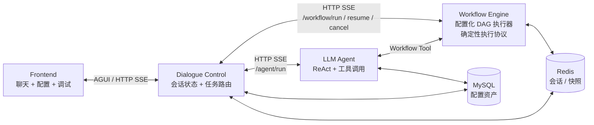

# 产品需求文档：混合 AI 助手平台 MVP

**日期**：2026-06-26
**状态**：评审稿
**版本**：2.0
**参考架构**：`ARCH-01-模块架构与职责说明.md`

---

## 1. 产品定位

本项目是一个混合 AI 助手平台，目标是在同一对话入口中同时支持：

- **确定性业务流程**：退款、账单查询、审批、工单等需要稳定执行、可审计、可控制的场景。
- **概率性智能问答**：解释、推荐、开放式查询、工具选择等需要 LLM 推理能力的场景。

产品的核心不是“让一个 Agent 做所有事”，而是通过 Dialogue Control 在 Workflow Engine 与 LLM Agent 之间做路由、状态管理和上下文隔离。

---

## 2. MVP 目标

MVP 阶段重点验证四件事：

1. 用户可以通过自然语言进入工作流或 Agent。
2. DC 可以稳定维护会话状态、活跃任务、挂起任务和槽位上下文。
3. Workflow 可以通过 HTTP/SSE 返回文本、挂起、完成等事件，DC 可以正确展示和恢复。
4. 前端可以同时承担聊天测试、运行链路观察和基础配置管理。

MVP 明确不追求一次性完成完整生产能力，例如生产级工作流版本治理、复杂审批中心、完善权限系统、RAG、生产级审计等。

---

## 3. 用户与角色

| 角色 | 目标 | 当前 MVP 支持 |
|---|---|---|
| 终端用户 | 通过自然语言办理业务或咨询问题 | 聊天测试入口已支持 |
| 业务/AI 配置人员 | 配置 Intent、Agent、API、Workflow 基础信息 | 基础配置界面已支持部分能力 |
| 开发/调试人员 | 观察 DC、WE、LA 链路和状态变化 | 调试面板已支持 |
| 运维/管理员 | 鉴权、审计、监控、发布治理 | 后续建设 |

---

## 4. 模块范围

系统由四个主要模块组成：

### 4.1 Frontend

定位：交互与配置面。

当前 MVP 能力：

- 聊天测试页面。
- 对话消息展示，消息内容展示时前后 trim。
- 模块链路日志与编排状态快照。
- `dc_log`、`workflow_log`、`subagent_log` 调试展示。
- 调试 JSON 复制按钮。
- 原始 AgentState 展示。
- Intent 配置，页面命名为“对话中控配置”。
- SubAgent 配置。
- Workflow React Flow 画布：支持节点可视化、点击节点右侧抽屉编辑、拖拽保存位置、连线创建、校验和发布。
- API 注册表。

MVP 不要求：

- 面向真实终端用户的正式 UI。
- 复杂画布能力，如自动布局、批量选择、复制粘贴、节点分组和版本对比。
- 可视化权限、审计和发布审批。
- 普通用户与开发调试事件分权展示。

### 4.2 Dialogue Control

定位：会话状态与任务路由控制面。

当前 MVP 能力：

- 基于 FastAPI + LangGraph 承载对话状态图。
- 统一从 `configured_intent_matcher` 进入每轮处理。
- 使用近 `DC_CONTEXT_TURNS` 轮 User/Assistant 上下文做意图识别和任务内分类。
- ToolMessage 默认不进入分类上下文。
- 通过 `session_route_resolver` 结合 `matched_intent` 和 `running_task` 决定走顶层路由、任务内分类、task switch 或 active_task_block。
- 支持 `running_task`、`suspended_tasks`、`pending_workflow`、`global_slots`、`submitted_slots` 等状态。
- 支持 DC 触发 workflow、workflow 挂起、用户补槽 resume。
- 支持 LLM 槽位抽取初版：WE 挂起后，DC 结合 workflow slot schema 与当前挂起信息抽取补槽；槽位纠正会做工程侧校验。
- 支持用户在挂起 workflow 与 agent/其他 workflow 之间切换。
- 支持命中已挂起 workflow 后恢复快照并 resume，而不是重新 run。
- 支持取消 workflow。
- 支持槽位纠正：模型识别为纠正后会先校验槽位是否已有旧值；未提交槽位本地更新，已提交槽位 cancel + restart。
- 支持调用 LA `/agent/run` 并转发 LA 流式事件。
- 支持 DC、LA、WE 模型参数从 `.env`/配置读取。
- 调试事件做安全序列化，避免消息对象和状态引用导致递归展示。

MVP 不要求：

- 生产级 Intent 检索能力。
- 完整 Slot Registry、schema 版本治理和严格校验。
- 复杂权限、审计、链路追踪治理。
- 将 `orchestrator/nodes.py` 拆分为正式分层服务。

### 4.3 Workflow Engine

定位：确定性业务执行面。

当前 MVP 能力：

- Python / FastAPI 配置化 DAG 执行器。
- 提供 `/workflow/run`、`/workflow/resume`、`/workflow/cancel`。
- 通过 HTTP SSE 返回业务事件。
- 从 MySQL 读取已发布 workflow 定义。
- 支持 start / slot / message / python / api / condition / end 节点。
- 支持节点输出项和 `{{nodes.node_key.output}}` 引用。
- 退款、账单查询、账单分期已通过 seed 配置到数据库。
- 支持缺槽挂起和快照 key。
- 开始与恢复 workflow 时输出不同文本，便于测试感知。

当前业务事件：

- `TEXT_OUTPUT`
- `WORKFLOW_SUSPENDED`
- `WORKFLOW_COMPLETED`

MVP 不要求：

- 生产级版本治理、发布审批和回滚。
- Human / LLM / 子流程 / 并行网关等高级节点。
- 完整幂等、重试、审计全链路。

### 4.4 LLM Agent

定位：概率性推理与工具执行面。

当前 MVP 能力：

- FastAPI 服务，提供 `/agent/run`。
- 根据 DB 中 SubAgent 配置加载模型、提示词和工具。
- 支持 ReAct 风格工具调用。
- 支持注册 API 工具。
- 支持 workflow 作为工具。
- 支持返回 token、tool_call、api_call、api_response、end 等事件。
- LA 触发 workflow 后，槽位收集权归 LA；DC 负责会话级状态和路由回 LA。

MVP 不要求：

- 完整 RAG / Vector DB。
- 多 Agent 协作。
- 生产级工具权限和密钥治理。
- 完整 tool call 幂等与失败恢复闭环。

---

## 5. 核心用户故事

### US-01：用户触发 DC 工作流

作为用户，我希望输入“我要退款 order_777”后，系统能识别退款意图并启动退款流程。

验收标准：

- DC 能匹配绑定到 workflow 的 Intent。
- DC 写入 `pending_workflow` 并调用 WE `/workflow/run`。
- 若 workflow 内部缺槽，由 WE `slot` 节点返回 `WORKFLOW_SUSPENDED`。
- 用户补槽后，DC 调用 WE `/workflow/resume`。
- WE 的 `TEXT_OUTPUT` 能展示在聊天区。
- WE 缺槽时，DC 能记录 `running_task.status = suspended` 并提示用户补充信息。

### US-02：用户补充 workflow 缺失槽位

作为用户，我希望 workflow 问我“退款金额是多少”后，我只回复“100 元”，系统可以继续原流程。

验收标准：

- DC 识别当前存在 suspended workflow。
- DC 使用 `running_task.suspension_info.required_input_schema.param_name` 作为槽位名。
- DC 调用 WE `/workflow/resume`，传回 `resume_token`。
- workflow 恢复输出能展示在聊天区。

### US-03：用户在挂起任务中切换话题

作为用户，我希望退款流程挂起时可以去问 Agent 问题，之后再回来补退款信息，系统不会重开退款流程。

验收标准：

- 当前 workflow 挂起时，用户输入命中 Agent 或其他 workflow，DC 进入 `task_switch`。
- 当前任务完整快照进入 `suspended_tasks`。
- 用户之后输入命中原 workflow 时，DC 按 `task_id` 恢复快照。
- 恢复后补槽调用 `/workflow/resume`，不是 `/workflow/run`。

### US-04：用户取消当前 workflow

作为用户，我希望输入“取消”后，系统取消当前流程，并告诉我结果。

验收标准：

- DC 任务内分类识别为 `workflow_cancel`。
- DC 调用 WE `/workflow/cancel`。
- DC 清理当前 `running_task` 和 `submitted_slots`。
- 若存在 `suspended_tasks`，DC 恢复上一个挂起任务并提示用户。

### US-05：用户纠正已提交槽位

作为用户，我希望已经提交订单号后，如果我说“订单号不是 order_777，是 order_999”，系统能用新值重启流程，并让我看得懂发生了什么。

验收标准：

- DC 任务内分类识别 `workflow_slot_correction`。
- 如果槽位存在于 `submitted_slots`，DC 先调用 `/workflow/cancel`。
- DC 用更新后的 `global_slots` 调用 `/workflow/run`。
- 聊天区展示“已取消当前 workflow，并使用新信息重新启动”的用户可见提示。

### US-06：开发人员查看链路日志

作为开发人员，我希望能在测试页看到 DC、WE、LA 的链路日志和状态快照，方便定位问题。

验收标准：

- 前端展示模块链路日志和编排状态快照。
- 原始 AgentState 默认展开且高度足够。
- JSON 面板支持复制。
- 日志中的 LangChain message 对象不会显示为无意义递归结构。

---

## 6. 功能需求

### 6.1 Frontend 需求

| 编号 | 需求 | MVP 状态 |
|---|---|---|
| FE-01 | 聊天测试页可发送用户消息并展示流式回复 | 已支持 |
| FE-02 | 展示 DC / WE / LA 调试日志 | 已支持 |
| FE-03 | 展示 AgentState 状态快照 | 已支持 |
| FE-04 | JSON payload 支持复制 | 已支持 |
| FE-05 | 对话消息展示前后 trim | 已支持 |
| FE-06 | Intent / Agent / API / Workflow 基础配置页 | 已支持 |
| FE-07 | Workflow React Flow 画布编辑和发布 | 已支持 |
| FE-08 | 普通用户视图与调试视图隔离 | 后续 |

### 6.2 Dialogue Control 需求

| 编号 | 需求 | MVP 状态 |
|---|---|---|
| DC-01 | 使用 LangGraph 编排对话流程 | 已支持 |
| DC-02 | 入口意图匹配与会话路由拆分为独立节点 | 已支持 |
| DC-03 | 使用近 N 轮 User/Assistant 上下文做分类 | 已支持 |
| DC-04 | ToolMessage 不进入分类上下文 | 已支持 |
| DC-05 | 支持 workflow run/resume/cancel | 已支持 |
| DC-06 | 支持 suspended task 完整快照和恢复 | 已支持 |
| DC-07 | 支持槽位纠正 cancel + restart | 已支持 |
| DC-08 | 支持 LA 路由和事件转发 | 已支持 |
| DC-09 | LLM 槽位抽取初版 | 已支持 |
| DC-10 | WE slot 挂起与 DC resume 补槽 | 已支持 |
| DC-11 | 完整 Slot Registry、schema 版本和严格校验 | 后续 |
| DC-12 | 节点代码按 service/client/repository 拆分 | 后续 |

### 6.3 Workflow Engine 需求

| 编号 | 需求 | MVP 状态 |
|---|---|---|
| WE-01 | `/workflow/run` | 已支持 |
| WE-02 | `/workflow/resume` | 已支持 |
| WE-03 | `/workflow/cancel` | 已支持 |
| WE-04 | SSE 输出 `TEXT_OUTPUT` | 已支持 |
| WE-05 | SSE 输出 `WORKFLOW_SUSPENDED` | 已支持 |
| WE-06 | SSE 输出 `WORKFLOW_COMPLETED` | 已支持 |
| WE-07 | 配置化 DAG 执行器 | 已支持 |
| WE-08 | 基础节点 start/slot/message/python/api/condition/end | 已支持 |
| WE-09 | 工作流版本、发布审批和审计 | 后续 |

### 6.4 LLM Agent 需求

| 编号 | 需求 | MVP 状态 |
|---|---|---|
| LA-01 | `/agent/run` | 已支持 |
| LA-02 | 从 DB 加载 Agent 配置 | 已支持 |
| LA-03 | 流式 token 和工具事件 | 已支持 |
| LA-04 | API 工具调用 | 已支持 |
| LA-05 | Workflow 工具调用 | 已支持 |
| LA-06 | LA-triggered workflow 恢复链路 | 初步支持 |
| LA-07 | RAG / Vector DB | 后续 |
| LA-08 | tool_call 幂等和失败恢复 | 后续 |

---

## 7. 非功能需求

### 7.1 可维护性

- DC Graph 节点职责必须清晰，重复逻辑应抽成独立节点或 service。
- 调试日志必须使用 JSON-friendly 结构，避免不可读对象或循环引用。
- 下游协议应收敛为 Pydantic model，减少 ad-hoc dict。

### 7.2 安全性

MVP 可暂时弱化，但正式环境必须补齐：

- 管理端鉴权。
- API 密钥加密或接入密钥服务。
- 租户隔离。
- CORS 收敛。
- 调试事件按角色和环境隔离。
- 工作流和 Agent 配置变更审计。

### 7.3 可靠性

- 每个 session 同一时间只允许一个 `running` workflow。
- workflow `suspended` 时允许 task switch，但必须保存完整快照。
- workflow `running` 时不允许 DC 本地伪挂起切换。
- `suspended_tasks` 需要 TTL、长度上限和过期提示。
- LA tool call 后续必须引入幂等键，避免重复触发业务副作用。

### 7.4 可观测性

- MVP 调试页保留 `dc_log`、`workflow_log`、`subagent_log`。
- 正式环境需要拆成用户业务事件、管理员观察事件、开发调试事件。
- 后续需要指标、trace、错误聚合和审计日志。

---

## 8. 当前不在 MVP 范围内

以下能力不作为当前 MVP 验收前置条件：

- 生产级 Workflow Engine 治理能力，如版本、回滚、灰度、重试和审计。
- 复杂 React Flow 画布能力，如自动布局、节点分组、批量操作和版本对比。
- Human Feedback 管理端任务闭环。
- RAG / Vector DB。
- 多 Agent 协同。
- 生产级鉴权、租户隔离、审计与密钥管理。
- 复杂 UI payload 白名单渲染。
- 完整工作流版本治理和回滚。

---

## 9. 关键架构决策

需要领导确认的决策与 ARCH-01 保持一致：

1. **DC 定位为会话状态与任务路由控制面**
   DC 不执行业务 DAG，不执行 Agent 推理。

2. **Workflow Engine 保持协议稳定、实现可演进**
   当前 Python WE 已承担配置化 DAG MVP 执行；后续可以继续生产化，也可以替换为其他正式实现，但 HTTP/SSE 协议应保持兼容。

3. **WE 面向 DC/LA 的业务事件收敛为三类**
   `TEXT_OUTPUT`、`WORKFLOW_SUSPENDED`、`WORKFLOW_COMPLETED`。

4. **槽位收集权跟随触发方**
   DC 触发 workflow，由 DC 补槽；LA 触发 workflow，由 LA 补槽，DC 只负责会话路由。

5. **配置资产由 DC 管理 API 统一暴露**
   前端管理端不直接写 WE/LA 私有运行时。

6. **MVP Workflow 进入配置化执行阶段**
   新增业务流程应通过配置化节点和边落库，不应再写死在 WE 代码中。

---

## 10. 里程碑建议

### M1：MVP 演示版

目标：

- 当前已基本达到。
- 打通 FE -> DC -> WE/LA 主链路。
- 支持 workflow 挂起、恢复、取消、纠正、任务切换。
- 支持基础配置和调试观察。

### M2：协议收敛版

目标：

- DC/WE/LA 请求响应改为显式 Pydantic model。
- Slot Registry、schema 版本、严格校验和真实 workflow 契约落地。
- `orchestrator/nodes.py` 拆分 service/client/repository。
- 调试事件和用户事件分层。

### M3：生产试点版

目标：

- 正式 Workflow Engine 技术栈落地。
- 工作流版本、发布、审计、幂等和重试。
- 管理端鉴权、密钥治理、租户隔离。
- 观测平台、指标和错误追踪。

---

## 11. 总结

本产品的 MVP 价值在于证明：**一个对话入口可以同时协调确定性 workflow 和概率性 Agent，并且通过 DC 保持清晰的会话状态、上下文边界和任务生命周期。**

当前代码已经具备主链路验证能力。后续建设的重点不是继续把逻辑堆进某一个模块，而是围绕 ARCH-01 中确认的模块边界，把协议、配置、状态、调试和安全治理逐步产品化。
